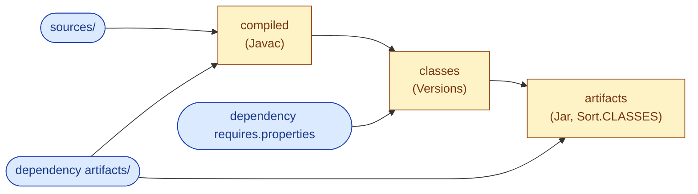
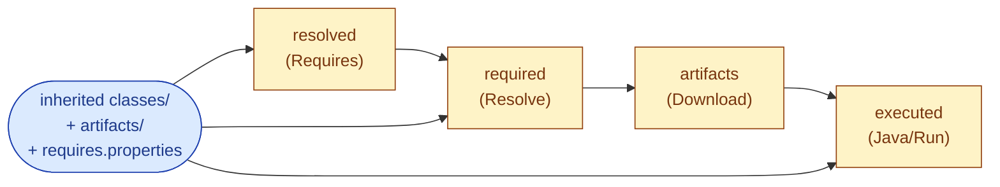
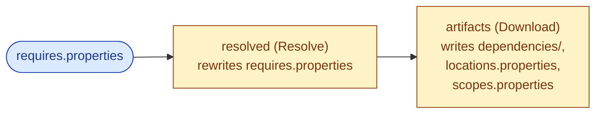

Jenesis
=======

Getting started
---------------

Jenesis is a build tool for Java projects, written and configured in Java itself. It builds **modular projects**
out of the box (anything whose modules declare themselves via `module-info.java`) and also understands the
declarative slices of a `pom.xml` - descriptive metadata, plugin-free dependency lists, parent coordinates - so
a Maven-shaped project that does not lean on plugin lifecycles can be built without conversion. Pointed at a
project root containing a `module-info.java`, a `pom.xml`, or both, Jenesis discovers the multi-project graph
automatically and wires the matching compile, package, and (where sources are present) test pipeline.

One design goal is to ship the build *with* the project as plain Java source, and not as a binary. The Jenesis
sources sit inside your repository under `build/jenesis/`, the launcher is the JVM's single-file mode
(`java build/jenesis/Project.java`), and the build is reproducible from a clone plus a JDK. There is no opaque
wrapper, no fetched plugin tree, no fetched daemon - which closes the supply-chain surface that wrappers and
plugin resolvers otherwise expose. Shipping the build as plain source also keeps it fully modifiable where
needed: humans (and AI agents) can adjust how a project is built by implementing build steps in ordinary Java,
without a large API to learn first.

A second design goal is that the build is naturally incremental at every step and naturally produces reproducible
outputs. Each build step's inputs, outputs, and configuration are content-hashed, so unchanged work is reused
unchanged from the previous run, and identical inputs always reproduce identical outputs. That same posture is
what makes Jenesis strongly security-focused: dependencies can be pinned not only by version number but also by
the checksum of every downloaded artifact, so a build is naturally resistant to supply-chain attacks on its
inputs. Pinning at that level of detail is itself a consequence of embedding the build tool inside the project,
since the pin set lives in the same committed sources as everything else. The combination of plain-Java
sources and content-hashed steps also lays a foundation for optimising complex builds: a non-trivial custom
build can itself be compiled ahead of time, or shipped as a native image for environments that run the same
build at high frequency (a CI server, for example), and step outputs - being pure functions of their
content-hashed inputs - are easy to share between builds as a cache. A Jenesis build requires a JVM of
version 25 or newer, but nothing else.

For runnable, self-contained examples of everything below - Maven and modular layouts, multi-module projects,
mixed Java/Kotlin, Java/Scala, and Java/Groovy sources, and loading build modules - see the [`demo/`](demo/)
directory.

### Installing

Three equivalent ways to populate `build/jenesis/` inside your project. All three land at the same on-disk
state, so the canonical `java build/jenesis/Project.java` invocation works identically afterwards:

**curl-piped bootstrap.** Fastest, no prerequisites beyond a JDK and `curl`. Run from your project root:

    curl -fsSL https://get.jenesis.build | bash
    java build/jenesis/Project.java

Set `JENESIS_VERSION=X.Y.Z` to pin a specific version. The script is `install.sh` at the repository root.

**Git submodule.** Most explicit; the pinned submodule commit is the reproducibility anchor, so a fresh clone
plus `git submodule update --init` is the entire setup with no separate install step:

    git submodule add https://github.com/raphw/jenesis.git .jenesis
    ln -s ../.jenesis/sources/build/jenesis build/jenesis
    java build/jenesis/Project.java

On platforms without symlink support, replace the `ln -s` with `cp -r .jenesis/sources/build/jenesis build/jenesis`
and refresh after each submodule update.

**SDKMAN.** Best fit when you would rather manage versions globally instead of vendoring sources per project.
Install once, then initialise each consuming project from the SDK:

    sdk install jenesis
    jenesis-init                       # from your project root
    java build/jenesis/Project.java    # or just 'jenesis', equivalent

`jenesis-init` populates `build/jenesis/` from the installed SDK. The companion scripts `jenesis-validate`,
`jenesis-version`, and `jenesis-switch` are documented under [Using Jenesis as a CLI](#using-jenesis-as-a-cli).

You can also skip the embedding entirely and run `jenesis` directly from a project root: the SDK's own copy
of `Project.main(...)` is invoked against the current directory, with no `build/jenesis/` written. Customisation
is then limited to system properties (`-Djenesis.project.layout=...` and friends); custom builders and
hand-wired `.java` files under `build/` are not reachable. Useful for quick trials and for building projects
with an untrusted build source, where Jenesis itself stays the trusted, SDK-installed copy.

### Example: Building Jenesis itself

A clone of this repository is the easiest working example. Sources live under `sources/` and tests under
`tests/`, with a `module-info.java` in each (`build.jenesis` and `build.jenesis.test`) and a single root
`pom.xml` that points at both directories. The same canonical invocation builds it:

    git clone https://github.com/raphw/jenesis.git
    cd jenesis
    java build/jenesis/Project.java

The auto-detected layout is `MAVEN`, since the root `pom.xml` takes precedence over a nested module-info.
The build compiles main and test sources, runs the tests, and writes artifacts under `target/`. Try
`java build/jenesis/Project.java stage` to materialise the release tree pushed to Maven Central, or browse
`metadata.properties` and the module-info javadoc to see how descriptive metadata flows into the emitted POM.

### Customizing the build

Customisation comes in three stages, picked by how far from the auto-wired pipeline you need to go.

**1. System properties on the canonical launcher.** When the project shape is fine but a knob needs flipping -
skip tests, force a layout, route `target/` elsewhere - pass `-Djenesis.project.*` flags. No Java code, no
separate entry point:

    java -Djenesis.test.skip=true \
         -Djenesis.project.layout=MODULAR_TO_MAVEN \
         build/jenesis/Project.java

`Project.main(...)` calls `resolveProperties()` first, which maps `jenesis.project.*` onto the corresponding
`Project` wither methods. The full list is in [Configuration](#configuration). `jenesis.project.root` also
lets you target a project that lives outside the directory holding `build/jenesis/`:

    java -Djenesis.project.root=/path/to/other/project build/jenesis/Project.java

Any of these `-Djenesis.*` / `-Dbuild.jenesis.*` properties can also live in a `jenesis.properties` file at the
project root. `Project.doMain(...)` loads it (the static `Project.loadJenesisProperties(Path)`) into the system
properties before the build, so a project carries its own defaults without a wrapper script. The file is optional,
and an explicit `-D` on the command line wins over a file entry (the file only fills values not already set). It is
read in `doMain`, after `resolveProperties()`, so it drives everything decided at run time (for example
`jenesis.project.watch` below); the fields `resolveProperties()` fixes up front - layout, target, cache, pinning -
are still taken from the command line.

**2. Custom entry point under `build/`.** When you want code-level control - a tailored assembler, an extra
step on top of the default per-module pipeline - drop a `.java` file alongside `Project.java` and use the
Builder there. Run it the same way (`java build/MyBuild.java`):

```java
package build;

import module java.base;
import build.jenesis.BuildExecutorModule;
import build.jenesis.Project;
import build.jenesis.project.JavaMultiProjectAssembler;
import build.jenesis.project.MultiProjectAssembler;
import build.jenesis.project.ProjectModuleDescriptor;

public class MyBuild {

    static void main(String[] args) throws IOException {
        MultiProjectAssembler<ProjectModuleDescriptor> base = new JavaMultiProjectAssembler();
        MultiProjectAssembler<ProjectModuleDescriptor> withSign = (descriptor, repos, resolvers) -> {
            BuildExecutorModule delegate = base.apply(descriptor, repos, resolvers);
            return (sub, inherited) -> {
                sub.addModule("assemble", delegate, inherited.sequencedKeySet().stream());
                sub.addStep("sign", new Sign(), "assemble"); // Sign is a user-defined BuildStep
            };
        };
        Project.builder()
               .assembler(withSign)
               .build(args);
    }
}
```

The wrapper registers `JavaMultiProjectAssembler`'s output as a nested module named `assemble` and then
chains a `sign` step that depends on it. Assemblers compose this way freely: each layer registers its
delegate as a sub-module and adds its own steps next to it, so you can stack multiple decorators (sign,
attach licence headers, emit checksums) on top of a base assembler without subclassing. Jenesis itself
relies on the same pattern internally - the `MAVEN` and `MODULAR_TO_MAVEN` layouts transparently wrap the
user's assembler with `PomAwareAssembler`, which registers the user-supplied assembler under `assemble/`
and emits the per-module POM alongside it.

**3. Hand-wired build on the `BuildExecutor` API.** When auto-detection is not the right starting point at
all - a non-Java pipeline, a wildly custom graph, or you just want the primitives - bypass `Project` and
wire the build yourself:

```java
package build;

import module java.base;
import build.jenesis.BuildExecutor;
import build.jenesis.step.Bind;
import build.jenesis.step.Jar;
import build.jenesis.step.Javac;

public class Hand {

    static void main(String[] args) throws IOException {
        BuildExecutor root = BuildExecutor.of(Path.of("target"));
        root.addSource("sources", Bind.asSources(), Path.of("sources"));
        root.addStep("classes", Javac.tool(), "sources");
        root.addStep("artifacts", Jar.tool(Jar.Sort.CLASSES), "classes");
        root.execute(args);
    }
}
```

`BuildExecutor.of(Path.of("target"))` is the root of the graph and writes all outputs under `target/`.
`addSource` binds an input directory through a `Bind` step so changes to the path invalidate downstream
caches; `addStep` chains a `BuildStep` whose argument list names its predecessors (`"sources"` for
`classes`, `"classes"` for `artifacts`); `execute(args)` runs the requested target (or the whole graph by
default), reusing cached outputs whose inputs have not changed. The full primitive set is documented under
[Architecture](#architecture), [Build steps](#build-steps), and [Build executor modules](#build-executor-modules),
and the demos under `demo/` (each a self-contained project with its own `build/` launcher) are progressively
richer working starting points.

### Faster launch: precompiling and native images

When the build ships as source files and is launched with `java build/jenesis/Project.java`, Java recompiles
the build's own engine and `Project.java` on every invocation. While the build code is unchanged you can skip
that recompile. Precompile once with `javac` and run from the classes:

    javac -d .jenesis/launcher \
        $(find build/jenesis/ -name '*.java')
    java -cp .jenesis/launcher build.jenesis.Project [selectors...]

Or ahead-of-time compile that launcher with GraalVM `native-image` for near-instant startup. Two things
matter for the native build:

- A native image has no in-process JDK tools, so Jenesis detects the native-image runtime (via the
  `org.graalvm.nativeimage.imagecode` system property) and defaults `jenesis.java.process` to `true`, forking
  the JDK `javac`/`jar` instead. Keep a JDK on `JAVA_HOME`/`PATH` at runtime.
- The incremental cache serializes every `BuildStep` to key it, so that a changed step configuration (for
  example the `jenesis.test.filter` filter) invalidates that step. That serialization needs native-image
  reachability metadata, which is captured from a real build with the native-image agent.

Putting it together (after the `javac` precompile above):

    # capture metadata from a representative build (process mode, so the forked-tool steps are recorded)
    java -Djenesis.java.process=true \
        -agentlib:native-image-agent=config-output-dir=.jenesis/native-config \
        -cp .jenesis/launcher build.jenesis.Project build

    # build the native launcher with that metadata
    native-image --no-fallback \
        -H:ConfigurationFileDirectories=.jenesis/native-config \
        -cp .jenesis/launcher build.jenesis.Project jenesis

    # run it; process mode is auto-detected, no flags needed
    ./jenesis [selectors...]

Capture the metadata from builds that exercise every layout and step you use, custom steps included, since it
only covers what the agent run reached. Loading foreign build modules (`InternalModule` / `ExternalModule`,
which bridge classes across class loaders) needs a full JVM and is not supported in a native image. Rebuild
the precompiled or native launcher whenever the build sources change; this only accelerates launching the
build, while the project being built is still recompiled by the build graph when its own sources change.

### Selectors

`Project.main(args)` and `Project.build(args)` accept selector strings as positional arguments. The canonical
example is `stage`, which runs the full release recipe (build → stage) and materialises a Maven-shaped tree
under `target/stage/maven/output/`:

    java build/jenesis/Project.java stage

Without arguments, `Project` runs whatever its `defaultTarget` is set to. Out of the box that is `"build"`,
which compiles and packages every discovered module but stops short of the downstream `stage` step.
`Project.defaultTarget(...)` changes the default (there is no matching system property). The other
top-level targets the shipped layouts register are `export` (on `MAVEN`, `MODULAR`, and `MODULAR_TO_MAVEN`;
`MAVEN` publishes the staged tree into the local Maven repository, `MODULAR` into the local Jenesis module
repository, and `MODULAR_TO_MAVEN` into both) and `pin` (rewrite every `pom.xml` / `module-info.java` so
the full transitive closure is pinned at source level).

**Module selectors.** Selectors that start with `+` are rewritten by the active layout into the per-project
module path of that name, so a single module can be built without dragging its siblings in. The shipped
layouts encode names as `module-<URLEncode(name)>` and place them under their per-project aggregator:

- `+sources` resolves to `build/modules/compose/module/module-sources` under `MODULAR` and `MODULAR_TO_MAVEN`,
  or to `build/maven/compose/module/module-sources` under `MAVEN`.
- `+` alone resolves to `module-` (trailing empty segment), the identity Maven's scanner produces for the root
  POM in a multi-module Maven layout. A pure modular project has no such root, so `+` alone will not resolve
  there.

The rewriter always yields a literal path, which avoids the lenient cascade that a bare module name would
trigger across sibling modules.

**General syntax and wildcards.** Under the hood every selector is a slash-delimited path of step identities
(`module/step`) that the executor matches against the registered graph. Two wildcards are supported:

- `:` matches a single path segment, so `build/:/binary` matches the `binary` module of every direct child of
  `build`.
- `::` matches any depth (zero or more segments), so `::/sign` matches every `sign` step anywhere in the
  tree.

Wildcards are lenient: branches that fail to match are silently skipped. A literal path that does not
resolve throws. Once a step is matched, its transitive preliminary closure runs unconditionally, so its
inputs are real folders rather than lenient-skipped placeholders. The full mechanics, including how sibling
modules along a wildcard path still have their `accept(...)` invoked, are documented under
[`BuildExecutor`](#buildexecutor) and [Selectors on the command line](#selectors-on-the-command-line).

### Layouts and assemblers

Two callbacks govern how the build is assembled, and they are pluggable independently:

- `Project.Layout` (set via `.layout(...)`) wires the top-level pipeline (the `download` step where applicable, the
  `build` multi-project module, the `stage` step that walks per-module inventories, and on the Maven layouts the
  `export` step that publishes the staged tree) and returns the `Function<String, String>` that expands
  `+`-prefixed selectors. The shipped constants `Layout.MAVEN`, `Layout.MODULAR`, and
  `Layout.MODULAR_TO_MAVEN` each wire one of the concrete pipelines tabulated below.
  `Layout.AUTO` (the default) calls `Layout.of(root)` and dispatches to one of the concrete layouts: a root
  `pom.xml` selects `MAVEN`, otherwise a `module-info.java` under the root selects `MODULAR_TO_MAVEN`, so a
  module declaration resolves its dependencies (named or automatic) through Maven by default. `MODULAR`
  (a modular jar resolved only against a module-name registry, with no emitted `pom.xml`) is reachable only
  explicitly, since by definition it cannot resolve a dependency that is published only as an automatic module.
- `MultiProjectAssembler<D extends ModuleDescriptor>` (set via `Project.assembler(...)`) wires the per-project
  sub-graph: what each discovered module compiles, packages, and tests. The assembler's
  `apply(D descriptor, Map<String, Repository> repositories, Map<String, Resolver> resolvers)` receives the
  per-module descriptor *and* the per-module merged repositories/resolvers (the layout-level maps with each
  sibling sub-module's `assign` URI prepended, so a coordinate resolved locally never falls back to the global
  repository). `Project` parameterises this over `ProjectModuleDescriptor`, an immutable class that captures the
  layout's base descriptor (`MavenProject.MavenModuleDescriptor` or `ModularProject.ModularModuleDescriptor`) and adds
  the project-level flags `test`, `source`, `documentation`; it exposes a wither per property (`sources(...)`,
  `artifacts(scope, ...)`, `test(...)`, and so on, each with a `String...` overload) so a wrapping assembler
  can customise any input without reimplementing the descriptor. The default assembler `JavaMultiProjectAssembler` is
  stateless and reads those flags off the descriptor it receives - no `Context` object: a `prepare` step plus a
  `JavaToolchainModule` is wired against the descriptor's reference-key sets (`sources`, `manifests`, and the
  compile/runtime `resolved` and `artifacts` keys) and the module's resources, and when `descriptor.test()`
  is set and the module's `module.properties` flags it as a test variant a `TestModule` sub-module is wired
  alongside the `JavaToolchainModule`, with an optional `sources` archive and an optional `documentation` sub-module
  (the inferred documentation chain, see below) appended when the matching flag is set. The `MAVEN` and `MODULAR_TO_MAVEN` layouts wrap the
  user's assembler with a `PomAwareAssembler` that emits a per-project `pom` step seeded with project-wide
  metadata read once from `metadata.properties` (when configured); `MODULAR` does not. Each layout adds a
  top-level `pin` module (sibling of `build`) that walks the BUILD outputs' per-module `inventory.properties`
  and rewrites every discovered `pom.xml` / `module-info.java` so the full transitive closure (with checksums
  where available) is pinned at source level. Each module's descriptor is pinned from **that module's own**
  resolved closure: every module's `Inventory` step records its resolved closure into `inventory.properties`
  (the `prefix.dependency` entries, each a coordinate with its jar path and any carried checksum), its own
  coordinates (`prefix.identity`), and its source path (`prefix.path`). The `pin` module reads those inventories,
  enumerates the modules to pin from their `prefix.path` entries, and wires one pin step per module that pins
  only that module's own `prefix.dependency` closure (selected by the module's prefix), so a dependency used by
  one module never appears in a sibling's dependency-management block. The pinned set is read from that resolved
  closure (concrete versions and checksums), not from the descriptor's own managed versions, so stale or
  cross-module entries are never carried over. Pin is opt-in - it's not part of the default target - and it skips
  coordinates that come from within the project (every module's `prefix.identity`, originally advertised through
  the `assign` step's `identity.properties`), so internal modules never leak into the dependency-management block. Within a module,
  pin records one version per dependency coordinate **per resolution trail**, and both unqualified and qualified
  pins use the single
  `@jenesis.pin` tag (in `module-info.java`) or `<!--jenesis.pin ... -->` comment block (in `pom.xml`).
  Independent trails are distinguished by a qualifier carried on the coordinate prefix: the canonical properties
  key is always `<prefix>[@<qualifier>]/<coordinate>` (e.g. `module/org.junit.jupiter`,
  `maven@kotlin/org.jetbrains.kotlin/kotlin-compiler-embeddable`), so the project's own dependencies (the
  unqualified trail) and a tool's copy of the same library (a qualified trail - the Kotlin/Scala compiler, or an
  `InternalModule` / `ExternalModule` build tool) never collide. A pin token is classified by its first `@` and
  `/`: a token with no `/` is unqualified under the source's default prefix (`org.junit.jupiter` ->
  `module/org.junit.jupiter`); a token that contains a `/` but no `@` carries an explicit prefix as its first
  segment (`maven/org.jetbrains/annotations` -> `maven/org.jetbrains/annotations`), so a `module-info.java` can
  pin a Maven coordinate it pulls in transitively (e.g. a non-modular transitive of a named module dependency)
  even though its default prefix is `module`; a leading `@` is qualified under the default prefix (`@kotlin/foo`
  -> `module@kotlin/foo`); a mid-token `@` is fully explicit (`maven2@kotlin/foo`). The default prefix is
  `module` in `module-info.java` and `maven` in `pom.xml`, so the everyday case carries no prefix at all. Qualified maven pins stay out of
  `<dependencyManagement>` (where Maven would act on them) and live in the `<!--jenesis.pin-->` comment instead;
  because an XML comment cannot contain `--`, any such sequence in a POM value is stored as `&#45;&#45;`. The
  Kotlin, Scala, and Groovy
  compiler modules default their qualifier to `kotlin`, `scala`, and `groovy` respectively (overridable via
  `.qualifier(...)`), so the inferred compiler chain qualifies them with no extra wiring; `InternalModule` and
  `ExternalModule` take the qualifier as the second constructor argument (nullable for the unqualified trail, but
  a required explicit choice). Because each compiler resolves on its own trail, the compiler
  process is launched against only its own qualified artifacts, so a project that pins a different version of a
  library the compiler also uses (for example `kotlin-stdlib`) can no longer downgrade the running compiler -
  that library still reaches the compilation classpath, but not the compiler's own runtime.
- The **inferred documentation chain** (`InferredDocumentationChainModule`) mirrors the compiler chain for API
  documentation. A `scan` step walks the module's `sources/` and records which languages are present
  (`.java`, `.kt`, `.scala`, `.groovy`); a `document` sub-module then wires the documentation tools and an
  `aggregate` step that merges their output into a single `javadoc/` tree (archived into the module's
  `-javadoc.jar`). The tools are resolved on their own qualified trails like the compilers: Kotlin through Dokka in
  its **HTML output format** (`@dokka`, `dokka-cli` plus `dokka-base` and `analysis-kotlin-descriptors` on the
  plugins class-path) - the format Dokka recommends and the one most Kotlin libraries ship in their `-javadoc.jar`,
  Scala through `scaladoc` (`@scaladoc`, fed the compiled `.tasty` classes since scaladoc reads tasty rather than
  source), Groovy through `groovydoc` (`@groovydoc`, in source-path plus package-name mode so packages render
  correctly), and Java through the JDK's `javadoc` (in class-path mode, skipping `module-info.java`). The layout
  follows what each tool can cover: Dokka also documents Java sources and `groovydoc` also documents Java, but
  `scaladoc` documents only Scala. So when **one tool can document every language present**, only that tool runs and renders at the archive
  root - Java + Kotlin is a single Dokka document, Java + Groovy a single groovydoc document, and a single-language
  module is just that language's tool. Only when the mix is **incompatible** (Java + Scala, or three or more
  languages, where no single tool covers everything) does `javadoc` render the Java at the root as the baseline and
  each remaining language render into its own subfolder (`dokka/`, `scaladoc/`, `groovydoc/`). Scala and Kotlin
  tools are version coordinated to the project's resolved compiler version (read from the upstream dependency jars).
  The chain is best-effort: every tool tolerates a non-zero exit so a documentation tool that fails never fails the
  build, and `aggregate` always guarantees a root `index.html` (linking to any per-language subfolders that
  rendered) so the produced `-javadoc.jar`, a Maven Central prerequisite, is never empty.

Layouts always combine their built-in repositories and resolvers (e.g. a Maven default for `MAVEN`, a chained
Jenesis module repository for `MODULAR`) with any user-provided ones. The merged map then has each sub-module's `assign`
URI prepended inside `MavenProject.make` / `ModularProject.make` and is handed to the assembler per call. User
entries with the same key override the layout default.

| Layout               | Pipeline                                                                                  | Demo                   |
| -------------------- | ----------------------------------------------------------------------------------------- | ---------------------- |
| `Layout.MAVEN`       | **Input: `pom.xml`. Output: classic JAR + `pom.xml`.** `MavenProject` scan + per-project `JavaToolchainModule` + per-module `Pom` step + `MavenRepositoryStaging` + `MavenRepositoryExport` | `demo/demo-01-java-pom`         |
| `Layout.MODULAR`     | **Input: `module-info.java`. Output: modular JAR (no `pom.xml`).** `ModularProject` over `JenesisModuleRepository` (public overlay, cached under `.jenesis/cache/`) with `JenesisModuleRepository.ofLocal()` prepended + per-project `JavaToolchainModule` + `ModularStaging` + `JenesisModuleRepositoryExport` | `demo/demo-02-java-modular`     |
| `Layout.MODULAR_TO_MAVEN` | **Input: `module-info.java`. Output: modular JAR + `pom.xml`.** `ModularProject` against a `MavenDefaultRepository` driven by `MavenModuleResolver`, which fetches each declared module's `:pom` artifact from a permissive `JenesisModuleRepository(false)` to translate the module name into its Maven coordinate, then resolves through `MavenPomResolver` as if the project were a single synthetic POM declaring those coordinates as its `<dependencies>`. No `module-info.class` is ever read; `<dependencyManagement>` is taken solely from the `@jenesis.pin` tags (a pin on a non-declared module is fetched the same way and registered as a managed dependency), never hoisted from the declared modules' own POMs. The discovered first-layer POMs seed the resolver cache, so they are not re-fetched from Maven Central. Per-module `Pom` step on top of the assembler; since the jars are genuine modules, both `stage` and `export` are modules with aligned `maven`/`modular` sub-steps - `MavenRepositoryStaging` + `ModularStaging`, then `MavenRepositoryExport` into the local Maven repository + `JenesisModuleRepositoryExport` into the local Jenesis module repository | `demo/demo-02-java-modular`     |
| `Layout.AUTO` (default) | Detection: a root `pom.xml` → `MAVEN`; else any `module-info.java` under the root → `MODULAR_TO_MAVEN`. Trees rooted at a nested `.jenesis.skip` marker are skipped. Falling through throws. | - |

`MODULAR_TO_MAVEN` translates each `requires` directive into the declaring module's Maven coordinate (discovered
from its `:pom` in the overlay) and resolves the transitive closure through `MavenPomResolver` against a
`MavenDefaultRepository`, exactly as if the project had declared a `pom.xml` listing those coordinates as its
`<dependencies>`. Versions therefore follow Maven's nearest-wins rules and dependency management rather than the
Java module system's single-binding requirement, and `<dependencyManagement>` comes solely from the project's own
`@jenesis.pin` tags, never from the declared modules' own POMs. The resolver reads no `module-info.class` at all;
it also does not check that every transitive jar carries a `module-info.class`
or a manifest `Automatic-Module-Name`, and Maven coordinates do not encode a Java module name, so the resolved
set may include plain classpath jars or coordinates whose filename is not a legal automatic module name. The
artifact may still be module-path-consumable in practice; the layout simply does not prove it. For this reason
the layout omits `prefix.module` from `inventory.properties` and `Execute` launches the staged jar on the
classpath rather than via `--module-path`. `MODULAR` is the layout that resolves only against a module-name
registry and so guarantees a module-path-consumable closure.

All three concrete layouts run a `stage` target that depends directly on `BUILD` and materializes the staged
tree(s) by walking every per-module `inventory.properties` the assembler produced. The staging and the matching
`export` shape differ by layout:

- `MAVEN` stages a single `MavenRepositoryStaging` step nested under a `maven` sub-step, so its output lands
  under `target/stage/maven/output/` - the same absolute path MODULAR_TO_MAVEN uses for its Maven layout, so
  the staged tree sits at a consistent location regardless of layout. For each main module it parses
  `prefix.pom` for `groupId` / `artifactId` / `version` and hardlinks the artifacts as
  `<groupId-as-path>/<artifactId>/<version>/<artifactId>-<version>.<ext>` (suitable for upload to a Maven
  repository). Test variants (those whose inventory carries a `prefix.test=<main-artifactId>` marker) are
  routed onto the main coordinate with a `-tests` classifier, and the test module's `pom.xml` is parsed for
  its dependencies, which are appended to the staged main POM with `<scope>test</scope>`. Its `export` is a
  matching `MavenRepositoryExport` under `export/maven` that copies the staged tree into the local Maven
  repository (default `~/.m2/repository`, overridable via `MAVEN_REPOSITORY_LOCAL`) with the right
  `maven-metadata-local.xml` and `_remote.repositories` markers.
- `MODULAR_TO_MAVEN` - whose jars are genuine modules (it builds with the module marker set) - stages and
  publishes to *both* repositories, so its `stage` and `export` are each a small module with matching `maven`
  and `modular` sub-steps that line up one-to-one. `stage/maven` runs the same `MavenRepositoryStaging` (Maven
  layout under `target/stage/maven/output/`) and `stage/modular` runs `ModularStaging` (module layout under
  `target/stage/modular/output/`, see the next bullet); `export/maven` then runs `MavenRepositoryExport` over
  `stage/maven` into `~/.m2/repository`, and `export/modular` runs `JenesisModuleRepositoryExport` over
  `stage/modular` into the local Jenesis module repository (default `~/.jenesis`, overridable via
  `JENESIS_REPOSITORY_LOCAL`).
- `MODULAR` stages a single `ModularStaging` step nested under a `modular` sub-step, so its output lands under
  `target/stage/modular/output/` (again matching MODULAR_TO_MAVEN's module layout, and its `export` runs as
  `export/modular`). For each module's inventory it reads `prefix.module` (the Java module system module name)
  and the optional `prefix.version`, then hardlinks the artifacts as `<module>/<module>.jar` (plus
  `-sources.jar` / `-javadoc.jar` siblings when produced). When `prefix.version` is present, the version is
  inserted as one extra path segment: `<module>/<version>/<module>.jar`. There is no `pom.xml` to anchor a
  Maven coordinate. The follow-up `JenesisModuleRepositoryExport` step copies that staged tree into the
  local Jenesis module repository (default `~/.jenesis`, overridable via the `JENESIS_REPOSITORY_LOCAL`
  environment variable), preserving the same `<module>[/<version>]/` shape. When a module is versioned, its
  files are *also* mirrored to the unversioned `<module>/` root so the module root always reflects the most
  recently built version (a subsequent build of the same module overwrites the root regardless of which
  version it produces). Each target directory written in a run is cleaned of pre-existing regular files
  before the new ones are linked in, so a build that no longer produces a `-javadoc.jar` does not leave a
  stale one behind; sibling version directories (e.g. `<module>/0.9/` while exporting `<module>/1.0.0/`) are
  untouched.

In either modular layout the staged tree includes a produced `.jmod` (the `jmod` step's output, which
`ModularStaging` hardlinks beside the jar), so `export` publishes the `.jmod` to `~/.jenesis` alongside the
jar without any extra step. A downstream Jenesis project then consumes it by resolving the `<module>:jmod`
coordinate, which `JenesisModuleRepository` serves from the published `.jmod` and otherwise falls back to
the jar - the cross-project half of the link-time propagation described in the `jmods/` row of the
conventions table. The producer publishes the jmod automatically (whenever the `jmod` step ran); only the
consumer opts in, by requesting the `:jmod` qualifier rather than the default jar.

Run `java build/jenesis/Project.java stage` to materialize that tree (it's the canonical entry point for
release publishing - see [The stage step](#the-stage-step) for the full release pipeline).

### Watching for changes

Set `-Djenesis.project.watch=true` to keep the process alive and rebuild on every source change:

    java -Djenesis.project.watch=true build/jenesis/Project.java

The first build runs as usual; Jenesis then registers a `WatchService` over the project root and re-runs the
requested target whenever a file changes, reusing the content-hash cache so each rebuild only re-executes the steps
whose inputs actually changed (a no-op change settles in well under a second). The watch excludes the output folders
(`target/` and the configured cache) and dot-directories, so the build's own writes never trigger a rebuild. Module
selectors still apply, so `-Djenesis.project.watch=true build/jenesis/Project.java +mymodule` watches and rebuilds
just that module's subgraph. Press Ctrl+C to stop. Setting `jenesis.project.watch=true` in a `jenesis.properties`
file makes watch a project's default.

### Printing the dependency tree

Set `-Djenesis.project.tree=true` to print each module's dependency tree as it is resolved, verbose-style,
the way `mvn dependency:tree` / `gradle dependencies` do:

    java -Djenesis.project.tree=true build/jenesis/Project.java

Unlike a separate "resolve" goal, this captures the **actual** resolution the build performs. It works by
passing an optional `ResolutionListener` into the resolver (`Resolver.dependencies(..., listener)`, which
defaults to `null`, so nothing changes and nothing is allocated when the flag is off): the resolver reports
each discovered parent -> child edge - with the property-file key, the discovered version and scope, and a
`followed` flag that is `false` on a dedup re-encounter - and announces each negotiated version through
`onResolution`. A `DependencyTreeReport` implements `ResolutionListener` directly; the flag wires a fresh one
per resolve (through `DependenciesModule` -> `Resolve`, which forces a re-run so the tree always prints), and on
the completion callback (`onResolved`) it renders and prints that resolve's tree to a `PrintStream` (defaulting
to `System.out`) - the printing happens on the callback, not as a build step. Each node shows the version each
parent requested, the negotiated version inline when it differs (`[1,2] -> 2`), the Maven scope, and any module
metadata; not-followed duplicates are dimmed and marked `(*)`, and a per-declared-dependency colour gradient
tints the tree connectors. A `Resolved dependencies` list of negotiated versions follows each tree. The
resolution tree itself is never persisted or hashed - only the flat closure remains the build's product - and the
report never reads or downloads anything the build did not already fetch. For `MODULAR_TO_MAVEN`, each module's
resolved Maven coordinate is what the tree shows (e.g. the `org.slf4j` module resolves to
`maven/org.slf4j/slf4j-api/2.0.16`). The listener is reusable, so the same hook can later report trees for other
resolution (e.g. plugins).

### Running inside Docker

Set `-Djenesis.project.docker=true` to run the entire build inside a throwaway container instead of directly on
the host JVM:

    java -Djenesis.project.docker=true build/jenesis/Project.java

A minimal image is built on demand the first time and cached for subsequent runs. To target a different image,
add `-Djenesis.project.docker.image=<reference>`.

By default only the project root (plus the JDK and the read-only local repositories) is mounted into the
container, so anything the build needs from outside the root - a `build/jenesis` symlinked to a shared engine
checkout, a sibling source tree, a generated-sources directory - is invisible inside it. Add those paths with
`-Djenesis.project.docker.mount=<host>[:<container>],...`: a bare `host` is mounted at the **same** path inside
the container (`host:host`), which is what a symlink or absolute path reference needs to resolve, while
`host:container` remaps it. These mounts are **read-only** (the build should not write outside its own tree); use
`-Djenesis.project.docker.mountWritable=<host>[:<container>],...` for the rare case that the build must write to
a host path outside the project root. Relative host paths are resolved against the project root, and several
mounts are comma-separated. For example, a project whose `build/jenesis` is a symlink into `../shared/sources`
builds in a container with `-Djenesis.project.docker.mount=../shared/sources`.

By default no host environment is forwarded into the container. Pass selected variables with
`-Djenesis.project.docker.env=<name>[=<value>],...`: a bare `name` forwards the host's current value of that
variable, while `name=value` sets it explicitly. This is the channel for build inputs that legitimately live in
the environment (a private-repository token, a proxy setting), and is deliberately opt-in so ambient host
secrets do not leak into the build by default.

### Running a module's main entry

`build/jenesis/Execute.java` is a companion launcher to `Project.java`. It runs the build first, finds the
module that declares a `@jenesis.main` (in its `module-info.java`) or `<mainClass>` (in its `pom.xml`), and spawns a
child `java` process for it, forwarding any trailing arguments to the program:

    java build/jenesis/Execute.java arg1 arg2

If exactly one module in the project declares a main, Execute selects it implicitly. If several do, it aborts
and lists the candidates; pass `-Djenesis.execute.module=<path>` (the same path you would use after `+` in a
build selector) and `-Djenesis.execute.mainClass=<fqcn>` to specify the target explicitly. Doing so also
narrows the build to that module's subtree, skipping siblings:

    java -Djenesis.execute.module=tools \
         -Djenesis.execute.mainClass=org.example.tools.Cli \
         build/jenesis/Execute.java --help

Execute can also run the launched program inside a container, independently of whether the build itself was
dockerised. Set `-Djenesis.execute.docker=true` to dispatch the final `java -m <module>/<main>` (or `java -cp
... <main>`) invocation through Docker, with `-Djenesis.execute.docker.image=<reference>` overriding the
image. `-Djenesis.execute.docker.mount` (read-only) and `-Djenesis.execute.docker.mountWritable` (read-write)
add bind mounts, and `-Djenesis.execute.docker.env=<name>[=<value>],...` forwards host environment variables -
all with the same syntax as the `jenesis.project.docker.*` flags above. The build runs as usual (locally, or in
`jenesis.project.docker.image` if set), and only the launch step crosses the container boundary, so the build
image and the runtime image can differ.

Architecture
------------

The lowest primitive is a `BuildStep`, a single unit of work that reads from a set of input folders and writes
into a fresh output folder. It is a functional interface:

```java
CompletionStage<BuildStepResult> apply(Executor executor,
                                       BuildStepContext context,
                                       SequencedMap<String, BuildStepArgument> arguments);
```

Each invocation is handed a `BuildStepContext` and a map of predecessor outputs. The context holds three folder
slots:

- `next`: the folder this invocation writes into. It is created fresh for every run; the step never modifies any
  other folder.
- `previous`: the same step's output folder from the prior run, or `null` on a first run. A step can read it to
  decide what to copy or hard-link instead of regenerating, but it must not write into it.
- `supplement`: scratch space tied to the step's lifetime, available for intermediate files the step doesn't want
  to publish in `next`.

The `arguments` map carries one `BuildStepArgument` per registered predecessor. Each argument exposes the folder to
read from (`argument.folder()`) and a per-file checksum status (`ADDED`, `ALTERED`, `REMOVED`, `RETAINED`) computed
against the previous run. The default `shouldRun(...)` re-runs the step when any input has changed; a step can
override it to express finer-grained dependencies (e.g. `Bind` only re-runs when files matching its bound paths
changed).

Steps are organised into a graph by `BuildExecutor`:

- `addSource(name, path)` registers an external folder as an input.
- `addStep(name, BuildStep, predecessors…)` adds a step whose `arguments` will be populated from the named
  predecessors. Predecessors are addressed by their registered names; cross-module references use the `../` prefix
  (`BuildExecutorModule.PREVIOUS`) to climb out of the current sub-graph.
- `execute(selectors…)` runs the graph on a virtual-thread executor, scheduling each node as soon as its
  predecessors have completed. With no selectors, the full graph runs. Otherwise each selector is a slash-delimited
  path of identities (`module/step`) that restricts execution to the named steps and their preliminaries; `:`
  matches any one path segment and `::` matches any depth (zero or more). Wildcards are lenient - branches without
  a match are silently skipped - while a literal path that doesn't resolve throws.

  Once a step is matched, its **transitive preliminary closure** runs unconditionally (no further selector filtering)
  so its inputs are real folders, not lenient-skipped placeholders. Modules along the path are different from steps
  here: a module's `accept(...)` always runs (modules aren't cached), and `accept` is allowed to read its predecessor
  folders to wire its sub-graph dynamically. So whenever a module is reached by any selector - including via lenient
  `::` propagation - its step preliminaries are pinned and run normally (cache-checked but not lenient-skipped),
  guaranteeing those folders exist when `accept` reads them. Sibling modules whose subtree contains no match still
  have their `accept` invoked and their declared step preliminaries run; the engine can't determine "no match here"
  without descending, since module substructure is registered by `accept` itself. In practice this is a hash check
  per preliminary on a warm cache. If you know the path you want, prefer literal selectors (`module/step`) over
  `::/leaf` to avoid that residual work on unrelated subtrees.

A `BuildExecutorModule` is a sub-graph factory, also a functional interface, with
`accept(BuildExecutor, inherited)` populating a nested `BuildExecutor` with its own steps and (transitively) its
own sub-modules. The `inherited` map exposes the predecessor folders the parent passed in, addressed under their
`../`-prefixed identifiers. Modules can rename their published outputs by overriding `resolve(...)`. Composing
steps into modules turns commonly-recurring patterns (compile + jar + test, resolve + checksum + download, scan a
multi-project tree, …) into reusable units that take only their inputs as configuration.

Unlike steps, modules are not cached: `accept(...)` runs on every build to (re-)register its sub-graph, and only
the registered steps are then content-hashed and considered for skipping. Logic that lives inside the module body
itself - file scans, classpath assembly, conditional step wiring - therefore executes unconditionally on every
run; wrap it in a step if you need it skipped on unchanged inputs.

Three properties of the model give incremental builds and reproducibility for free:

- **Each step's output folder is immutable once produced.** A step only ever writes into its own `next`; downstream
  steps see predecessor outputs as read-only inputs. There is no shared mutable state, so a step's result is a pure
  function of its inputs.
- **Inputs and outputs are content-hashed.** Every output folder is checksummed when the step finishes; on the next
  run, those checksums become the predecessors' input checksums. If they all match and `shouldRun(...)` returns
  `false`, the step's previous output is reused unchanged. Anywhere along the chain that the hashes diverge (a
  source edit, an upstream re-run, a different dependency), the affected step (and only the affected step) is
  re-executed into a fresh `next` folder, which transparently replaces its predecessor.
- **Each step's configuration is content-hashed too.** `BuildStep extends Serializable`, and a
  `BuildStepHashFunction` digests the step's serialized form alongside the output checksums (in
  `<step>/checksum/step`). When a step is reconstructed with different field values - a different `Jar.Sort`,
  a different `Resolver`, a different placement function - its hash changes and the step re-runs even if its
  inputs are unchanged. Configuration that should *not* count as part of the build's identity (a `Repository` that
  by contract returns the same artifact for the same coordinate, a JDK service factory, a `MavenPomEmitter`) is
  marked `transient` so it never reaches the digest. Lambdas held by step fields use intersection bounds
  (`<T extends Function<…> & Serializable>`) at the constructor so the compiler generates them serializable. The
  hash stream also installs a `replaceObject` hook that substitutes any `java.nio.file.Path` for its `toString()`,
  making `Path`-typed step fields a first-class part of the configuration hash by design - the JDK's `Path`
  interface is not declared `Serializable`, so without this substitution any step that held a `Path` would fail
  serialization. Steps that still hold genuinely non-serializable state throw `NotSerializableException` at hash
  time so the bug surfaces at the first run instead of silently breaking cache invalidation.

Declaring an explicit `serialVersionUID` on a `BuildStep` is the Java-native equivalent of adding a manual
version field to the type: it replaces the JVM-computed shape fingerprint with a pinned value the author
maintains by hand. The trade-off is real, because the auto-computed UID is the only part of the default
serialization stream that tracks method signatures at all. The class descriptor itself records only the class
name, flags, non-transient field shape, and superclass chain, never methods or bodies. Pinning a UID therefore
removes the cache's only handle on behavioural changes: a step whose `execute(...)` gains parameters, whose
helpers change signature, or whose superclass adds a method then hashes identically to the prior version, and
stale outputs may be reused. The author is then responsible for bumping the UID by hand on every
behaviour-affecting change. The implicit UID is not perfect either, since it does not recurse into superclasses
or interfaces and ignores method bodies, but it catches more accidental drift than a pinned value and is the
default `BuildStep` authors should rely on. Pin one only when stream stability across JVMs or compiler versions
outweighs the loss of automatic discovery, and treat the value as something you bump by hand thereafter; once
an explicit UID is declared the JDK no longer computes the implicit one, and there is no supported way to ask
`ObjectOutputStream` what it would have been.

The executor places a `.jenesis.skip` marker at the build root so source scanners (`MavenProject`,
`ModularProject`) can skip nested builds, stores all per-step state under `target/`, and uses `.jenesis/cache/`
by convention for cross-build caches such as downloaded module URIs.

### Best practice: communicate through file/folder conventions, not step names

A step or module should treat its `inherited` map as an opaque set of **input folders** and discover what to
read by looking for files and folders at well-known relative paths inside each input. It should not pattern-match
on the keys themselves to infer which predecessor an input came from. The same applies to its outputs: a step
writes file and folder layouts that downstream consumers look up by name, never expecting the consumer to know
how the step was wired.

Concretely:

- **Don't filter `inherited.sequencedKeySet()` by step-name patterns.** If a module needs to distinguish two
  categories of inputs (e.g. compile-side vs. runtime-side), let the caller wire each category to a distinct
  predecessor or pass an explicit predicate; don't have the module sniff `key.split("/").contains("runtime")` to
  guess.
- **Don't compose `inherited` keys with extra `BuildExecutorModule.PREVIOUS` (`../`) prefixes** to chase a
  predecessor that lives one level higher than the descriptor states. Instead, do the lookup at the level where
  the descriptor's path strings apply directly (typically the outer assembler lambda) and capture the result for
  any inner sub-module that needs it.
- **A module's exposed steps must not publish the same file at the same relative path in more than one of
  them.** Exposing several intermediate steps is *not* a problem by itself - a consumer that doesn't recognise
  a given file/folder convention just ignores those entries. The problem is when two of a module's exposed
  steps both write, say, `versions.properties` at the same relative path: a consumer iterating
  `inherited.values()` and resolving `folder.resolve(BuildStep.VERSIONS)` will find that file twice with
  possibly different content (typically an early-pipeline placeholder and a later-pipeline refined version),
  and which one wins depends on iteration order. Override `resolve(String path)` to return `Optional.empty()`
  for any leaf whose exposure would create such a collision, keeping only the step that holds the **final**
  state of each file. A chain like `Resolve` -> `Download` where each step rewrites `requires.properties` /
  `versions.properties` should expose only the downstream `Download` leaf; the upstream `Resolve` output stays
  available to its in-module successor by name but disappears from the module's published map. Leaves whose
  files don't collide with any sibling can stay exposed unchanged. `ExternalModule` is the strict end of the
  spectrum: it hides every internal node (`coordinate`, `dependencies`, `external`, `delegate`) and republishes
  the delegated module's leaves under its own registered name (see [`ExternalModule`](#externalmodule)).
- **Define each step-name constant once, at the class that adds the step**, and have all consumers reference
  that constant. `MultiProjectModule.IDENTIFIER` / `.COMPOSE` / `.MODULE` belong on `MultiProjectModule`
  because that's the framework that wires those sub-modules; `DependenciesModule.RESOLVED` / `.ARTIFACTS`
  belong on `DependenciesModule` because that's where the steps are added. The per-scope sub-module folder
  names are derived from `DependencyScope.label()` rather than living as separate constants. A class that
  wants to point at a predecessor's leaf step uses the owner's constant - no separate "same string" duplicate.
- **`*.properties` files exchanged between steps in different files should have a documented schema.** The
  conventional files (`identity.properties`, `module.properties`, `metadata.properties`, `requires.properties`,
  `versions.properties`, `scopes.properties`, `exclusions.properties`, `locations.properties`,
  `inventory.properties`) are listed in the table below with their produced/consumed keys and value semantics.
  The filenames live as constants on `BuildStep`; each property key's contract belongs in the README rather than
  as a magic string scattered across writer and reader sites.
- **Paths inside a properties file should be self-anchored: written relative to that file's own folder.** A
  consumer resolves the path with `<file's parent folder>.resolve(<value>).normalize()` and never depends on
  the absolute layout of `target/` or on where the file happens to live in the build graph. Writers achieve
  this by `context.next().relativize(absolutePath)` before storing the value. This is what `process/*.properties`
  does for command-line path fragments, what `identity.properties` does for assigned artifact paths, and what
  `inventory.properties` does for `artifact*`, `pom`, and `runtime`. The convention is load-bearing for
  reproducible builds: it means the same folder tree linked, copied, or mounted under a different absolute
  prefix continues to work without rewriting any properties file, and a step's output is therefore safe to
  hard-link into another build's cache, ship between machines, or move between `target/` directories. The
  inverse - storing absolute paths or paths anchored to some shared root - couples the file's validity to
  its physical location and breaks the moment the build tree moves.
- **A self-anchored path is an identifier, not a content fingerprint, so pair it with a content hash.** The
  same path value persists unchanged when the bytes it points at change, so a step whose output records only
  the path will not re-trigger its consumers when an internal artifact is rebuilt in place: the properties
  file stays byte-identical, its checksum is unchanged, and the stale artifact is silently reused. Any value
  that is a stable identifier (a path, or a version) must therefore travel with the referenced content's
  checksum, written in the project's `BuildExecutor` digest as `<algorithm>/<hex>` (`BuildStep.checksum`), so
  the file's content tracks the artifact's content. The step that emits it must also *watch* the artifact
  (depend on `ARTIFACTS`) so it actually re-runs to recompute the hash. `requires.properties` does this for
  internal sibling-module coordinates (`MultiProjectDependencies` hashes the resolved artifact rather than
  writing an empty checksum), and `versions.properties` does it inline as `<version> <hash>`.
- **Schema-level vocabulary in those properties files is matched as literal strings.** The values written to
  `scopes.properties` (e.g. `compile`, `runtime`) are an open-ended token set documented in the table below;
  new steps and producers are free to introduce additional tokens without touching the shared `DependencyScope`
  enum. The standard producers and consumers use `DependencyScope.COMPILE.label()` /
  `DependencyScope.RUNTIME.label()` to derive the string, which keeps writer and reader spellings in sync
  without forcing every participant to depend on the enum (the wire format is the string, not the enum value).
  Beyond the two standard tokens, a value may be a namespaced custom scope `<kind>:<qualifier>` (e.g.
  `compiler:kotlin`, `module:tool`); the `:` marks it as a non-standard scope that `Inventory` keeps out of the
  produced module's runtime closure. The general infrastructure (`BuildExecutor`, `BuildStep`, the
  `scopes.properties` file format) does not enforce a closed token set: only the bundled `MavenProject.make` /
  `ModularProject.make` wiring and its helpers (`MultiProjectDependencies`, `Pom`) reference
  `DependencyScope`, and they only consume the tokens they know about. A custom project type or layout that
  supplies its own `Manifests` step, its own per-scope prepare step, and its own consumer (or skips `Pom`
  entirely) can introduce additional scope tokens with no framework-level changes; the `DependencyScope` enum
  is a convenience for the bundled flow, not a global registry.

The exception is **inline sub-modules of the same enclosing module**: a class that adds several sub-modules and
steps in its own `accept(...)` may reference its own sub-module/step names by their (private) constants, since
the wiring lives in one file and never crosses the module boundary. `ExternalModule`'s references to its inner
`EXTERNAL`, `DEPENDENCIES`, `DELEGATE` step names; `MavenProject`'s references to its private `MODULE`,
`DEPENDENCIES`, `PREPARE` constants; and `MultiProjectModule`'s references to its `IDENTIFIER`, `COMPOSE`,
`MODULE`, `GROUP` sub-module names are all of this shape.

Conventional folders and files
------------------------------

Every step writes its output into `context.next()`. The conventions below define the names a step uses for the
artifacts it produces and the names downstream steps look for. The canonical names are constants on `BuildStep`;
others are declared next to the step that emits them.

| Path                       | Constant                         | Purpose                                                                                         |
| -------------------------- | -------------------------------- | ----------------------------------------------------------------------------------------------- |
| `sources/`                 | `BuildStep.SOURCES`              | A directory tree of `.java` source files (mirroring their package structure) consumed by compilation and documentation tooling. The same folder name is also the conventional output location for the packaged source jar produced by `Jar.tool(Jar.Sort.SOURCES)`, which writes a single `sources.jar` file alongside the tree at `sources/sources.jar`. A sources jar is not a deployable artifact, so it lives next to the source tree rather than in `artifacts/`. |
| `resources/`               | `BuildStep.RESOURCES`            | A directory tree of non-source files (configuration, message bundles, static assets) that should appear on the classpath alongside compiled classes and be embedded into produced jars.                                                              |
| `classes/`                 | `BuildStep.CLASSES`              | A directory tree of compiled `.class` files in their package layout, plus any non-source companion files copied verbatim from `sources/`. Forms a class- or module-path entry for downstream compilation, packaging and execution.                  |
| `artifacts/`               | `BuildStep.ARTIFACTS`            | A flat directory holding **the module's own produced binary jars** (typically just `classes.jar`, emitted here by `Jar.tool(Jar.Sort.CLASSES)`). Downloaded dependency jars deliberately do not live here, see `dependencies/`. Source jars and documentation jars do not live here either, since they are not deployable binaries, see `sources/` and `documentation/`. Path consumers (`Javac`, `Java`, `Javadoc`, `TestEngine`) walk this folder without filtering by extension, so every file placed here is treated as a class-/module-path entry; only runtime-usable jars belong here, which is why link-time-only `.jmod` files get their own `jmods/` folder. |
| `dependencies/`            | `BuildStep.DEPENDENCIES`         | A flat directory holding **downloaded dependency jars** that `Download` placed for this step (every transitive jar pulled in for the configured scope, whether external Maven or a sibling module's binary that was resolved by coordinate). Downstream classpath/module-path consumers (`Javac`, `Java`, `Javadoc`, `TestEngine`) walk both `artifacts/` and `dependencies/` to assemble the full set of jars. |
| `javadoc/`                 | `Javadoc.JAVADOC`                | A generated Javadoc tree (HTML, CSS and supporting resources), ready to be archived into a documentation jar or served as static content.                                                                                                            |
| `documentation/`           | `BuildStep.DOCUMENTATION`        | Conventional output location for packaged documentation. `Jar.tool(Jar.Sort.JAVADOC)` writes `documentation/javadoc.jar` here, distinct from both the generated tree under `javadoc/` and from `artifacts/` (a javadoc jar is documentation, not a deployable binary).                                                                  |
| `packages/`                | `JPackage.PACKAGES`              | Conventional output location for native application images and installers produced by the `jpackage` tool via the `JPackage` step (e.g. an `app-image` directory tree or a platform installer named after the configured `--name`).                  |
| `runtime/`                 | `JLink.RUNTIME`                  | Conventional output location for a custom runtime image produced by the `jlink` tool via the `JLink` step (a self-contained JDK image tree with `bin/`, `lib/`, `release`, and so on). When the assembler wires it (`-Djenesis.java.jlink=true`), `Inventory` records it as `prefix.image` and the `STAGE` module's `runtime` step (`ImageStaging`) collects it into `stage/runtime`.                                                                |
| `jmods/`                   | `JMod.JMODS`                     | Conventional output location for `.jmod` module files produced by the `jmod` tool via the `JMod` step, named `<module>.jmod`. A `.jmod` is the module's own produced binary but, unlike a modular jar, is valid only on a compile- or link-time module path and never at runtime, so it lives apart from `artifacts/` (whose contents are walked onto the runtime path unfiltered) and is consumed by the `JLink` step as `--module-path` entries. When the assembler wires it (`-Djenesis.java.jmod=true`), `Inventory` records it as `prefix.jmod` and `ModularStaging` hardlinks it alongside the jar in `stage/modular`. Because it is staged next to the jar, the `JenesisModuleRepository` resolves a `<module>:jmod` coordinate qualifier to the published `.jmod` (analogous to `:pom`), falling back to the jar when no `.jmod` was published - so a consumer (e.g. a custom assembler wiring cross-module link-time propagation) can request the link-time form unconditionally. |
| `bundle/`                  | `Bundle.BUNDLE`                  | Conventional output location for the runnable bundle produced by the `Bundle` step: a single `bundle.zip` holding every jar the module's launcher needs, split into `classpath/` and `modulepath/` folders, plus an `application.properties` carrying a `mainClass` property (and `mainModule` for a modular launcher). Produced only for modules that declare a main class. It is meant as a self-contained input for building a container image or other deployment that runs the module without the JDK packaging tools. |
| `testreport/`              | `BuildStep.TEST_REPORT`         | Conventional output location for the JUnit Platform Open Test Reporting XML (`junit-platform-events-*.xml`) written by the `test` step's `JUnitPlatform` engine when reporting is enabled (`-Djenesis.test.reporting=true`). Each file is recorded by `Inventory` into the indexed `prefix.testreport` group, and the `STAGE` module's `reports` step (`TestReportStaging`) hardlinks them into `stage/reports/<prefix>/`. Absent when reporting is off, so nothing downstream is staged. |
| `groups/`                  | `Group.GROUPS`                   | One `<encoded-group-name>.properties` file per identified group, listing the other groups whose coordinates the group transitively depends on so cross-project wiring can be derived purely from on-disk state.                                      |
| `pom/`                     | `MavenProject.POM`               | A mirror of the directory layout of a Maven multi-module project, with each `pom.xml` hard-linked from its original location to give downstream tooling a stable, sandboxed snapshot of the project's POM tree.                                      |
| `maven/`                   | `MavenProject.MAVEN`             | One properties file per discovered Maven module (`module-<encoded-path>.properties` for the main artifact, `test-module-<encoded-path>.properties` for the test artifact), holding the parsed coordinate, source/resource directories, packaging and dependency list extracted from a single `pom.xml`. |
| `identity.properties`      | `BuildStep.IDENTITY`             | `<prefix>/<coordinate>` keys (e.g. `maven/groupId/artifactId/[type/[classifier/]]version` or `module/<java-module-name>`) mapped to either an empty value (artifact not yet built; identifies the project's own coordinate) or the absolute filesystem path of an already-built jar.                          |
| `requires.properties`      | `BuildStep.REQUIRES`             | Same `<prefix>/<coordinate>` keys as `identity.properties`, mapped to either an empty value (no integrity validation requested) or an `<algorithm>/<hex>` content checksum that `Download` verifies against the downloaded artifact (mismatch fails the build). Checksums are pinned in source by the user: a `<!--Checksum/<algorithm>/<hex>-->` comment inside a POM `<dependency>` element, or a `<!--Checksum/...-->` inside `<dependencyManagement>` (which propagates to whichever transitive resolves to that coord), or an `@jenesis.pin <module> <version> <algorithm>/<hex>` Javadoc tag in `module-info.java`. Checksums are computed once, by the `pin` step: `PinPom` / `PinModuleInfo` read each module's resolved closure from `inventory.properties` (`prefix.dependency.<n>`, which carries each coordinate's self-anchored jar path), rehash the referenced jar using `-Djenesis.project.digest` (default `SHA-256`), and write the result back into `pom.xml`'s `<!--Checksum/...-->` comments or `module-info.java`'s `@jenesis.pin <module> <version> <algorithm>/<hex>` Javadoc tags. `Download` then validates every subsequent fetch against the pinned checksum (mismatch fails the build); a coordinate that still has no pinned checksum is downloaded without integrity validation - or, when strict pinning is enabled (the `-Djenesis.dependency.pin=strict` property resolved as `Project`'s default pinning via `Pinning.fromProperty()`, or an explicit `Project.pinning(Pinning.STRICT)` override, threaded through `MavenProject.make` / `ModularProject.make` / `DependenciesModule` / `ProjectModuleDescriptor` / `JavaMultiProjectAssembler` / `TestModule` into every `Download`), the build fails. After `Resolve` runs, module-style coordinates carry an optional trailing `/<version>` segment (`module/org.junit.jupiter/5.11.3`) reflecting the version a resolver chose for that module. |
| `versions.properties`      | `BuildStep.VERSIONS`             | `<prefix>/<version-less-coordinate>=<version>[ <algorithm>/<hex>]` entries that act as a *bill of materials* for the resolution that follows: every resolver receives this map alongside `requires.properties` and uses the version part to pin any (declared or transitive) dependency that matches the bare coordinate. The optional space-separated `<algorithm>/<hex>` suffix is the pre-pinned content checksum for that coordinate; resolvers carry it through into the resolved `requires.properties` value so `Download` validates the bytes against it. For Maven the key is `groupId/artifactId[/type[/classifier]]`; for modules it is the bare Java module name. A prefix may carry a `@<qualifier>` segment (`maven@kotlin/...`) to denote an independent resolution trail that resolves and pins on its own. The file is written next to `requires.properties` by producers that have version data to contribute (`ModularProject` from `@jenesis.pin` Javadoc tags, `MavenProject` from `<dependencyManagement>` and the `<!--jenesis.pin-->` comment block). |
| `scopes.properties`        | `BuildStep.SCOPES`               | Sibling of `requires.properties` produced by the `Manifests` steps in `ModularProject` / `MavenProject` (per declared dependency) and by `Download` (for a whole resolved closure, when the step is given a scope). Each key is a `<prefix>/<coordinate>`; the value is a comma-separated list of scope tokens describing in which scopes the dependency is visible. The token set is open-ended (matched as literal strings) so steps can introduce their own scope tokens. The standard tokens are the lower-case `DependencyScope.label()` values `compile` and `runtime`: compile-only entries (Maven `provided`, Java `requires static`) carry just `compile`; runtime-only entries (Maven `runtime`) carry just `runtime`; entries visible in both carry `compile,runtime`. A token may also be a **namespaced custom scope** `<kind>:<qualifier>` (the `:` marks it as non-standard): the compiler modules stamp their tool closure `compiler:<qualifier>` (e.g. `compiler:kotlin`) and `InternalModule` / `ExternalModule` stamp theirs `module:<qualifier>`. `MultiProjectDependencies` filters `requires.properties` against the `DependencyScope` it is bound to; `Pom` emits each dependency as `compile`/`provided`/`runtime` and ignores custom scopes; `Inventory` treats any `:`-namespaced scope as a build tool and excludes it from the produced module's runtime closure. |
| `exclusions.properties`    | `BuildStep.EXCLUSIONS`           | Sibling of `requires.properties` produced by `MavenProject.Manifests` (only when a dependency declaration in a `pom.xml` carries `<exclusions>`). Each key is a `<prefix>/<coordinate>` from `requires.properties`; the value is a comma-separated list of `<groupId>/<artifactId>` patterns that the resolver must subtract from this dependency's transitive closure (so e.g. `mockito-core <exclusion>net.bytebuddy/byte-buddy</exclusion>` does not silently re-pull `byte-buddy` through the test classpath). `MultiProjectDependencies` carries the entries through to the per-scope prepare step alongside the matching `requires.properties` rows; `Resolve` reads the file from its arguments and threads the exclusion set per coordinate into `Resolver.dependencies`, where `MavenPomResolver` populates `MavenDependencyValue.exclusions` so the transitive walk honours them. `ModularJarResolver` rejects any non-empty exclusion set up front because Java modules have no exclusion concept. `Pom` reads the file to emit each `<dependency>` with its declared `<exclusions>` so consumers of the published POM keep the same closure. The file is omitted entirely when no dependency in the module declares exclusions. |
| `module.properties`        | `BuildStep.MODULE`               | Per-module **graph-state** descriptor written by every `Manifests` step. Carries only keys the framework manages, never the user. Always present with `path=<directory-relative-to-project-root>` (the source folder housing this module's `pom.xml` / `module-info.java`) and `modular=<true|false>` (set by `ModularProject.Manifests` from whether the descriptor is a real module, `false` for Maven modules; read by `Inventory` to route modular artifacts). `ModularProject.Manifests` also writes `module=<java-module-name>`. Test variants additionally carry `test=<artifactId>` (or the empty string for the deprecated bare `@jenesis.test` form); the key is absent on main modules, and consumers (`Pom`, `JavaMultiProjectAssembler`, `Inventory`) use that absence/presence as the test-variant signal, with `Inventory` mirroring the value into `inventory.properties` as `prefix.test` so `MavenRepositoryStaging` and `ModularStaging` can route test modules at staging time. Modules with an entry point carry `main=<class>` on the **main** variant (omitted on test variants): `ModularProject.Manifests` populates it from an `@jenesis.main <class>` Javadoc tag on `module-info.java`, `MavenProject`'s per-module manifests step populates it from a `<properties><mainClass>...</mainClass></properties>` entry in the module's `pom.xml`. `JavaMultiProjectAssembler` runs a `prepare` step that translates `main` into a `process/jar.properties` file with a `--main-class=<class>` flag; the existing `ProcessBuildStep` plumbing then prepends that flag to the `jar` command line, which makes the produced `classes.jar` carry both a manifest `Main-Class:` entry and a `ModuleMainClass` attribute on the bundled `module-info.class`. `Inventory` mirrors `path` into `inventory.properties` as `prefix.path`, which `Project.PinModule` reads to discover which modules to pin without pattern-matching graph paths. |
| `metadata.properties`      | `BuildStep.METADATA`             | Per-module **POM coordinates and descriptive metadata** written by every `Manifests` step. Always carries the three coordinate keys `project=<groupId>`, `artifact=<artifactId>`, `version=<version>`: `MavenProject`'s per-module manifests step copies them straight from the `pom.xml`, while `ModularProject.Manifests` derives them from the Java module system module name (first two dot-separated segments for `project`, the full name for `artifact`) and defaults `version` to `1-SNAPSHOT`. On top of the coordinates the step adds whatever descriptive metadata is available: `ModularProject.Manifests` parses `name` and `description` from the module-info Javadoc; `MavenProject`'s manifests step lifts `<name>`, `<description>`, `<url>`, every `<license>` (as `license.<id>.name` / `license.<id>.url`, where `<id>` is the license name lowercased with spaces and dots replaced by `_`), every `<developer>` (as `developer.<id>.name` / `developer.<id>.email`), and the `<scm>` block (`scm.connection`, `scm.developerConnection`, `scm.url`) from the module's `pom.xml`. After the framework's own defaults are written, the step folds any upstream `metadata.properties` from its input folders on top (later puts win), which is how user-supplied overrides take precedence over both the framework defaults and the POM-extracted values. `Pom` consumes the file as the single source of truth for the emitted pom and throws if any of `project` / `artifact` / `version` is missing. The optional project-root override file (conventionally `project.properties`, pointed at via `-Djenesis.project.metadata=<path>`) uses the same key schema and is bound into the executor's `metadata` module so its entries reach every per-module `metadata.properties` as upstream input; `-Djenesis.project.version=<v>` is appended last and overrides any `version` from either layer. |
| `locations.properties`     | `BuildStep.LOCATIONS`            | Written by `Download` next to the `dependencies/` it fills: a map from each resolved `<prefix>/<coordinate>/<version>` to the **self-anchored relative path** of the jar it produced (`dependencies/<prefix>-<coordinate>.jar`). It is the authoritative coordinate-to-artifact index, so consumers never reconstruct a jar filename from a coordinate: `Inventory` joins it with `scopes.properties` (scope) and the resolved `requires.properties` (checksum) to assemble both the runtime closure (`prefix.runtime`) and the per-module dependency closure (`prefix.dependency`) it publishes, and `pin` then hashes the jar each `prefix.dependency` entry references rather than reading this file itself. Consumers read each value with `<file's parent folder>.resolve(value).normalize()`. |
| `inventory.properties`     | `Inventory.INVENTORY`            | Per-module **launchable and stageable summary** written by `Inventory`. Each module produces one file whose keys carry a single-segment prefix derived from the module's path: `module` for the root module (empty `path`), `module-<path>` otherwise (e.g. `module-core`). Keeping the prefix dot-free lets a consumer recover the prefix from any key by taking the substring up to the first `.`. The three folder-listing keys are indexed: each file found in the matching folder among the inventory's predecessors is written under a zero-based key `prefix.<group>.<n>` (the path is the value, directly after the index), so `prefix.artifacts.0`, `prefix.artifacts.1`, and so on. The groups are `prefix.artifacts` (the contents of every `artifacts/` folder, i.e. the module's produced binary jars; the staging steps require exactly one entry ending in `.jar`), `prefix.sources` (the contents of every `sources/` folder, typically just the produced `sources.jar`; the staging steps require at most one entry ending in `.jar`), `prefix.documentation` (the contents of every `documentation/` folder, typically just the produced `javadoc.jar`; same at-most-one-jar rule), and `prefix.testreport` (the contents of every `testreport/` folder, the JUnit Open Test Reporting XML files produced when reporting is enabled; `TestReportStaging` hardlinks them under `stage/reports/<prefix>/`). Plus the scalar keys: `prefix.pom` (path to the generated `pom.xml` when the layout emits one), `prefix.version` (mirror of `metadata.properties`' `version`), `prefix.test` (mirror of `module.properties`' `test`, set only on test modules), `prefix.module` (mirror of `module.properties`' `module`, written under `MODULAR` and `MODULAR_TO_MAVEN` since both build genuine modules, and omitted under `MAVEN`), `prefix.mainClass` (mirror of `module.properties`' `main`), and `prefix.path` (mirror of `module.properties`' `path`, the module's source folder relative to the project root; `Project.PinModule` reads it to discover which modules to pin). Two further indexed groups carry the per-module dependency state that `pin` consumes: `prefix.identity.<n>` (the module's own coordinates, mirrored from `identity.properties`, so `pin` can exclude internal sibling coordinates project-wide) and `prefix.dependency.<n>` (the module's full resolved closure, one entry per coordinate written as `<coordinate> <self-anchored jar path>[ <algorithm>/<hex>]`, assembled by joining `locations.properties` for the jar path, `scopes.properties` for the scope, and the resolved `requires.properties` for any already-known checksum; unlike `prefix.runtime` it **includes** the `:`-namespaced tool-scoped (`compiler:` / `module:`) entries, and it is the single source `PinPom` / `PinModuleInfo` read to recompute and write source-level pins). Finally the indexed `prefix.runtime.<n>` (the binary artifact followed by every **non**-tool-scoped jar of the resolved closure - i.e. `prefix.dependency` minus the `:`-namespaced tool scopes: the runtime classpath that `Execute` uses). All path values are **self-anchored**: written relative to the inventory file's own folder, and consumers resolve them with `<inventory's parent>.resolve(value).normalize()`. Any key whose value would be empty is omitted entirely. A consumer that reads several modules' inventories can `putAll` them into one `Properties` map without key collisions, then group by prefix to recover per-module records. Consumers: `Project.PinModule` enumerates the modules to pin from every `prefix.path`, then wires one `PinPom` / `PinModuleInfo` per module that reads that module's own `prefix.dependency` closure (selected by its prefix) and every module's `prefix.identity` for internal-coordinate filtering; `Execute` picks candidates with `prefix.mainClass` set and assembles the classpath/modulepath from `prefix.runtime`; `MavenRepositoryStaging` parses `prefix.pom` for coordinates, routes by `prefix.test`, validates the folder-listing keys, and hardlinks the single jars into the Maven repository layout; `ModularStaging` reads `prefix.module` plus optional `prefix.version`, validates the folder-listing keys, and hardlinks the single jars - and, when present, the `prefix.jmod` `.jmod` (produced by the `jmod` step) - under `<moduleName>/[<version>/]`; `ImageStaging` collects the directory-tree images recorded as the scalars `prefix.package` (the `jpackage` application image) and `prefix.image` (the `jlink` runtime image) into `stage/packages` and `stage/runtime` respectively; `TestReportStaging` reads the indexed `prefix.testreport` group and hardlinks each module's JUnit report files under `stage/reports/<prefix>/`. |
| `uris.properties`          | `DownloadModuleUris.URIS`        | `<prefix>/<java-module-name>` keys mapped to an absolute jar URL; populated from line-based `<module>=<url>` registries (default: sormuras/modules) and used during dependency resolution to translate a Java module name into a download URL. When a versioned coordinate is requested (e.g. `org.assertj.core/3.27.0`) and the bare name is mapped to a URL whose final path segments follow the Maven repository layout (`.../<artifactId>/<version>/<artifactId>-<version>[-<classifier>].<ext>`), an opt-in version-resolver function (`MavenDefaultRepository.versionResolver()`) supplied by the caller rewrites the path's version segment and the filename's version segment to the pinned value, so a single-URL registry still satisfies version pins. Without that function, `Repository.ofUris` performs strict literal lookup only; if the version resolver is supplied but returns `Optional.empty()` for a versioned coordinate (e.g. the registered URL is not in Maven layout), the fetch is a clean miss - the bare-name URL is **not** silently substituted, so a build that asked for `foo/1.2.3` will never quietly receive the registry's default version. A launcher that wires `Repository.ofProperties` over such a registry passes this resolver explicitly, since the dominant Java module URL registries (sormuras/modules and most internal mirrors) point at Maven Central -- making the Maven layout assumption visible at the use site rather than baked into the generic `Repository` infrastructure. The shipped `Layout.MODULAR` does not consume `uris.properties` directly anymore; its `module` prefix is served by the `https://repo.jenesis.build/module/` overlay (which performs the same version rewrite internally), with `JenesisModuleRepository.ofLocal()` prepended. The shipped `Layout.MODULAR_TO_MAVEN` also no longer consumes it: a `MavenModuleResolver` fetches each declared module's `:pom` artifact from `https://repo.jenesis.build/artifact/` instead, translates it into a Maven coordinate, and seeds the bytes into `MavenPomResolver` as the pre-fetched first layer of a single synthetic project POM, so those first-layer POMs are never re-downloaded from Maven Central before transitive resolution. |
| `process/<command>.properties` | `ProcessBuildStep.PROCESS` (folder)  | Command-line fragments contributed to a downstream `ProcessBuildStep` whose tool name matches `<command>` (`java`, `javac`, `jar`, `javadoc`). Keys are flags (e.g. `--add-modules`); values are flag values, with literal `\n` inside a value emitting the same flag once per piece. Each input folder's file is processed independently and its entries are appended to the command line in folder order, so the same key in two folders becomes two flag instances. Values that name filesystem paths are written relative to the file's containing folder (paths are not resolved until the consumer step needs them), which keeps the on-disk content position-independent so build outputs can be relocated or shared between caches without rewriting.                                                                                          |
| `pom.xml`                  | `Pom.POM`                        | A generated Maven Project Object Model, ready to be packaged alongside a built jar so the artifact can be published to and consumed from any Maven-aware repository.                                                                                  |
| `target/`                  | (passed to `BuildExecutor.of`)   | The root folder under which every step's per-run output and the executor's incremental bookkeeping (output checksums and predecessor checksum snapshots used to decide whether a step needs to re-run) live. Safe to delete to force a clean build.   |
| `.jenesis/cache/`          | by convention                    | A project-root folder for caches that outlive a single build, hardlink-shared with `target/`. The `MODULAR` layout populates `.jenesis/cache/<encoded-coordinate>.jar` via `Repository.cached(...)` so module jars survive a `target/` wipe; `MAVEN` and `MODULAR_TO_MAVEN` cache into `~/.m2/repository` instead. Relocatable via `Project.cache(Path)` or `-Djenesis.project.cache=<path>`. See the *Repositories and resolvers* and *The `.jenesis/cache/` folder* sections below for the full picture. |
| `.jenesis.skip`           | `BuildExecutor.SKIP_MARKER`     | An empty marker file placed at the root of an active build directory. Project-tree walkers honour it as a stop signal so nested builds aren't re-discovered as part of the parent build's project graph.                                              |

Build steps
-----------

The steps listed here are pre-implemented for convenience; the build tool itself does not depend on any of them, and a build is free to ignore them and supply its own `BuildStep` implementations.

| Step                       | What it does                                                                                                                                                                                   | Inputs (per predecessor folder)                                                                                                       | Outputs (under `context.next()`)                                                |
| -------------------------- |------------------------------------------------------------------------------------------------------------------------------------------------------------------------------------------------| ------------------------------------------------------------------------------------------------------------------------------------- | ------------------------------------------------------------------------------- |
| `Bind`                     | Hard-links files from each predecessor into a target layout under `context.next()`, driven by a `Map<Path, Path>` that mirrors specific subtrees under canonical names (used by the static factories `asSources()`, `asResources()`, `asIdentity(...)`, `asRequires(...)`). | a source folder, a named properties file, or any other predecessor subtree named in the map                                          | `sources/`, `resources/`, `identity.properties`, `requires.properties`, or any layout produced by the configured map |
| `Javac`                    | Compiles each predecessor's `sources/` with the `javac` tool, using their `artifacts/` (and, for a non-modular compile, their `classes/`) as class- or module-path entries; writes the resulting `.class` files to `classes/`. When the compiled sources include a `module-info.java`, predecessors' `classes/` directories - the same module's other-language output produced earlier in the inferred chain (Kotlin, Scala) - are instead supplied via `--patch-module <module>=<dirs>` (the module name read from the `module-info.java` source), so the module declaration can resolve and `exports` packages that only those classes populate. Source files under `sources/META-INF/versions/<N>/` are recognised as multi-release overlays and compiled in a separate pass per `<N>` with `--release <N>`, writing the resulting classes to `classes/META-INF/versions/<N>/`. For the overlay pass, main sources are made available via the just-compiled main classes - on the class-path when main is non-modular, or via `--module-path` plus `--patch-module <module>=<overlay-source-root>` when main has a `module-info.java`. When any overlay was produced, a `manifest.mf` containing `Multi-Release: true` is emitted alongside `classes/` so the downstream `Jar` step can mark the produced jar as multi-release. | `sources/`, `classes/`, `artifacts/`                                                                                                  | `classes/` (plus `classes/META-INF/versions/<N>/` for overlay passes and a top-level `manifest.mf` when an overlay was produced)  |
| `Jar`                      | Packages the folders selected by the configured `Jar.Sort` into a single jar at the convention path that matches the sort: `CLASSES` writes `artifacts/classes.jar` (the deployable binary), `SOURCES` writes `sources/sources.jar` (alongside the source tree), `JAVADOC` writes `documentation/javadoc.jar` (alongside the docs tree); the latter two stay out of `artifacts/` since they are not deployable binaries. When one or more predecessors supply a top-level `manifest.mf`, those files are parsed and merged (matching attributes collapse, conflicting values for the same attribute fail the step) into a single manifest staged in `context.supplement()`, which is then passed to `jar` via `--manifest` so the merged attributes (notably `Multi-Release: true` emitted by a preceding multi-release `Javac` pass) land in the produced jar's `META-INF/MANIFEST.MF`. | per `Jar.Sort`: `CLASSES` reads `classes/` + `resources/`; `SOURCES` reads `sources/` + `resources/`; `JAVADOC` reads `javadoc/`; all sorts pick up each predecessor's top-level `manifest.mf`         | `artifacts/classes.jar`, `sources/sources.jar`, or `documentation/javadoc.jar` (depending on `Jar.Sort`) |
| `Javadoc`                  | Invokes the `javadoc` tool over each predecessor's `sources/` and writes the generated documentation tree to `javadoc/`.                                                                       | `sources/`                                                                                                                            | `javadoc/`                                                                       |
| `JPackage`                 | Stages every jar found in each predecessor's `artifacts/` and `dependencies/` into a single directory under `context.supplement()` and invokes the `jpackage` tool with `--dest packages/`, writing the produced application image or installer to `packages/`. It runs in one of two launch modes, chosen by the supplied `process/jpackage.properties`: a **classpath** launcher (`--main-jar`/`--main-class`) reads the app from `--input <staged>`, while a **modular** launcher (`--module <module>/<class>`) reads it from `--module-path <staged>` and bundles a module-tailored runtime. The packaging details (`--name`, `--type`, and so on) come from the same properties file, the way `Javac` reads `--release` from `process/javac.properties`. When neither a `--main-jar` nor a `--module` launcher is configured the step is skipped. | `artifacts/`, `dependencies/`, `process/jpackage.properties`                                                                          | `packages/`                                                                      |
| `JLink`                    | Collects the modular jars and `.jmod` files in each predecessor's `jmods/`, `artifacts/` and `dependencies/` into a `--module-path` and invokes the `jlink` tool with `--output runtime/`, writing the produced custom runtime image to `runtime/`. The JDK's own modules are observable to `jlink` automatically, so only the project's modules need staging. The root modules to link in (`--add-modules`) and any other options are supplied through a `process/jlink.properties` file, the same way `Javac` reads `--release` from `process/javac.properties`. The step is skipped when no `--add-modules` is configured (so it does not run for non-modular modules). When `JavaMultiProjectAssembler` wires it (via `-Djenesis.java.jlink=true`), the `prepare` step supplies `--add-modules <module>`, `Inventory` records the image as `prefix.image`, and the `STAGE` module's `runtime` step (`ImageStaging`) collects it into `stage/runtime`. | `jmods/`, `artifacts/`, `dependencies/`, `process/jlink.properties`                                                                   | `runtime/`                                                                       |
| `JMod`                     | Packs each predecessor's `classes/` into a single `jmods/<module>.jmod` via the `jmod` tool's `create` mode, naming the file after the module read from `classes/module-info.class`. It also routes a predecessor's `jmodconfig/`, `jmodlibs/` and `jmodcmds/` folders to `jmod --config`/`--libs`/`--cmds`, so a custom step can pack non-class content (config files, native libraries, commands) that `jlink` then lays into a runtime image's `conf/`/`lib/`/`bin/` - content a jar cannot carry into a runtime (see the `custom-jmod` demo). The output goes to `jmods/` rather than `artifacts/` because a `.jmod` is a link-time-only artifact (rejected on the runtime module path), and the path consumers walk `artifacts/` unfiltered; `jmods/` keeps it off the runtime path while still feeding `JLink`. Additional options (`--main-class`, `--module-version`, and so on) are supplied through a `process/jmod.properties` file, the same way `Javac` reads `--release` from `process/javac.properties`. When the classes carry no `module-info.class` the step is skipped. When `JavaMultiProjectAssembler` wires it (via `-Djenesis.java.jmod=true`), `Inventory` records the file as `prefix.jmod` and `ModularStaging` hardlinks it alongside the jar in `stage/modular`. | `classes/`, `jmodconfig/`, `jmodlibs/`, `jmodcmds/`, `process/jmod.properties`                                                                                                | `jmods/<module>.jmod`                                                            |
| `Bundle`                   | Collects every jar from each predecessor's `artifacts/` and `dependencies/` and writes a single `bundle/bundle.zip` containing two folders, `classpath/` and `modulepath/`, plus an `application.properties` with a `mainClass` property (and, for a modular launcher, a `mainModule`). The launcher is read from `process/jpackage.properties` (the same file `jpackage` consumes): a `--module <module>/<class>` entry yields a modular bundle (real and automatic-module jars go onto `modulepath/`, the rest onto `classpath/`, mirroring how `Execute` launches), while a `--main-class` entry yields a class-path-only bundle. The step is skipped when no main launcher is configured, so it produces nothing for a module without a main class. The zip is a ready-to-run input for building a Docker image or similar: the consumer puts `modulepath/` on `--module-path`, `classpath/` on `--class-path`, and reads the entry point from `application.properties`. | `artifacts/`, `dependencies/`, `process/jpackage.properties`                                                                          | `bundle/bundle.zip`                                                              |
| `Java`                     | Runs `java` with each predecessor's `classes/`, `resources/` and the jars in `artifacts/` assembled into a class- and module-path; the entry point and command line are supplied by subclasses or `Java.of(...)`. | `classes/`, `resources/`, `artifacts/`                                                                                                | runs `java`; no canonical output                                                 |
| `Resolve`                  | Reads `requires.properties` and (when present) `versions.properties`, asks each prefixed group's `Resolver` for the transitive closure with the version map as a pin set, and writes the resolved coordinates to a fresh `requires.properties` (module-style coordinates pick up a trailing `/<version>` segment when a version is known). Checksums supplied via the `versions.properties` `version checksum` suffix - or via comments in transitive POMs the resolver visits - are propagated as the value for matching resolved coordinates, so the downstream `Download` step can validate them. It also reads `exclusions.properties` (when present) to drop excluded transitives during resolution. | `requires.properties`, `versions.properties`, `exclusions.properties`                                                                  | `requires.properties` (transitively resolved, per-prefix `Resolver`)             |
| `Download`                 | Reads `requires.properties` and downloads each coordinate's artifact into `dependencies/`, validating against the recorded checksum where present (mismatch fails the build) and reusing a previous run's file when valid. Coordinates with empty values are downloaded without integrity validation. Writing to `dependencies/` (instead of `artifacts/`) keeps the module's own produced binary separated from its downloaded deps. Always writes `locations.properties` (the coordinate-to-jar index); when constructed with a scope (the compiler / build-module tool closures pass `compiler:<qualifier>` / `module:<qualifier>`) it also writes a `scopes.properties` tagging every downloaded coordinate with that scope. | `requires.properties`                                                                                                                 | `dependencies/<prefix>-<coordinate>.jar`, `locations.properties`, optional `scopes.properties` |
| `Translate`                | Rewrites the keys of `requires.properties` (and `versions.properties` when present, with the same translator) through user-supplied per-prefix translator functions (e.g. Java module name → Maven coordinate).                                                  | `requires.properties`, `versions.properties`                                                                                          | `requires.properties`, `versions.properties` (keys remapped per-prefix)                                 |
| `Versions`                 | Walks each predecessor's `classes/`, hard-links every non-`module-info.class` file under `context.next()/classes/`, and rewrites every `module-info.class` so each `requires <X>` directive gets a `compiledVersion` set from the matching entry in the resolved `requires.properties` (module-style `<prefix>/<name>/<version>` coordinates). Uses the JDK's `java.lang.classfile` API; module flags (`OPEN`), the module's own version, `exports`, `opens`, `uses` and `provides` round-trip unchanged. | `classes/`, `requires.properties`                                                                                                     | `classes/` (non-`module-info` hard-linked, `module-info.class` rewritten in-place) |
| `Group`                    | Reads each predecessor's `identity.properties` and `requires.properties`; for each identified group, writes a `groups/<name>.properties` listing the other groups whose coordinates it depends on. | `identity.properties`, `requires.properties`                                                                                          | `groups/<encoded-name>.properties`                                               |
| `Assign`                   | Fills the empty values of `identity.properties` with paths to the jars in the predecessors' `artifacts/`, finalising the coordinate → file mapping.                                           | `identity.properties`, `artifacts/`                                                                                                   | `identity.properties` (empty values filled with artifact paths)                  |
| `Inventory`                | Builds a per-module **launchable, stageable and pinnable summary**: scans each predecessor for `module.properties` (`path`, `main`, `module`, `test`), `metadata.properties` (`version`), `identity.properties` (the module's own coordinates), any `artifacts/` subdir (each file goes into `prefix.artifacts`), any `sources/` subdir (each file into `prefix.sources`), any `documentation/` subdir (each file into `prefix.documentation`), any `packages/` subdir (the application image produced by the `package` step, recorded whole as the scalar `prefix.package` for `ImageStaging` to collect), any `jmods/` subdir (the `.jmod` produced by the `jmod` step, recorded as `prefix.jmod` for `ModularStaging` to stage alongside the jar), any `runtime/` subdir (the runtime image produced by the `jlink` step, recorded whole as the scalar `prefix.image` for `ImageStaging` to collect), any `testreport/` subdir (the JUnit Open Test Reporting XML files produced by the `test` step, each recorded into the indexed `prefix.testreport` group for `TestReportStaging` to collect), and a top-level `pom.xml` (the generated POM when the layout emits one). The module's resolved closure is assembled by joining each predecessor's `locations.properties` (coordinate → jar), `scopes.properties` (coordinate → scope), and resolved `requires.properties` (coordinate → checksum), and emitted as `prefix.dependency` (one entry per coordinate, carrying the self-anchored jar path and any checksum, **including** the `:`-namespaced build-tool scopes); the `prefix.runtime` classpath is that same closure minus the tool-scoped entries (so a compiler / build-module closure never leaks into the produced module). The module's own coordinates become `prefix.identity` and its source path `prefix.path` - both consumed by `pin`. Emits one `inventory.properties` with a single-segment prefix (`module` for the root, `module-<path>` otherwise); all path values are self-anchored to the inventory file's folder. See the row in the conventions table above for the recognised keys. | `module.properties`, `metadata.properties`, `identity.properties`, `artifacts/`, `sources/`, `documentation/`, `packages/`, `jmods/`, `runtime/`, `locations.properties`, `scopes.properties`, `requires.properties`, `pom.xml`                                                                              | `inventory.properties`                                                            |
| `DownloadModuleUris`       | Fetches the configured remote URL lists and concatenates them into a single `uris.properties`. The default registry is [sormuras/modules](https://github.com/sormuras/modules), a community-maintained map of Java module names to Maven Central jar URLs; its refresh is manual, so a brand-new upstream version may not appear in the registry until the next refresh is published. | none (fetches the configured URLs)                                                                                                    | `uris.properties`                                                                |
| `MultiProjectDependencies` | Merges per-project `requires.properties` (and looks up sibling-project paths in their `identity.properties`) into one unified `requires.properties`. Sibling-built coordinates are written with empty values (no integrity validation; trust is implicit within the same build); externally-pinned coordinates pass through with their declared checksums intact. | per-predecessor `identity.properties` or `requires.properties`, partitioned by predicate                                              | unified `requires.properties`                                                    |
| `Pom`                      | Emits a Maven `pom.xml`, taking the project's own coordinate from the empty entry in `identity.properties` and its dependencies from `requires.properties` entries that share the same prefix. | `identity.properties` (self coordinate = empty value), `requires.properties`                                                          | `pom.xml`                                                                       |
| `MavenRepositoryStaging`   | Per-module inventory walker that stages the contents of every `inventory.properties` it sees into a Maven-repository tree under `context.next()`. For each main module it parses `prefix.pom` for `groupId`/`artifactId`/`version`, validates that `prefix.artifacts` lists exactly one `.jar` and `prefix.sources`/`prefix.documentation` each list at most one `.jar`, then hardlinks the binary plus the (optional) sources/documentation jars plus the pom as `<groupId-as-path>/<artifactId>/<version>/<artifactId>-<version>.<ext>`. For each test module (`prefix.test=<main-artifactId>`) it routes the jars onto the named main's coordinate with a `-tests` classifier; the test module's POM is parsed for additional dependencies and merged into the staged main POM with `<scope>test</scope>`. Refuses duplicate main artifactIds and multiple test modules pointing at the same main. | every `inventory.properties` reachable through the predecessors                                                                       | `<groupId-as-path>/<artifactId>/<version>/<artifactId>-<version>[-<classifier>].{jar,pom}` |
| `ModularStaging`           | Per-module inventory walker that stages Java-module-named artifacts. For each inventory it reads `prefix.module` (the Java module system module name) and optional `prefix.version`, validates that `prefix.artifacts` lists exactly one `.jar` and `prefix.sources`/`prefix.documentation`/`prefix.jmod` each list at most one, then hardlinks them under `<moduleName>/[<version>/]<moduleName>{,-sources,-javadoc}.jar` plus, when a `.jmod` was produced (the `jmod` step), `<moduleName>/[<version>/]<moduleName>.jmod` alongside the jar. Test modules (`prefix.test` set) are skipped by default and emitted under their own Java module system name when `includeTests` is enabled. | every `inventory.properties` reachable through the predecessors                                                                       | `<moduleName>/[<version>/]<moduleName>{,-sources,-javadoc}.jar` and `<moduleName>.jmod`                  |
| `ImageStaging`             | Per-module inventory walker that collects a produced directory-tree image, the staging analogue of `MavenRepositoryStaging`/`ModularStaging`. Constructed with the inventory key it collects: `ImageStaging("package")` gathers each `prefix.package` (the `jpackage` image, staged as the `packages` step into `stage/packages`), `ImageStaging("image")` gathers each `prefix.image` (the `jlink` runtime, staged as the `runtime` step into `stage/runtime`). It hardlinks the recorded tree into `context.next()` so every module's image lands side by side. Inventories without the key are skipped, so the step (registered unconditionally in each layout's `STAGE`) stages nothing when nothing was produced. | every `inventory.properties` reachable through the predecessors                                                                       | the produced image trees, hardlinked under `context.next()` |
| `TestReportStaging`        | Per-module inventory walker that collects the JUnit Platform Open Test Reporting XML files (produced under `testreport/` by `JUnitPlatform` when `-Djenesis.test.reporting=true`). For each inventory it reads the indexed `prefix.testreport` group and hardlinks every listed file into `context.next()` under the module's prefix folder, i.e. `<prefix>/<filename>` (`module/junit-platform-events-1.xml`, `module-core/junit-platform-events-1.xml`, and so on), so each module's reports land separately and never collide. Staged as the `reports` step into `stage/reports` in every layout's `STAGE`. Inventories with no `prefix.testreport` entries are skipped, so the step stages nothing when reporting was off. | every `inventory.properties` reachable through the predecessors                                                                       | `<prefix>/<report-file>.xml`, hardlinked under `context.next()` |
| `MavenRepositoryExport`    | Publishes a staged Maven-repository tree to an external target path (default `~/.m2/repository`, overridable via the `MAVEN_REPOSITORY_LOCAL` environment variable). Always re-runs (`shouldRun = true`) since the destination is outside the executor's control. Walks each predecessor for `.pom` files, copies every sibling in the version directory into the matching target path with `REPLACE_EXISTING`, then writes the `mvn install`-equivalent metadata: a `maven-metadata-local.xml` per artifact (`<release>` set to the highest non-SNAPSHOT version by Maven semantics, `<versions>` sorted ascending, `<lastUpdated>` timestamp), an `_remote.repositories` marker per version directory, and a `modelVersion="1.1.0"` `maven-metadata-local.xml` inside each `-SNAPSHOT` version directory listing per-extension/classifier `<snapshotVersions>`. | a staged Maven-repository tree (typically `MavenRepositoryStaging`'s output)                                                          | files copied under the configured target path; nothing is written under `context.next()` |
| `PinPom`                   | Reads the module's resolved closure from `inventory.properties` (the `prefix.dependency.<n>` entries, each a concrete `<prefix>/<coordinate>/<version>` coordinate with its self-anchored jar path and any `<algorithm>/<hex>` checksum), excluding the project's own coordinates advertised in every module's `prefix.identity`, filters the remainder by a configured prefix (typically `maven`), and rewrites the configured `pom.xml` source file(s) so that the `<dependencyManagement>` block lists every entry as a `<dependency>` (with `<type>`/`<classifier>` when present) plus a `<!--Checksum/<algorithm>/<hex>-->` comment when one is known. The descriptor's own managed `versions.properties` is **not** read back in, so a module is pinned strictly from what it actually resolves and stale entries are dropped. Where the jar a `prefix.dependency` entry points at is present its checksum is recomputed; otherwise the entry's carried checksum is used. Replaces the existing block in place if present, inserts one before `<dependencies>` (or before `</project>`) if absent. Also strips any `<!--Checksum/...-->` comments from direct `<dependency>` entries outside `<dependencyManagement>`, since the rewritten BOM is the single source of truth for those checksums. Coordinates whose prefix carries a `@<qualifier>` (independent resolution trails, e.g. a compiler) are written instead into a Maven-ignored `<!--jenesis.pin ... -->` comment block (the default `maven` prefix omitted, `--` stored as `&#45;&#45;`), so `<dependencyManagement>` stays the project's own dependencies. Accepts either a single `Path` or a `List<Path>` of pom.xml files to update. Always re-runs (`shouldRun = true`) and writes back to the source file outside `context.next()`. | `inventory.properties` (`prefix.dependency` + `prefix.identity` + `prefix.path`) from each predecessor                              | none under `context.next()`; mutates the configured `pom.xml` file(s)            |
| `PinModuleInfo`            | Reads the module's resolved closure from `inventory.properties` (the `prefix.dependency.<n>` entries with their self-anchored jar paths), excluding the project's own coordinates from every module's `prefix.identity`, filters the remainder by a configured prefix (typically `module`), and rewrites the configured `module-info.java` source file(s) so that the preceding Javadoc block contains `@jenesis.pin <module> <version>[ <algorithm>/<hex>]` tags for every entry. Qualified (`@<qualifier>`) coordinates are always pinned (compiler / internal / external trails), with checksums recomputed from the jar each `prefix.dependency` entry references. In `MODULAR_TO_MAVEN` (`fromJars` mode) the unqualified entries are pinned by inspecting that same jar for its real module name, but only for jars that are genuine modules (a `module-info` or an `Automatic-Module-Name`); plain, non-modular jars are skipped rather than pinned under a filename-derived synthetic name that would fail to re-resolve. Replaces the existing `@jenesis.pin` lines in place if present (preserving other block tags like `@jenesis.release`, `@jenesis.test`); inserts a fresh Javadoc block above the module declaration if none exists. Qualified coordinates are written as `@jenesis.pin [<prefix>/]<qualifier>@<coordinate> <version>[ <algorithm>/<hex>]` tags, with the default `module` prefix omitted (so `module@kotlin/...` is written `@kotlin/...`). Accepts either a single `Path` or a `List<Path>` of module-info.java files. Always re-runs (`shouldRun = true`) and writes back to the source file outside `context.next()`. | `inventory.properties` (`prefix.dependency` + `prefix.identity` + `prefix.path`) from each predecessor                              | none under `context.next()`; mutates the configured `module-info.java` file(s)   |

`ProcessBuildStep` and `Java` are abstract bases (used by `Javac`, `Jar`, `Javadoc`, and the inner `executed`
step that `TestModule` registers); `Java.of(...)` gives an ad-hoc command runner. `DependencyProcessingBuildStep`
is the shared interface implemented by `Resolve`, `Download`, and `Translate`; they all parse `requires.properties` into
`(prefix, coordinate)` groups, transform them, and write `requires.properties` back.

Before launching its tool, every `ProcessBuildStep` walks each input folder for `process/<command>.properties`
(where `<command>` is the tool name supplied to the constructor - `java`, `javac`, `jar`, `javadoc`), loads each
folder's file into its own map keyed by argument, and passes the per-folder maps to `process(...)`. Whatever the
subclass leaves behind in those maps is then materialised as command-line tokens prepended to the command line
the subclass produced, in folder order: each entry becomes a `--key value` pair, and `\n` inside a value emits
the same flag once per piece (so a predecessor can write `--add-modules=foo\nbar` to repeat a flag, and the same
key contributed by two predecessors yields two flag instances).

Path-shaped values are stored as paths relative to the file's containing folder and never resolved by
`ProcessBuildStep` itself - keeping the on-disk content position-independent in the same way `requires.properties`
does for coordinates. Resolution is the consumer's job. `Java` does this in its own per-folder iteration: in
addition to scanning each predecessor's `classes/`/`resources/`/`artifacts/`, it pulls `--module-path` and
`--class-path` entries out of that folder's properties map, splits each value on `\n`, resolves each piece against
the same `argument.folder()`, and folds the result into the path lists it ultimately joins with the platform
path-separator into a single `--module-path` / `-classpath` argument. Removing the keys from the per-folder map as
it consumes them keeps `ProcessBuildStep` from also materialising them as repeated flag instances the JVM would
treat as last-wins overrides.

`MavenRepositoryExport` is the one step that intentionally breaks two of the conventions that every other step
holds to. Its job is to publish a build's staged outputs outside the `target/` tree (typically into the user's
local Maven repository), so it cannot honour the "immutable, content-hashed output folder" invariant that drives
incremental builds:

- **Writes outside `context.next()`.** The destination is supplied as a `Path` to the constructor and lives
  wherever the user wants it - `~/.m2/repository` by default, otherwise a network share, an existing distribution
  layout, or any other target. Files are copied (not hard-linked, since the target may be on a different
  filesystem) and `REPLACE_EXISTING` always overwrites whatever is at the destination. `context.next()` itself is
  left empty.
- **Always re-runs.** `shouldRun(...)` returns `true`, so even if all inputs are unchanged the export is performed
  again. The reason is that the destination is outside the executor's control - anything could have edited or
  removed those files between builds - so the only safe assumption is that the export needs redoing every time.
  The step's serialized form is still hashed (config-aware cache invalidation still applies), but consistent
  predecessor checksums just shorten the diff the step sees, not whether it runs.

`MavenRepositoryExport` consumes a tree already shaped by `MavenRepositoryStaging`. It walks each predecessor for
every `.pom` file, takes the file's parent directory as the version directory of one artifact, and copies every
sibling there (`<artifactId>-<version>[-<classifier>].{jar,pom}`) into the matching target path. After copying,
the same step writes the `mvn install`-equivalent metadata next to each artifact: a `maven-metadata-local.xml`
per artifact (`<release>` set to the highest non-SNAPSHOT version by Maven semantics, `<versions>` sorted
ascending, `<lastUpdated>` timestamp), an `_remote.repositories` marker per version directory, and a
`modelVersion="1.1.0"` `maven-metadata-local.xml` inside each `-SNAPSHOT` version directory listing per-extension
/classifier `<snapshotVersions>`. Unhandled today: checksum sidecars (`.sha1`/`.md5`), GPG signatures, and
`<parent>` version inheritance - the `Pom` step always emits an explicit `<version>`, so the last is fine in
practice for artifacts produced by this build.

Build executor modules
----------------------

The modules listed here are pre-implemented for convenience; the build tool itself does not depend on any of them, and a build is free to ignore them and supply its own `BuildExecutorModule` implementations.

In every diagram below, blue rounded nodes are inputs (folders or files), yellow rectangles are steps, and
purple rectangles are nested sub-modules.

### `JavaToolchainModule`

Used for compiling and packaging a single Java module from its sources and its resolved dependencies. The
record carries four `BuildExecutorModule` components: a `compiler`, an optional `transformer`, an optional
`validator`, and an `archiver`. Compilation runs first (`compiled`), then a `Versions` step (`classes`) consults
the compile-scope `requires.properties` and rewrites every `module-info.class` to embed the resolved versions on
each `requires` directive, so the produced jar carries the same versions that were used to assemble its module
path. Whether the compiler and archiver run in-process (`Javac.tool()` / `Jar.tool(...)`) or out-of-process
(`Javac.process()` / `Jar.process(...)`) is decided by which implementations the caller supplies;
`JavaMultiProjectAssembler` supplies the forking variants when `-Djenesis.java.process=true` is set so the build
can run under a stricter sandbox. A two-argument constructor `JavaToolchainModule(compiler, archiver)` leaves
both optional hooks null.

When a `transformer` is supplied, it runs as a `transform` module between `classes` and the archiver: it consumes
the versioned classes and produces the classes that are archived, and it also becomes what the module exposes as
its `classes` output, so downstream consumers transparently see the transformed result. A bytecode rewriter or
instrumentation pass plugs in here. When a `validator` is supplied, it runs as a `validate` module that consumes
the same (post-transform) classes purely to assert over them; it is an independent side-step that the archiver
does not depend on, so it never gates the jar. An enforcer-style check, such as banning a dependency or asserting
a package layout, belongs here. Both hooks default to null, in which case the module compiles, version-stamps,
and packages exactly as the diagram below shows.

Running the compiled tests is not part of `JavaToolchainModule` itself - that is wired separately by
`JavaMultiProjectAssembler` as a sibling `TestModule` when the project enables tests and the module is flagged as
a test variant (see *`TestModule`* below).



### `TestModule`

A `BuildExecutorModule` that runs a configured `TestEngine` (e.g. the JUnit Platform) against the compiled tests of its
predecessors. Construction requires `repositories` and `resolvers` maps; the runner is fetched on the side via
an inlined `Resolve` → `Download` pipeline, so the user never has to declare it as a compile-time `requires`
of their test module. Empty maps are valid when the runner is already present on the inherited class- or
module-path - the `Requires` step then writes an empty `requires.properties` and nothing is fetched:

- `resolved` (`TestModule.Requires`) first picks the engine. `TestEngine.scan(...)` reads the module name of
  every inherited jar (from its `module-info.class`, or a declared `Automatic-Module-Name` - a filename-derived
  name is ignored), and `TestEngine.of(...)` tries the built-in engines in order `[JUnitPlatform, JUnit4, TestNG]`,
  selecting the first whose `isEngine(...)` matches any scanned module (`JUnitPlatform` matches
  `org.junit.platform.engine`, `JUnit4` matches `junit`, `TestNG` matches `org.testng`). It then asks the chosen
  engine for its runner coordinates: `TestEngine.coordinates(<engine module>)` returns a map of version-less
  coordinate to *default version* (a `null` value means "no default; let the coordinate float"). `Requires`
  establishes the accepted prefix from the first key whose `<prefix>` is served by one of the configured
  resolvers, then writes *every* coordinate sharing that prefix into `requires.properties` (so an engine may
  contribute more than one runner dependency). `JUnitPlatform` contributes both `module/org.junit.platform.console`
  and `maven/org.junit.platform/junit-platform-console`, so the same engine works across the `MODULAR` and
  `MODULAR_TO_MAVEN` layouts and hand-wired `BuildExecutor` builds. The default version is derived from the version of the discovered
  `org.junit.platform.engine` module (1.x for JUnit 5, 6.x for JUnit 6); the `maven` entry falls back to `RELEASE`
  and the `module` entry to `null` (float to latest) when no version can be read. The non-`null` defaults are
  written into `versions.properties` with `putIfAbsent`, *after* folding in the project's own upstream pins - so a
  user pin (a `dependencyManagement` entry or `@jenesis.pin` tag for the console launcher) always wins over the
  derived default, and a user may pin a higher console version than the tests' platform line. The derived default
  carries no checksum (a checksum only makes sense once a version is pinned). If the runner is already visible on
  an input folder (`TestEngine.hasRunner(...)`, i.e. some scanned module matches the engine's `isRunner(...)`),
  the whole block is skipped - neither a coordinate nor a default version is written.
- `required` (`Resolve`) takes the runner coordinate *together* with every upstream
  `requires.properties` (the project's already-transitively-resolved compile/runtime deps) and runs the
  resolve a second time across the combined set. The resolver dedups by coordinate key and negotiates a
  single version per key, so a transitive dependency the runner pulls in that the project already resolved
  collapses to one entry rather than producing two clashing module-path entries downstream.
- `artifacts` (`Download`) fetches the unified resolved set into `artifacts/`, validating checksums when
  present and hard-linking from the local cache when available so the second resolve doesn't re-fetch jars
  the project's own resolve already brought down.
- `executed` (`TestModule.Run` extends `Java`) accepts `filter`, `group`, `parallel`, and `reporting` arguments.
  `filter` is a comma-separated list of Java regex entries, each `<classRegex>` or `<classRegex>#<methodName>`;
  `group` is a comma-separated list of test groups; `parallel` and `reporting` are flags. The **default value**
  of each is resolved from a `jenesis.test.*` system property (`jenesis.test.filter`, `jenesis.test.group`,
  `jenesis.test.parallel`, `jenesis.test.reporting`): `TestModule`'s public constructor reads them once
  (`System.getProperty` / `Boolean.getBoolean`) to seed the fields. The matching `filter`/`group`/`parallel`/
  `reporting` withers override that default directly - an explicit value wins, including an explicit `null` or
  `false`, which does not fall back to the property. The assembler no longer reads these properties; it wires a
  bare `TestModule` whose defaults already carry them. The
  matched class and method names, the parsed group set, and the two flags are handed to the engine's
  `commands(supplement, output, classes, methods, groups, parallel, reporting)`, which shapes them into the
  runner's argument syntax: `JUnitPlatform` emits `--select-class=` / `--select-method=` per entry, one
  `--include-tag=` per group, the `junit.jupiter.execution.parallel.*` config parameters when parallel, and the
  `junit.platform.reporting.open.xml.enabled` / `junit.platform.reporting.output.dir` config parameters when
  reporting, writing the Open Test Reporting XML into a `testreport/` subfolder of the step's `output` folder
  (the folder name is the public `BuildStep.TEST_REPORT` constant, so consumers can locate the reports; the
  listener ships in `org.junit.platform.reporting`, which the console runner already requires); `TestNG` joins
  the groups into a
  single comma-separated `-groups` argument and adds `-parallel methods`; `JUnit4` rejects groups (its console
  runner cannot select `@Category` by name) and ignores the parallel and reporting flags. `filter` and `group`
  are part of the step's serialized state (so changing either invalidates the cache) and, when set, force the step
  to re-run regardless of cache consistency; `reporting` is also part of the serialized state (so toggling it
  invalidates the cache and re-runs to produce or drop the report) but, like `parallel`, is not forced to re-run
  on every invocation; `parallel` is transient - it changes how tests run, not their result, so toggling it
  neither invalidates the cache nor forces a re-run. `Java` scans each
  argument's `artifacts/` for jars and dispatches them to `--module-path` or `--class-path` based on its own
  `modular` flag.



### `DependenciesModule`

Used for resolving and downloading external dependencies declared in `requires.properties`. The pipeline is
`Resolve` (transitive closure) → `Download` (jars). `Download` validates each downloaded jar against the
checksum recorded in `requires.properties` when one is present (sourced from POM/`module-info` pins, see
the [`requires.properties`](#conventional-folders-and-files) row); coordinates without a pinned checksum
are downloaded without integrity validation.



### `MultiProjectModule`

Used as the generic shape behind multi-project layouts. An *identifier* sub-module discovers the projects in a
source tree and writes their coordinates and dependencies; a `Group` step partitions the cross-project
dependency graph; a *factory* then assembles one sub-module per discovered project, wiring cross-project edges
between them. Each per-project closure receives a `ProjectModule` exposing the module `name()`, its `dependencies()`, and the standardised inherited
keys as helpers (`sources()`, `resources()`, `manifests()`, `coordinates()`, `artifacts(DependencyScope)`, `resolved(DependencyScope)`),
each a `SequencedSet<String>` so a descriptor may contribute several folders per kind (the concrete implementations are
`ModularModuleDescriptor` and `MavenModuleDescriptor`), so a closure doesn't need to know how
the identifier laid out its outputs. The example below shows two projects `A` and `B` where `A` requires `B`,
so `B` is built first and its output flows into `A`.


### `MavenProject`

Used to drive a build from a Maven project layout. As the identifier inside a `MultiProjectModule`, it mirrors
every `pom.xml` into `pom/`, parses each into a per-module `maven/<path>.properties`, and emits one
`module-X` sub-module per discovered POM containing source folders, optional resource folders, and a
`manifests` step that writes the project's own coordinate (`identity.properties`) and its declared Maven
dependencies (`requires.properties`). Each POM's `<dependencyManagement>` block is captured into the same
manifests step's `versions.properties`, so the resolver sees the project's BOM entries the same way it would
see them if they had been declared in a top-level POM under resolution - pinning applies uniformly to declared
dependencies and to transitives that aren't directly required. A `<properties><maven.compiler.release>` element
in the POM is captured by the same manifests step into a `process/javac.properties` sidecar with `--release=<V>`,
which `ProcessBuildStep` forwards to `javac`. A `<!--Checksum/<algorithm>/<hex>-->` comment placed inside any
`<dependency>` element is parsed as an optional pre-pinned content checksum for that artifact and lands in
`requires.properties` as the dependency's value (instead of empty); the same comment placed inside a
`<dependencyManagement>` `<dependency>` lands as the optional `version checksum` suffix in
`versions.properties` and is propagated by the resolver to whichever transitive resolves to that coordinate.
`Download` validates non-empty `requires.properties` values against the downloaded bytes and fails the build on
mismatch; coordinates without a pinned checksum are downloaded without integrity validation. There is no
on-the-fly hash computation in the build - validation is opt-in by declaring hashes in source. The same
comment may also be placed inside a `<parent>` element or a `<dependencyManagement>` `<dependency>` with
`<scope>import</scope>` (a BOM import); when the resolver downloads that referenced POM during resolution,
it streams the bytes through a digest and fails the build if they do not match the pinned hash, so the
integrity story extends to POMs the build pulls in for reference, not just to artifact jars.
`MavenProject.make(...)` returns the full wrapped `MultiProjectModule` whose factory runs
`prepare` (`MultiProjectDependencies`), `dependencies` (`DependenciesModule`: `Resolve` then `Download`),
`build` (caller-supplied, typically `JavaToolchainModule`), `assign` (`Assign`), and `inventory` (`Inventory`,
producing the per-module `inventory.properties` consumed by `Execute`) for each project.

```xml
<dependency>
    <groupId>org.junit.jupiter</groupId>
    <artifactId>junit-jupiter</artifactId>
    <version>5.11.3</version>
    <scope>test</scope>
    <!--Checksum/SHA256/abcdef0123...-->
</dependency>
```



```mermaid
flowchart LR
  classDef input fill:#dbeafe,stroke:#1e40af,color:#1e3a8a;
  classDef step fill:#fef3c7,stroke:#92400e,color:#78350f;
  classDef module fill:#ede9fe,stroke:#7c3aed,color:#4c1d95;
  tree(["project tree<br/>with pom.xml files"]):::input
  subgraph "MavenProject (identifier)"
    direction LR
    scan["scan<br/>(mirrors pom.xml<br/>into pom/)"]:::step
    prepare["prepare<br/>(writes maven/*.properties)"]:::step
    subgraph "module"
      direction LR
      idA["module-A<br/>(sources, resources-N,<br/>manifests step)"]:::module
      idB["module-B<br/>(sources, resources-N,<br/>manifests step)"]:::module
    end
    scan --> prepare --> idA
    prepare --> idB
  end
  subgraph "B (per project)"
    direction LR
    pBprep["prepare<br/>(MultiProjectDependencies)"]:::step
    pBdeps["dependencies<br/>(DependenciesModule)"]:::module
    pBbuild["build<br/>(caller-supplied)"]:::module
    pBassn["assign<br/>(Assign)"]:::step
    pBinv["inventory (Inventory)<br/>writes inventory.properties"]:::step
    pBprep --> pBdeps --> pBbuild --> pBassn --> pBinv
  end
  subgraph "A (per project, requires B)"
    direction LR
    pAprep["prepare<br/>(MultiProjectDependencies)"]:::step
    pAdeps["dependencies<br/>(DependenciesModule)"]:::module
    pAbuild["build<br/>(caller-supplied)"]:::module
    pAassn["assign<br/>(Assign)"]:::step
    pAinv["inventory (Inventory)<br/>writes inventory.properties"]:::step
    pAprep --> pAdeps --> pAbuild --> pAassn --> pAinv
  end
  pin["pin (sibling of build)<br/>PinPom per module<br/>reads inventory.properties"]:::module
  tree --> scan
  idA --> pAprep
  idB --> pBprep
  pBassn --> pAprep
  pAinv --> pin
  pBinv --> pin
```

### `ModularProject`

Used to drive a build from a Java-modular project layout. As the identifier inside a `MultiProjectModule`, it
walks the source tree for `module-info.java` files and emits one sub-module per descriptor, each containing a
`sources` source and a `manifests` step that parses the descriptor and writes `identity.properties` plus
`requires.properties` from the Java `requires` directives. Javadoc tags of the form `@jenesis.pin <module> <version>`
on the module declaration are captured into the same manifests step's `versions.properties` as a BOM-style pin
map - the tag does not have to name a directly-required module, so a transitive can be pinned the same way:

```java
/**
 * @jenesis.release 25
 * @jenesis.pin org.junit.jupiter 5.11.3
 * @jenesis.pin org.junit.platform.commons 1.11.4
 */
open module build.jenesis.test {
    requires org.junit.jupiter;
}
```

An `@jenesis.release <V>` tag on the module declaration (independent of the BOM pins above) is captured by the
manifests step into a `process/javac.properties` sidecar containing `--release=<V>`, which `ProcessBuildStep`
forwards to `javac` when compiling the module.

The same `@jenesis.pin` tag also pins a coordinate on an independent resolution trail when its token carries an
`@<qualifier>`: a token is classified by its first `@`, so `org.junit.jupiter` is an unqualified `module/` pin,
`@kotlin/some.module` is `module@kotlin/some.module` (leading `@`, default prefix), and
`maven@kotlin/org.jetbrains/annotations` is fully explicit. All forms land in the same `versions.properties`
under their canonical `<prefix>[@<qualifier>]/<coordinate>` key and resolve separately from the module's own
dependencies.

An optional space-separated `<algorithm>/<hex>` after the version on a `@jenesis.pin` Javadoc tag
(e.g. `@jenesis.pin org.junit.jupiter 5.11.3 SHA256/abcdef0123...`) is captured into the same
`versions.properties` value (as `version checksum`); the resolver propagates it to whichever transitive
resolves to that bare module name, so `Download` validates the bytes against it. There is no on-the-fly
hash computation in the build - validation is opt-in by declaring hashes in source.

`ModularProject.make(...)` returns the full wrapped `MultiProjectModule` whose factory runs `prepare`
(`MultiProjectDependencies`), `dependencies` (`DependenciesModule`: `Resolve` then `Download`),
`build` (caller-supplied, typically `JavaToolchainModule`), `assign` (`Assign`), and `inventory` (`Inventory`,
producing the per-module `inventory.properties` consumed by `Execute`) for each project.



```mermaid
flowchart LR
  classDef input fill:#dbeafe,stroke:#1e40af,color:#1e3a8a;
  classDef step fill:#fef3c7,stroke:#92400e,color:#78350f;
  classDef module fill:#ede9fe,stroke:#7c3aed,color:#4c1d95;
  tree(["project tree<br/>with module-info.java files"]):::input
  subgraph "ModularProject (identifier)"
    direction LR
    idA["module-A<br/>(sources + manifests step<br/>writing identity + requires)"]:::module
    idB["module-B<br/>(sources + manifests step<br/>writing identity + requires)"]:::module
  end
  subgraph "B (per project)"
    direction LR
    pBprep["prepare<br/>(MultiProjectDependencies)"]:::step
    pBdeps["dependencies<br/>(DependenciesModule)"]:::module
    pBbuild["build<br/>(caller-supplied)"]:::module
    pBassn["assign<br/>(Assign)"]:::step
    pBinv["inventory (Inventory)<br/>writes inventory.properties"]:::step
    pBprep --> pBdeps --> pBbuild --> pBassn --> pBinv
  end
  subgraph "A (per project, requires B)"
    direction LR
    pAprep["prepare<br/>(MultiProjectDependencies)"]:::step
    pAdeps["dependencies<br/>(DependenciesModule)"]:::module
    pAbuild["build<br/>(caller-supplied)"]:::module
    pAassn["assign<br/>(Assign)"]:::step
    pAinv["inventory (Inventory)<br/>writes inventory.properties"]:::step
    pAprep --> pAdeps --> pAbuild --> pAassn --> pAinv
  end
  pin["pin (sibling of build)<br/>PinModuleInfo per module<br/>reads inventory.properties"]:::module
  tree --> idA
  tree --> idB
  idA --> pAprep
  idB --> pBprep
  pBassn --> pAprep
  pAinv --> pin
  pBinv --> pin
```

### `ExternalModule`

Used for loading a `BuildExecutorModule` from a published modular jar at build time, so a build can pull in
plug-in modules from a repository instead of vendoring them as source. The plug-in must ship as a Java
module that declares `provides build.jenesis.BuildExecutorModule with ...;` in its `module-info.java`.

Given a `<prefix>/<coordinate>` string, a `qualifier` (the pin trail to record the tool's closure under, or
`null` for the unqualified trail), a map of `Repository` instances, and a map of `Resolver` instances,
`ExternalModule` registers three internal nodes:

- `coordinate` writes the requested coordinate (plus any added via `dependencies(...)`) into a fresh
  `requires.properties`. It also scans its inherited inputs for a `versions.properties` and copies through
  every entry on this module's own pin trail (`<prefix>` when the qualifier is `null`, `<prefix>@<qualifier>`
  otherwise) as the plug-in's `versions.properties`, so the project's `@<qualifier>/<module> <version>
  <checksum>` pins govern the version and integrity of the plug-in's resolved closure (including transitive
  modules such as `build.jenesis` itself). To activate this, the host forwards its `manifests` step when
  registering the module.
- `dependencies` is an embedded `DependenciesModule` that resolves + downloads the coordinate's transitive
  closure using the supplied repositories and resolvers, pinning each coordinate to the forwarded versions
  and validating its checksum on download. The plug-in's own `requires build.jenesis;` is followed by the
  resolver, so its copy of Jenesis is fetched alongside its other dependencies.
- `delegate` builds a fresh `ModuleLayer` over the downloaded jars and runs the plug-in's
  `BuildExecutorModule.accept(...)` against the same inherited folders `ExternalModule` itself received
  (see *Plug-in isolation* below).

`ExternalModule.resolve(...)` hides the three internal nodes from the published output map and strips the
`delegate/` prefix from the delegated module's outputs, so the plug-in's nodes surface under
`ExternalModule`'s registered name. The hidden steps still execute and participate in the cache; only
their published names disappear.

```java
new ExternalModule("module/com.example.plugin", "tool", repositories, resolvers)
        .dependencies("module/com.example.extra");
```

### `InternalModule`

Used for loading a `BuildExecutorModule` from a local source folder, so a plug-in can be developed
alongside the project that consumes it without first publishing it to a repository. The source folder
must contain a `module-info.java` that `provides build.jenesis.BuildExecutorModule with ...;` - the
plug-in still has to ship as a Java module, just one built from source instead of pulled from a
repository.

`InternalModule` takes a coordinate `prefix`, a `qualifier` (the pin trail, or `null` for the unqualified
trail), a `Path` to the source folder, a `Repository` map, and a `Resolver` map - with a three-argument
`(prefix, qualifier, source)` convenience form that defaults the two maps to the Jenesis module repository
with the local export prepended - and registers:

- `source` binds the source folder as Java sources via `Bind.asSources()`.
- `compile-requires` and `runtime-requires` each parse the source's `module-info.java` and write a
  `requires.properties` for the corresponding scope (`requires` for compile, `requires` minus `static` for
  runtime). Each entry is keyed `<prefix>/<module-name>`, so the resolver under `prefix` can look it up.
  Both steps also scan their inherited inputs for a `versions.properties` and copy through every entry on
  this module's own pin trail (`<prefix>` when the qualifier is `null`, `<prefix>@<qualifier>` otherwise)
  as the plug-in's `versions.properties`, so the project's `@<qualifier>/<module> <version> <checksum>` pins
  govern the version and integrity of the plug-in's resolved closure (the embedded `Resolve` pins the
  version and `Download` validates the checksum). To activate this, the host forwards its `manifests` step
  alongside the project sources when registering the module. Both steps re-run when `sources/module-info.java`
  or a forwarded `versions.properties` changes.
- `compile` and `runtime` are scope-specific `DependenciesModule` instances that download the two
  classpaths separately.
- `java` is a `JavaToolchainModule` that compiles the source against the compile classpath.
- `delegate` builds a `ModuleLayer` over the compiled jar plus the runtime classpath and runs the
  plug-in.

`dependencies(...)` adds extra coordinates (written verbatim, no prefix added) to both
`requires.properties` files, for plug-ins that need modules not declared in their own `module-info.java`.
The source must declare `requires build.jenesis;` (plus whatever else it uses from Jenesis); the resolver
fetches Jenesis like any other module dependency. `InternalModule` errors at build time if the source
lacks `module-info.java`.

### Plug-in isolation

Both modules load the plug-in into a fresh `ModuleLayer` whose ClassLoader parent is the platform loader,
not the host's application loader. As a result:

- The host's `build.jenesis` classes are invisible to the plug-in. The plug-in pulls in its own copy of
  Jenesis via its `requires build.jenesis;` declaration; the resolver downloads it like any other
  module. The two copies are different `Class` instances in different loaders.
- Two plug-ins with conflicting transitive dependencies do not clash, because they each get their own
  layer with their own copy of every non-platform module.

Because the host can't simply call methods on the loaded plug-in (the types live in a different loader),
`JenesisClassLoaderBridge` mediates: it creates a `java.lang.reflect.Proxy` implementing the *foreign*
`BuildExecutor` and hands that proxy to the plug-in's `accept(...)`. As the plug-in calls `addStep`,
`addModule`, etc. on the proxy, the bridge:

- Forwards default-method calls through `InvocationHandler.invokeDefault`, so the abstract overloads are
  all the bridge has to special-case.
- Wraps each `BuildStep` argument as a host `BuildStep` that, on `apply(...)`, translates the host's
  `BuildStepContext` / `BuildStepArgument` into foreign records (via `MethodHandle`s bound to the foreign
  record constructors), invokes the foreign step's `apply` via `MethodHandle`, and translates the foreign
  `BuildStepResult` back. `ChecksumStatus` enum values are mapped across loaders by name.
- Wraps each `BuildExecutorModule` argument as a host `BuildExecutorModule` that recursively re-enters
  the same bridge when invoked, so plug-ins can register nested modules.
- Passes everything else (Strings, `Path`s, `SequencedMap<String, String>`,
  `Function<String, Optional<String>>`) through unchanged - those types live in `java.base` and are
  shared across loaders.

The reflective calls use `MethodHandles`, and the bridge uses `ModuleLayer.Controller.addOpens` plus
`MethodHandles.privateLookupIn` to obtain a lookup whose accessing class is in the foreign loader. That
lookup is required so the JVM's loader-constraint check (which would otherwise complain that the host and
foreign loaders define different `BuildExecutor` `Class` objects for the same name) does not trip.

### Picking a specific plug-in: `@BuildModuleName` and `buildModuleName(...)`

The plug-in's layer must resolve to **exactly one** `BuildExecutorModule` service provider. By default
(no `buildModuleName(...)` call), only providers without a `@build.jenesis.BuildModuleName` annotation
qualify. Annotated providers are selected explicitly:

```java
package com.example;

@BuildModuleName("publish")
public class Publish implements BuildExecutorModule { ... }
```

```java
new ExternalModule("module/com.example.plugin", repositories, resolvers)
        .buildModuleName("publish");
```

`InternalModule` exposes the same `buildModuleName(String)` factory. If zero or more than one provider
match the (possibly null) requested name, the build fails at `delegate` time with a descriptive error.
This makes it possible to ship multiple entry points in a single plug-in jar and let the consumer pick
which one to run per `ExternalModule` / `InternalModule` instance.

Implementing a `BuildStep`
--------------------------

A custom `BuildStep` is a serializable functional implementation of:

```java
CompletionStage<BuildStepResult> apply(Executor executor,
                                       BuildStepContext context,
                                       SequencedMap<String, BuildStepArgument> arguments);
```

A few rules of thumb for new steps:

- **Write only into `context.next()`.** Treat predecessor folders (`argument.folder()`) and `context.previous()` as
  read-only; use `context.supplement()` for scratch files that should not be published. The "immutable output
  folder" invariant is what makes downstream caches correct.

- **Use `shouldRun(...)` for finer dependencies.** The default re-runs the step whenever any input checksum
  changed. Overriding it lets a step ignore subtrees that do not affect its output (`Bind` only watches its bound
  paths).

- **Decide what counts as "configuration".** Every non-`transient` field is folded into the step's configuration
  hash via `ObjectOutputStream.writeObject(step)`. Anything that should *not* count as part of the build's
  identity - a `Repository` that by contract returns the same artifact for the same coordinate, a JDK service
  factory, a `MavenPomEmitter` - must be marked `transient` so swapping equivalent backends does not invalidate
  the cache. Conversely, fields that *do* affect the output (a sort order, a placement function, a flag list)
  must stay non-transient.

- **Hold lambdas through serializable bounds.** Constructors that take functional values should declare an
  intersection bound (`<T extends Function<…> & Serializable>`) so the compiler emits a serializable lambda.
  A step that holds a non-serializable value will fail outright when `BuildStepHashFunction.ofSerializationDigest`
  tries to serialize it for the configuration hash, propagating a `NotSerializableException`. This is intentional:
  silent fallback would hide a bug that breaks cache invalidation, so the surface is loud at build time instead.
  `java.nio.file.Path` is the one exception that is *not* a bug to hold: the digest stream substitutes any `Path`
  for its `toString()`, making it a serializable participant in the configuration hash by design even though the
  JDK's concrete `Path` implementations don't implement `Serializable`.

- **Bump `serialVersionUID` to communicate code changes.** The cache's notion of "configuration" is the step's
  *serialized form* - the values of its non-transient fields plus the class's `serialVersionUID`. Editing the
  body of `apply(...)` (fixing a bug, changing a tool flag, switching to a different output layout) does not
  alter the serialized form, and therefore does **not** invalidate previously cached outputs. To force a rebuild
  after such a change, increment the step's `serialVersionUID`: the new value flows into the stream's class
  descriptor, the configuration hash changes, and every previously cached run of that step re-executes.
  (`-Djenesis.executor.rebuild=true` achieves the same thing globally, but discards every other step's cache too.)

- **Return a meaningful `BuildStepResult`.** A successful result with `next() == true` atomically promotes
  `context.next()` over the previous run. A result with `next() == false` keeps the previous folder and discards
  the temp (useful for steps that detect their inputs would yield the same output as last time). A failed
  `CompletionStage` or a thrown exception deletes the temp and propagates as a build failure.

Steps that follow these rules participate fully in incremental builds: identical inputs and identical
configuration reuse the previous output unchanged, and a meaningful change anywhere - fields,
`serialVersionUID`, or predecessor outputs - re-executes the step into a fresh `next` folder.

Configuration
-------------

The following system properties and environment variables tune the build at launch time.

| Name                    | Kind                | Effect                                                                                                                                                                                                                                |
| ----------------------- | ------------------- | ------------------------------------------------------------------------------------------------------------------------------------------------------------------------------------------------------------------------------------- |
| `jenesis.executor.digest`  | system property | Algorithm passed to `HashDigestFunction` and `BuildStepHashFunction.ofSerializationDigest(...)` by `BuildExecutor.of(Path)` for both the per-file content checksums (used to compute step input/output diffs) and the per-step serialization hash (used to detect config changes). Any `MessageDigest` algorithm name is accepted. Default `MD5`. |
| `jenesis.verbose`          | system property | When `true`, the default `BuildExecutorCallback` prints per-step verbose output (input/output checksum diffs, decisions to skip or re-run) instead of just the high-level status lines. The same flag also enables verbose logging in `Repository`, `MavenDefaultRepository`, `Project`, and `Execute`.                                              |
| `jenesis.executor.timeout` | system property | ISO-8601 duration (e.g. `PT5M`, `PT30S`) applied to every `BuildStep` by `BuildExecutor.of(Path)`. Each step's returned `CompletionStage` is wrapped with `orTimeout`, so the build fails fast with a `TimeoutException` (surfaced as a `BuildExecutorException`) when a step exceeds the limit. Note that the future is only completed exceptionally; the underlying virtual thread is not interrupted and only winds down when the surrounding `ExecutorService` closes at the end of the build. Default `PT0S` disables the timeout. |
| `jenesis.executor.rebuild` | system property | When `true`, `BuildExecutor.of(Path)` recursively deletes the target folder before constructing the executor, forcing a full rebuild from a clean tree. Equivalent to `rm -rf target/` ahead of the build. The `of(target, timeout, hash, stepHash, callback, rebuild)` overload accepts the flag directly; the convenience `of(Path)` overload reads this property. Default `false`. |
| `jenesis.test.filter`     | system property     | Read by `TestModule` as an implicit default for the test filter: a comma-separated list of `<classRegex>[#<method>]` entries. When set, `TestModule.executed` only emits selectors for classes (and optionally methods) matching those patterns, and the value becomes part of the step's serialized state, forcing a re-run. `TestModule` applies it **unless** the `filter(String)` wither was set explicitly (an explicit wither always wins); the assembler wires a bare `TestModule` and no longer reads the property itself. |
| `jenesis.test.group`     | system property     | Read by `TestModule` as an implicit default for the test group selector (overridable by the `group(String)` wither): a comma-separated list of groups mapped per framework (JUnit Platform tags, TestNG groups). Like the filter it becomes part of the step's serialized state and forces a re-run when set; `JUnit4` rejects it, since its console runner cannot select `@Category` by name. |
| `jenesis.test.parallel` | system property     | Read by `TestModule` as an implicit default (overridable by the `parallel(boolean)` wither); enables parallel test execution where the framework supports it (JUnit Platform parallel config parameters, TestNG `-parallel methods`; ignored by `JUnit4`). It is transient on the test step, so toggling it neither invalidates the cache nor forces a re-run. |
| `jenesis.test.reporting` | system property     | Read by `TestModule` as an implicit default (overridable by the `reporting(boolean)` wither); when `true`, `JUnitPlatform` enables the JUnit Platform Open Test Reporting listener (`junit.platform.reporting.open.xml.enabled` plus `junit.platform.reporting.output.dir`), writing the lossless Open Test Reporting XML into a `testreport/` subfolder (the public `BuildStep.TEST_REPORT` constant) of the test step's `output` folder. The listener ships in `org.junit.platform.reporting`, which the console runner (`org.junit.platform.console`) already requires, so no extra coordinate is resolved. `TestNG` and `JUnit4` ignore the flag. Unlike `filter`/`group` it is part of the step's serialized state without forcing a re-run, so toggling it invalidates the cache and re-runs to produce or drop the report, but a cached run with the flag unchanged is reused. Default `false`. |
| `jenesis.java.jpackage`  | system property     | Read by `JavaMultiProjectAssembler`. When set, it wires a per-module `jpackage` step that runs `jpackage` for every module declaring a main class (a `@jenesis.main` Javadoc tag, or a `<mainClass>` POM property); modules without one are skipped. The value is the `jpackage --type`; a bare `-Djenesis.java.jpackage` defaults to `app-image` (a self-contained launcher plus runtime, the only type that needs no platform-native tooling), while `-Djenesis.java.jpackage=deb|rpm|dmg|pkg|exe|msi` selects a native installer. Unset means no per-module `jpackage` step is wired, so nothing is produced. The `--name` and the launcher are derived by the `prepare` step from the module's metadata and main class: a module built for the module path (`descriptor.modulePath().modular()`, i.e. the `MODULAR`/`MODULAR_TO_MAVEN` layouts) gets a modular launcher (`--module <module>/<class>`, run from `--module-path`), while a classpath module (the `MAVEN` layout) gets `--main-jar`/`--main-class` run from `--input`. Each produced image is recorded in `inventory.properties` as `prefix.package`, and the `STAGE` module's `packages` step (always registered, alongside `maven`/`modular`) collects every module's image into `stage/packages/` - the staging analogue of `stage/maven`/`stage/modular`. When no module produced an image, the `packages` stage step simply stages nothing. Application images are staged but never exported (they do not belong in a Maven or module repository). |
| `jenesis.java.jmod`     | system property     | Read by `JavaMultiProjectAssembler`. When `true`, it wires a per-module `jmod` step that runs the `jmod` tool over every modular module's `classes/`, producing `jmods/<module>.jmod` (modules with no `module-info.class` are skipped). `Inventory` records it as `prefix.jmod`, and `ModularStaging` hardlinks it **alongside the jar** as `<moduleName>/[<version>/]<moduleName>.jmod` in `stage/modular`. A `.jmod` is the link-time form of the module (consumable by `javac`/`jlink`, never at runtime), which is why it is staged into the module repository next to the jar rather than into `artifacts/`. Default `false`. |
| `jenesis.java.jlink`    | system property     | Read by `JavaMultiProjectAssembler`. When `true`, it wires a per-module `jlink` step that runs the `jlink` tool over every modular module plus its runtime dependency jars, producing a custom runtime image in `runtime/`. The root module (`--add-modules <module>`) is supplied by the `prepare` step from the module's name, so non-modular modules (which get no `--add-modules`) are skipped. `Inventory` records the image as `prefix.image`, and the `STAGE` module's `runtime` step (`ImageStaging`) collects every module's image into `stage/runtime/`. Like the runtime image embedded by `jpackage`, it is staged but not exported. When `-Djenesis.java.jmod=true` is also set, `jlink` links from the produced `.jmod` (the richer link-time form, which can carry native libraries `jlink` places into the image) instead of the jar - the two never both feed `jlink`, which would be a duplicate module. Default `false`. |
| `jenesis.java.bundle`   | system property     | Read by `JavaMultiProjectAssembler`. When `true`, it wires a per-module `bundle` step that writes `bundle/bundle.zip` for every module declaring a main class (a `@jenesis.main` Javadoc tag, or a `<mainClass>` POM property); modules without one are skipped. The zip carries every jar the module's launcher needs, split into `classpath/` and `modulepath/` folders (the modular split mirrors `Execute`: real and automatic modules go on the module path, the rest on the class path; a non-modular launcher puts everything on the class path), plus an `application.properties` with a `mainClass` property and, for a modular launcher, a `mainModule` property. It is meant as a single, self-contained input for building a container image or other deployment, the lightweight counterpart to `jenesis.java.jpackage` (which invokes `jpackage`). Default `false`. |
| `jenesis.dependency.pin` | system property | A pinning mode - `strict` or `ignore` (unset is the lenient default). `strict` makes every `Download` step the project wires (through the layouts' `MavenProject.make`/`ModularProject.make`, and through `JavaMultiProjectAssembler`'s `TestModule`) fail the build with an `IllegalStateException` for any resolved coordinate that has no checksum pinned in `requires.properties` - locking the build down so every artifact has to come with a SHA pin from a `pom.xml` `<!--Checksum/...-->` comment or a `@jenesis.pin <module> <version> <algorithm>/<hex>` Javadoc tag. `ignore` is the opposite: every Jenesis pin (managed version and checksum) is dropped, so versions float to the latest the repository serves and checksums are not verified; run the `pin` step under it on a trusted machine to refresh the pinned closure to the latest versions and freshly computed checksums. Unset applies existing pins but tolerates missing ones. The mode is a `Pinning` enum whose **default value is resolved from this property**: `Project`'s default constructor reads it once via `Pinning.fromProperty()` (a bare `Project()` is pinned according to `jenesis.dependency.pin`), and that value is threaded down through `MavenProject.make` / `ModularProject.make` / `DependenciesModule` / `ProjectModuleDescriptor` / `JavaMultiProjectAssembler` / `TestModule` into every `Resolve`/`Download`, so a user never has to remember to propagate it. The `pinning(...)` withers override that default - `Project.pinning(Pinning.STRICT)` to lock down or `Project.pinning(Pinning.IGNORE)` to opt out - and the override (including an explicit `null`, which stays lenient regardless of the property) wins all the way down; `Download` also takes it directly (`new Download(repositories, Pinning.STRICT)`). |
| `jenesis.project.digest` | system property | Content digest algorithm threaded through the build as the project's `HashDigestFunction` (default `SHA-256`). Used by `PinPom` / `PinModuleInfo` to recompute checksums over the resolved jar artifacts during the `pin` step - pin always rehashes whatever is sitting in the upstream `artifacts/` folders, so the pinned `<!--Checksum/...-->` / `@jenesis.pin` lines always reflect the bytes the build actually used - and by `MultiProjectDependencies` to fingerprint each intra-project dependency jar into `requires.properties`, so a consumer re-resolves and recompiles when a sibling artifact changes. Any `MessageDigest` algorithm name is accepted (`SHA-512`, `SHA-1`, etc.). |
| `jenesis.project.version` | system property   | When set, stamps the version onto every artifact this build produces. It is appended last into every per-module `metadata.properties` (after the framework defaults and the project-root override file), so it overrides the `version` from either layer. `Javac` passes `--module-version <V>` when compiling a `module-info.java`, so the produced `module-info.class` carries it as `Module.version` (and downstream consumers automatically pick it up as `compiledVersion` on their `requires` directives). `Pom` writes it into `<version>`; dependency versions are unaffected. `MavenRepositoryStaging` reads coordinates from the produced `pom.xml`, so the staged folder path, artifact filenames and `MavenRepositoryExport`'s `maven-metadata-local.xml` follow along. |
| `jenesis.project.layout`        | system property | Read by `Project` (the canonical entry point) to force a `Layout` regardless of auto-detection or any in-code `.layout(...)`. Accepts `auto`, `maven`, `modular`, `modular_to_maven` (case-insensitive). Unknown values throw on `resolveProperties()`. |
| `jenesis.test.skip`     | system property | When set (any value, including the empty string from a bare `-Djenesis.test.skip`), `Project` resolves the project-level `test` flag to `false`. The flag is carried on `ProjectModuleDescriptor.test()`, and `JavaMultiProjectAssembler` skips wiring the sibling `TestModule` sub-module when it is `false`, so test sources and test dependencies are not wired into the graph. |
| `jenesis.test.stage`    | system property | When set to `true`, the `STAGE` step includes test-variant artifacts. For `MAVEN` and `MODULAR_TO_MAVEN` that means the `-tests.jar` (plus `-tests-sources.jar` / `-tests-javadoc.jar` when those flags are on) and the test module's dependencies merged into the main `pom.xml` with `<scope>test</scope>`. For `MODULAR` it means the test module is staged as its own `<module>/<module>.jar` directory. Default `false`: tests still run during the build but their artifacts are not placed into the staging tree. |
| `jenesis.project.root`          | system property | Overrides the project root that `Project` scans for `module-info.java` / `pom.xml` (default `.`). |
| `jenesis.project.target`        | system property | Overrides the per-build output folder passed to `BuildExecutor.of(...)` (default `target`). Safe to delete to force a clean build. |
| `jenesis.project.cache`         | system property | Overrides the cross-build cache folder (default `.jenesis/cache`) under which the `MODULAR` layout stores `<encoded-coordinate>.jar` for each downloaded module jar (see *The `.jenesis/cache/` folder*). Effectively ignored by `MAVEN` and `MODULAR_TO_MAVEN` since they cache through `~/.m2/repository` instead. |
| `jenesis.project.watch`         | system property | When `true`, `Project.doMain(...)` does not return after one build: it registers a `java.nio` `WatchService` over the project root (via `ProjectWatch`) and re-runs the requested target on every file change, excluding the output folders (`target/`, the configured cache) and dot-directories so the build's own writes do not re-trigger. Each rebuild reuses the incremental cache, so only changed steps re-execute; module selectors are honored. See *Watching for changes*. Default `false` (single build). |
| `jenesis.project.tree`          | system property | When `true`, `Project.doMain(...)` runs the build with a fresh `DependencyTreeReport` (which implements `ResolutionListener`) per resolve, threaded in through `DependenciesModule` -> `Resolve` (forced to re-run so it always fires). Each report prints its tree to `System.out` on its `onResolved` callback as the module is resolved - printing happens on the callback, not as a build step. The listener argument defaults to `null`, so a normal build is byte-identical and allocates nothing extra; the tree is never persisted or hashed and the report reads/downloads nothing extra. Each node shows the property-file key, the requested version (with the negotiated version inline when it differs), and (Maven) scope; `MODULAR_TO_MAVEN` shows each module's resolved Maven coordinate. See *Printing the dependency tree*. Default `false`. |
| `jenesis.project.sources`       | system property | When `true` (bare flag accepted), resolves the project-level `source` flag to `true`, so `JavaMultiProjectAssembler` also assembles a per-module sources jar. |
| `jenesis.project.documentation` | system property | When `true` (bare flag accepted), resolves the project-level `documentation` flag to `true`, so `JavaMultiProjectAssembler` also assembles a per-module javadoc jar. |
| `jenesis.project.metadata`      | system property | Path to a project-level metadata override file (conventionally `project.properties`) whose entries are merged into every module's `metadata.properties` between the framework defaults and `jenesis.project.version`. |
| `MAVEN_REPOSITORY_URI`  | environment variable| Overrides the default `MavenDefaultRepository` upstream URL (`https://repo1.maven.org/maven2/`). Useful for pointing at an internal mirror; a trailing slash is added automatically if missing.                                       |
| `MAVEN_REPOSITORY_LOCAL`| environment variable| Overrides the local Maven repository directory (default `~/.m2/repository`) for both reads and writes: `MavenDefaultRepository` reads from and hardlinks downloaded jars into it; `MavenRepositoryExport` publishes the staged tree into it. On the read side, an explicit override must point at an existing directory or `MavenDefaultRepository` throws on construction (unset is permissive: a missing default silently disables the local cache and every fetch streams from upstream). On the write side, the directory is created on demand. |
| `MAVEN_REPOSITORY_TOKEN`| environment variable| When set, `MavenDefaultRepository` sends the value verbatim as an `Authorization` header on every HTTP fetch (artifact bytes and `.sha1` sidecars). Useful for upstreams that require token-based auth: set the full header value, e.g. `Bearer <token>` for OAuth-style endpoints or `Basic <base64(user:pass)>` for HTTP Basic. Ignored for `file://` URIs and any non-HTTP scheme. |
| `JENESIS_REPOSITORY_URI` | environment variable| Overrides the upstream base URL that `JenesisModuleRepository`'s default constructor (`JenesisModuleRepository(boolean requireNamedModules)`) points at (default `https://repo.jenesis.build/`, the public overlay; see *Jenesis Repository layout for Java modules*). A trailing slash is added automatically if missing; the constructor then appends `module/` (when `requireNamedModules` is `true`) or `artifact/` (when `false`) to form the actual repository root. Useful for pointing at a mirror or a privately hosted publication of the same on-disk shape. The explicit `URI`-arg constructors bypass this variable entirely (and bypass the subpath append - the caller passes the full root). |
| `JENESIS_REPOSITORY_LOCAL` | environment variable| Overrides the local Jenesis module repository directory (default `~/.jenesis`) used by `JenesisModuleRepositoryExport` (writes the staged module tree into it; directory created on demand) and by the static factory `JenesisModuleRepository.ofLocal()` (reads module jars back from it). `JenesisModuleRepository`'s no-arg constructor does **not** consult this variable; the remote overlay is governed by `JENESIS_REPOSITORY_URI` / `JENESIS_REPOSITORY_TOKEN` instead. |
| `JENESIS_REPOSITORY_TOKEN` | environment variable| When set, `JenesisModuleRepository`'s no-arg constructor sends the value verbatim as an `Authorization` header on every HTTP fetch (e.g. `Bearer <token>` or `Basic <base64(user:pass)>`). Ignored for `file://` roots and any non-HTTP scheme. The `(URI, String token)` constructor takes an explicit token instead, bypassing this variable. The set of three `JENESIS_REPOSITORY_*` variables mirrors the `MAVEN_REPOSITORY_*` set above. |
| `JAVA_HOME`             | environment variable| Consulted by `ProcessBuildStep`/`ProcessHandler` to locate the `java`/`javac`/`javadoc` binaries when the `java.home` system property is not set (typical when launching from a non-JDK runtime).                                     |

Properties are passed on the JVM command line, e.g.

    java -Djenesis.executor.rebuild=true build/jenesis/Project.java

### Selectors on the command line

The build script forwards its `String[] args` to `BuildExecutor.execute(...)` (e.g. `root.execute(args)` in
a hand-wired launcher), so any positional arguments after the launcher are interpreted as selectors. With no
arguments, the full graph runs.

| Invocation                                | What runs                                                                                                                                                       |
| ----------------------------------------- | --------------------------------------------------------------------------------------------------------------------------------------------------------------- |
| `java build/jenesis/Project.java`                 | Whole graph. On a warm cache, every step is `[SKIPPED]`.                                                                                                        |
| `java build/jenesis/Project.java ::/test`         | Every `test` sub-module at any depth, plus its transitive preliminary closure. Modules along the path have their step preliminaries cache-checked; sibling sub-graphs that happen to be scheduled by `::` lenient-skip. |
| `java build/jenesis/Project.java build/::/test`   | Same, but anchored under the top-level `build` module. Top-level entries that aren't on the path to `build` (e.g. the `stage` step that depends on `build`) are not scheduled at all.                  |
| `java -Djenesis.test.filter='.*FooTest' build/jenesis/Project.java ::/test` | Same selector, but `TestModule.executed` re-runs unconditionally and only selects classes matching the regex; upstream `classes`/`artifacts` etc. stay cached. |

Literal selectors that don't resolve throw `Unknown selector: …`. Wildcards (`:` for one segment, `::` for any
depth) silently skip non-matching branches, but over-schedule sibling subtrees: each such module's `accept(...)`
runs and its declared step preliminaries are pinned, guaranteeing the predecessor folders exist wherever the
wildcard lands. Prefer literal paths when you know them.

Implementation details
----------------------

### `BuildExecutor`

`BuildExecutor` is the engine that owns one level of the graph. It does two things in sequence: collect
*registrations* into an ordered map, then *execute* that map under a set of selectors. The same class plays both
roles at every nesting depth - a module is implemented as a child `BuildExecutor` whose `target` directory is a
subfolder of its parent's and whose `location` prefix is "parent-path/", so log lines and error messages stay
addressable as slash-delimited paths.

**Registrations.** Every `addSource`/`addStep`/`addModule` call funnels into the private `add(...)` helper, which
stores a `Registration(Bound bound, Set<String> preliminaries, Map<String, String> dependencies)` keyed by the
caller-supplied identity. `dependencies` is the raw declaration (which may contain slashes for paths into
sub-modules); `preliminaries` is the derived set of *top-level* identifiers the registration depends on (the
substring before the first slash). Preliminaries drive scheduling order; dependencies drive how predecessor
summaries are filtered into a registration's input map. Sources reach the same code path: a source is a step that
publishes a fixed folder.

**`Bound`.** Each registration carries a `Bound`, a tiny internal interface with a single `apply(...)` method that
returns a `CompletionStage<Map<String, Map<String, StepSummary>>>` - the outer map's single key is the
registration's identity, the inner map is its published outputs (one entry per leaf for steps; potentially many,
keyed by sub-paths, for modules). `Bound` also carries a `module()` flag (default `false`, overridden to `true` by
`bindModule`). The flag is the only externally-visible distinction between steps and modules at execution time;
everything else falls out of `Bound.apply`'s behavior.

**`bindStep`.** Wraps a `BuildStep` in a `Bound` whose `apply` does the per-step caching. On entry it bails early
with an empty result if any forwarded selector reaches it (so lenient-skipping costs nothing). Otherwise it locates
the step's persistent folder under `target/<urlencoded-identity>/`, reads the previously written input checksums and
step-config hash, and computes `consistent` by comparing them against the current step-config hash and the current
output folder's contents. If `consistent && !shouldRun(arguments)`, the cached output is returned as-is. Otherwise
the step runs into a fresh temp directory; on success the temp directory atomically replaces the persistent folder
(or, if the step set `BuildStepResult.next() == false`, the temp is deleted and the previous run is reused).
Crashed runs always delete the temp.

**`bindModule`.** Wraps a `BuildExecutorModule` in a `Bound` whose `apply` is *not* short-circuited by selectors:
modules always run their `accept(buildExecutor, folders)` to register a sub-graph. The child `BuildExecutor` it
hands to `accept` shares the parent's hash functions and callback, but has its own `target` subfolder and its own
empty `registrations`. After `accept` returns, the child's `doExecute(...)` is invoked with the same selectors that
reached the parent module, so filtering descends with the user's selector intact. Each result published by the
child is run through the module's optional `resolver` to give the parent its public name.

**`doExecute`.** The selector resolver. It produces three sets: `scheduled` (registrations that will be dispatched
in this level), `pinned` (registrations whose preliminary chain must run unconditionally), and `direct`
(registrations that should not receive any forwarded selectors). It also produces a `forwarded` map of selectors
to pass into each registration:

- A literal first segment matching a registration name pins it. With no tail, it also goes into `direct`. With a
  tail, the tail is forwarded.
- `:` and `::` schedule every registration at this level. With no tail, all are pinned and direct. With a tail,
  the descend selector is forwarded to all and (for `::`) the tail is also re-queued so it can match at this depth.
- A literal first segment with no matching registration throws unless the selector is lenient.

After the queue drains, two passes pin preliminaries: every preliminary of any pinned registration is added to
`scheduled`, `direct`, and `pinned`, transitively. The second pass adds every *scheduled module* to `pinned` so
the same walk picks up the module's step preliminaries - this is what guarantees a module's `accept` finds its
predecessor folders even when the selector reached it only via lenient propagation. Finally, registrations in
`direct` have their forwarded selectors stripped, so they execute unconditionally instead of lenient-skipping.

Dispatch is then a topological loop: pick scheduled entries whose preliminaries have all been dispatched, build
their input map by translating each declared dependency into a `StepSummary` (cross-module dependencies via the
inherited map, intra-level dependencies by name, sub-path dependencies by exact path lookup into the predecessor's
published outputs), and call `bound.apply(...)` on the executor. Results are collected per-registration in
`dispatched`; the final result is the union of all top-level published summaries.

**Caching invariants.** Three things have to match for a step to be reused: the step's *configuration hash* (a
digest of `ObjectOutputStream.writeObject(step)`), the *predecessor input checksums* (compared against what was
recorded on the previous run), and the *current output folder* (re-hashed and compared against the previously
written `checksums` file). A divergence anywhere - a constructor field changed, a predecessor produced different
bytes, the output was tampered with - flips `consistent` to `false` and the step re-runs. Selectors are *not* part
of the hash; they only gate scheduling, so a step that runs under selectors produces the same cached output a full
build would have, and subsequent unselected runs hit the cache as expected.

### Repositories and resolvers

`Repository` and `Resolver` are the two pluggable surfaces for dependency lookup: a `Repository` goes from a
coordinate to bytes, a `Resolver` goes from a root set of coordinates to a transitive closure. Layouts wire
defaults; user code overrides them per prefix.

`Repository` is a `@FunctionalInterface` with a single method `fetch(Executor, String coordinate) -> Optional<RepositoryItem>`,
where `RepositoryItem` is a thin wrapper exposing an `InputStream` and optionally a `Path` (so consumers can
hardlink instead of copy). Two default methods compose: `repo.prepend(other)` tries `other` first and falls
back to `this`; `repo.cached(folder)` wraps `this` with an on-disk hardlink cache that names each fetched
artifact `folder/<BuildExecutorModule.encode(coordinate)>.jar`.

Static factories on the interface itself:

- **`Repository.empty()`** - never resolves anything. Useful as the default for a prefix with no associated
  repository.
- **`Repository.ofUris(Map<String, URI>)`** and the overload **`Repository.ofUris(uris, versionResolver)`** -
  coordinate-to-URI lookup. The optional `versionResolver` (a `Serializable BiFunction<URI, String, Optional<URI>>`)
  rewrites the registered URL for a versioned coordinate; when omitted, the lookup is strict-literal.
  `MavenDefaultRepository.versionResolver()` is the canonical implementation: it parses the registered URL as
  a Maven-layout path and substitutes the requested version into both the directory segment and the filename,
  so a single-URL registry can satisfy arbitrary version pins. `file://` URIs are returned as
  `RepositoryItem.ofFile(...)` so the framework can hardlink the existing on-disk bytes instead of streaming.
- **`Repository.ofFiles(Map<String, Path>)`** and **`Repository.files()`** - coordinate-to-`Path` lookups (the
  second interprets the coordinate string itself as a filesystem path). Used when bytes are produced locally.
- **`Repository.ofProperties(suffix, folders, resolver, [versionResolver,] cache)`** - bulk-loads a
  `Map<String, Repository>` keyed by prefix from line-based `<prefix>/<key>=<location>` registries found in
  `folders`. Each prefix's URIs become `Repository.ofUris(..., versionResolver).cached(cache)`. The
  a launcher resolving modules from a URL registry uses this to convert the `uris.properties` output of
  `DownloadModuleUris` into a per-prefix repository map with `.jenesis/cache/` as the cross-build hardlink
  cache. The shipped `Layout.MODULAR` instead points its `module` prefix at the public Jenesis overlay's
  `https://repo.jenesis.build/module/` root directly (see *Jenesis Repository layout for Java modules* and
  the `JenesisModuleRepository` paragraph above).
- **`Repository.prepend(left, right)`** - per-prefix `prepend` of two repository maps (the right map's entries
  are tried first, falling back to the left's for the same prefix).

`MavenRepository` extends `Repository` with a structured `fetch(executor, groupId, artifactId, version, type,
classifier, checksum)` and an optional `fetchMetadata(executor, groupId, artifactId, checksum)` returning the
artifact's `maven-metadata.xml`. `MavenRepository.of(Repository)` adapts any plain `Repository` by serialising
the parts into a `groupId/artifactId[/type[/classifier]]/version` coordinate string.

`MavenDefaultRepository` is the concrete implementation: it talks HTTP to the upstream Maven repository
(default `https://repo1.maven.org/maven2/`, overridable via the `MAVEN_REPOSITORY_URI` environment variable),
and hardlinks fetched bytes through the user's **local Maven repository**, defaulting to `~/.m2/repository`
and overridable via the `MAVEN_REPOSITORY_LOCAL` environment variable (this is **not** the project's
`.jenesis/cache/` folder). When `MAVEN_REPOSITORY_LOCAL` is set explicitly, the directory must exist or the
constructor throws; the default `~/.m2/repository` is permissive in the other direction, silently bypassing
the local cache layer when absent. For upstreams that require authentication, `MAVEN_REPOSITORY_TOKEN` is
sent verbatim as the `Authorization` header on every HTTP fetch (set the full value including the scheme,
e.g. `Bearer <token>` or `Basic <base64(user:pass)>`); the token is also threaded through to `.sha1` sidecar
fetches and ignored for `file://` URIs. Each download is validated against its `.sha1` sidecar; a mismatch
deletes the cached file and any cached digests so the next request re-downloads from upstream.

`JenesisModuleRepository` is the read-side counterpart to `JenesisModuleRepositoryExport`: it fetches module
jars (or other artifacts) from a tree shaped by the export step (`<root>/<module>[/<version>]/<module>.<ext>`).
The default constructor takes a single boolean - `JenesisModuleRepository(boolean requireNamedModules)` - and
defaults to the public overlay at `https://repo.jenesis.build/`, appending `module/` (when `requireNamedModules`
is `true`, restricting consumers to named Java modules) or `artifact/` (when `false`, allowing automatic
modules and adjacent artifacts such as POMs) to produce the actual repository root. The default base URL is
overridable via the `JENESIS_REPOSITORY_URI` environment variable (the subpath is always appended on top of
whatever that variable is set to). `JENESIS_REPOSITORY_TOKEN` is sent verbatim as an `Authorization` header on
every HTTP fetch (e.g. `Bearer <token>` or `Basic <base64(user:pass)>`, ignored for `file://` and any non-HTTP
scheme). The `URI` constructor accepts any root explicitly and uses it as-is - **no `module/` / `artifact/`
subpath is appended** - so a `file://`, `http://`, or `https://` URL pointing at a publication of the desired
shape works the same way; the `(URI, String token)` overload additionally accepts an explicit auth token,
bypassing `JENESIS_REPOSITORY_TOKEN`. The static factory `JenesisModuleRepository.ofLocal()` returns a
repository rooted at `~/.jenesis` (overridable via `JENESIS_REPOSITORY_LOCAL`, the same variable the export
honours) and likewise uses that path as-is. `ofLocal()` does not consult the `JENESIS_REPOSITORY_TOKEN`
variable - tokens only apply to the remote overlay or to a custom `JenesisModuleRepository` wired explicitly
through `Project.repositories(...)`. The coordinate string accepted by `fetch(executor, coordinate)` is
`<module>[/<version>][:<type>]`: a bare name fetches `<root>/<module>/<module>.jar`; a coordinate with a
version fetches `<root>/<module>/<version>/<module>.jar`; an explicit `:<type>` suffix (e.g. `:pom`) replaces
the `.jar` extension on the resolved file (so `foo:pom` fetches `<root>/foo/foo.pom`, and `foo/1.0:pom`
fetches `<root>/foo/1.0/foo.pom`). When the type is omitted it defaults to `jar`. For `file://` URIs the
returned `RepositoryItem` exposes the underlying `Path` so downstream caches can hardlink instead of copy; for
HTTP URIs the stream is opened eagerly and an HTTP 404 surfaces as `Optional.empty()` so resolvers can fall
back cleanly. The `MODULAR` layout wires the `module` prefix as `new JenesisModuleRepository(true)` (the
public overlay's `module/` root, wrapped with `.cached(.jenesis/cache/)`) with `JenesisModuleRepository.ofLocal()`
prepended, so a local hit at `~/.jenesis` short-circuits the network fetch and a miss falls back to the
overlay transparently. The `MODULAR_TO_MAVEN` layout uses `new JenesisModuleRepository(false)` (the public
overlay's `artifact/` root) as the discovery repository passed to `MavenModuleResolver`, which fetches each
declared module's `:pom` artifact once and feeds the bytes straight into `MavenPomResolver`.

`https://repo.jenesis.build/` is the public Jenesis overlay; it serves two parallel trees rooted at
`module/` and `artifact/`, both run as thin redirect layers in front of Maven Central. The `module/` tree
answers requests for `<module>[/<version>]/<module>.jar` by looking the module up in the
[sormuras/modules](https://github.com/sormuras/modules) catalogue and 302-ing to the matching jar at
`repo.maven.apache.org`, with the version segment in the resolved URL rewritten when the request carried
one - this is the entry point `Layout.MODULAR` consumes. The `artifact/` tree accepts the same shape with
an additional `:<type>` suffix (typically `:pom`) and is what `Layout.MODULAR_TO_MAVEN`'s `MavenModuleResolver`
queries to fetch each declared module's POM. The returned bytes are handed to `MavenPomResolver` as the
already-resolved root, so transitive resolution then continues against `repo1.maven.apache.org` without
re-downloading the POMs the overlay already produced. Both paths exist so that out-of-the-box every Jenesis
project can resolve standard Java modules without any per-project configuration. The catalogue itself is
refreshed manually, so brand-new versions may not be reachable through the overlay until the next sormuras
refresh; a project that needs a missing module/version can layer its own
`JenesisModuleRepository(URI.create(...))` on top, or feed `DownloadModuleUris` an updated registry URL when
using a custom layout. The local repository at `~/.jenesis` (returned by `JenesisModuleRepository.ofLocal()`)
is **not** a cache equivalent of Maven's `~/.m2/repository` - it is a *supplement* to the remote map, used to
publish modules locally so a project can deviate from whatever version the overlay would resolve. A module
exported there via `JenesisModuleRepositoryExport` (or hardlinked in by hand) takes precedence over the
overlay because the layout prepends it; remove or empty that entry and the overlay's mapping wins again.
Caching of remote fetches is a separate concern handled per project under `.jenesis/cache/` (see *The
`.jenesis/cache/` folder* below), so even a fresh `~/.jenesis` does not trigger a re-download on the next
build.

`Resolver` is a `Serializable @FunctionalInterface` whose method takes the root coordinates, the
`Map<String, Repository>` to fetch from, a `versions` pin map (with optional space-separated `<algorithm>/<hex>`
checksum suffix), a `DependencyScope` (`COMPILE` or `RUNTIME`), and an optional `ResolutionListener`, and
returns the resolved closure as a
`SequencedMap<String, String>`. The value carries the chosen version and/or checksum that the downstream
`Download` step validates against. The default method `resolver.translated(targetPrefix, translator)`
rewrites both coordinates and the prefix before delegating, which is useful when a generic translation
function suffices. `MODULAR_TO_MAVEN` does not use it; instead `MavenModuleResolver` is wired directly under the
`module` prefix (no `ModularJarResolver`, so no `module-info.class` is read), fetching each `module/<name>`
coordinate's `:pom` from a `JenesisModuleRepository(false)` to learn its Maven coordinate and handing the bytes to
`MavenPomResolver`'s pre-fetched-root entry point. Declared modules become the synthetic project's direct
dependencies; `@jenesis.pin` entries on non-declared modules are fetched the same way and passed as managed
dependencies, so `<dependencyManagement>` derives only from the pins and the first-layer POMs are never
re-downloaded from Maven Central.

Static factories: **`Resolver.identity()`** emits its inputs unchanged under the supplied prefix without any
transitive walk; **`Resolver.of(translator)`** flat-maps each coordinate through a
`Function<String, SequencedCollection<String>>` (useful for static, non-network resolution). The two
graph-walking implementations live in the per-layer sections below: `ModularJarResolver` under *Java support*
and `MavenPomResolver` under *Maven support*.

**Per-prefix dispatch.** Every `requires.properties` line is prefixed `<prefix>/<coordinate>`, and the
framework routes each line to `resolvers.get(prefix)` with the entire repository map attached (resolvers may
read from sibling prefixes when chaining). The two built-in prefixes are `maven` and `module`. Users define
new prefixes - or override the layout's defaults on the same prefix - by passing
`Map<String, Repository>` and `Map<String, Resolver>` through `Project.repositories(...)` /
`Project.resolvers(...)`; the user maps are `putAll`-merged *after* the layout defaults, so a user entry
under the same key wins, and the merged maps are forwarded through `JavaMultiProjectAssembler` into every
per-module `JavaToolchainModule` / `TestModule`.

### Jenesis Repository layout for Java modules

The Jenesis Repository for Java modules is the on-disk format that `JenesisModuleRepositoryExport` writes
and `JenesisModuleRepository` reads - the persistent, cross-project home for built modules, analogous to
`~/.m2/repository` for the Maven layout. `JenesisModuleRepositoryExport` and the static factory
`JenesisModuleRepository.ofLocal()` both default to `~/.jenesis` (overridable via the
`JENESIS_REPOSITORY_LOCAL` environment variable); `JenesisModuleRepository`'s default constructor
(`JenesisModuleRepository(boolean requireNamedModules)`) instead defaults to the public overlay at
`https://repo.jenesis.build/`, appending `module/` (strict named modules) or `artifact/` (also serves
automatic modules and adjacent artifacts like POMs) on top of the base URL (see *The public overlay* at
the end of this section). A `URI`-arg constructor on `JenesisModuleRepository` accepts any root and uses
it as-is (no subpath append), so a `file://`, `http://`, or `https://` URL pointing at a publication of
the same shape works equally well.

**On-disk shape.** Each module owns a directory at the root named after its Java module name. Versioned
builds live under one extra path segment named after the version; unversioned builds live directly at the
module root. Inside either, the produced jars are named after the module, with optional `-sources.jar`
and `-javadoc.jar` siblings when the build emits them:

```
<root>/
  com.example.foo/                   # unversioned export
    com.example.foo.jar
    com.example.foo-sources.jar
  com.example.bar/                   # versioned export
    com.example.bar.jar              # root mirror of the most recently built bar
    com.example.bar-sources.jar
    1.0.0/
      com.example.bar.jar            # immutable version slot
      com.example.bar-sources.jar
    2.0.0/
      com.example.bar.jar
      com.example.bar-sources.jar
```

**Writes.** `JenesisModuleRepositoryExport` walks the `ModularStaging` output tree and hardlinks every
file into the matching slot under the root (copy fallback when the filesystem refuses the link). Each
target directory (module root or version subdirectory) is cleaned of pre-existing regular files on the
first write to it per run, so a build that no longer produces a `-javadoc.jar` does not leave a stale one
behind. Sibling version directories under the same module root are non-recursively untouched: exporting
`<module>/2.0.0/` cleans `<module>/` and `<module>/2.0.0/` but leaves `<module>/0.9/`, `<module>/1.0.0/`,
etc. exactly as they were. When the module is versioned, the export *also* mirrors each jar to the module
root, so `<root>/<module>/<module>.jar` always reflects the most recently built version regardless of
which version that was.

**Reads.** `JenesisModuleRepository.fetch(executor, coordinate)` parses the coordinate as
`<module>[/<version>][:<type>]` and maps it to the file path:

- `<module>` (no version, no type) -> `<root>/<module>/<module>.jar` (the root mirror).
- `<module>/<version>` -> `<root>/<module>/<version>/<module>.jar`.
- `<module>:<type>` -> `<root>/<module>/<module>.<type>` (e.g. `foo:pom` -> `<root>/foo/foo.pom`).
- `<module>/<version>:<type>` -> `<root>/<module>/<version>/<module>.<type>`.

The `:<type>` suffix replaces the default `.jar` extension on the resolved file, which is what
`MavenModuleResolver` uses to pull each declared Java module's `.pom` for `Layout.MODULAR_TO_MAVEN`. A
missing file produces `Optional.empty()` so resolvers can fall back. For `file://` roots the returned
`RepositoryItem` exposes the underlying `Path`, letting downstream caches hardlink instead of copy; for
HTTP roots the stream is opened eagerly and an HTTP 404 surfaces as `Optional.empty()` the same way.

**Versioned versus unversioned interplay.** Version subdirectories are *immutable points in history*:
once `<module>/<version>/` is populated, exporting any other version of the same module never touches
those files. A consumer that pins `@jenesis.pin <module> <version>` always reads from the versioned subdirectory
and is therefore unaffected by later re-exports of the same module at different versions. The root
mirror, by contrast, is *rolling latest*: every export of the module overwrites it, so an unversioned
fetch returns whichever build was most recently exported. The resolver pipeline funnels coordinates
through the versioned path after pinning - once a `@jenesis.pin <module> <version>` lands in source, downstream
`Resolve` and `Download` always ask for `<module>/<version>`, never the bare name - so the root mirror's
volatility cannot leak into a checksum-pinned build.

The shape is identical to the tree `ModularStaging` produces in `target/`, so the export is a straight
hardlink mirror with no format transformation. Republishing the local repository elsewhere (uploading it
to an HTTP server, copying it onto another machine, mounting a network share) is also a straight
file-tree mirror; the resulting URL or path is a valid `JenesisModuleRepository` root.

**The public overlay.** The default base URL `https://repo.jenesis.build/` is a publicly-served redirect
layer that exposes two parallel trees - `module/` and `artifact/` - both mapping the
`<module>[/<version>]/<module>.<ext>` request shape onto Maven Central. The
`JenesisModuleRepository(boolean)` constructor selects between them: `true` (strict, used by
`Layout.MODULAR`) appends `module/`; `false` (permissive, used by `Layout.MODULAR_TO_MAVEN`'s
`MavenModuleResolver` for `.pom` lookups) appends `artifact/`. It is a thin Cloudflare Worker that looks
the requested module up in the [sormuras/modules](https://github.com/sormuras/modules) registry and 302s
to the matching upstream jar (or POM, when the request carries `:pom`); when a version segment is
supplied, the Worker rewrites the version inside the resolved URL before redirecting, so any version that
exists at the upstream coordinate is reachable - not just the one the registry pins. The catalogue itself
is refreshed manually, so brand-new versions may not be reachable through the overlay until the next
sormuras refresh; a project that needs a missing module/version can layer its own
`JenesisModuleRepository(URI.create(...))` on top, or feed `DownloadModuleUris` an updated registry URL in
a custom layout. The overlay holds no bytes of its own and performs no authentication of its own; cache
and transport behaviour are whatever Maven Central serves at the redirect target.

### The `.jenesis/cache/` folder

`.jenesis/cache/` is the project-root home for caches that should outlive a single build but stay local to the
project tree. It sits between `target/` (incremental per-run state, deletable to force a clean rebuild) and
`~/.m2/repository` (shared across every project on the user's machine). The path defaults to `.jenesis/cache/`
at the project root and can be relocated via `Project.cache(Path)` or `-Djenesis.project.cache=<path>`.

What lives there today: hardlinked artifacts fetched through any `JenesisModuleRepository` wrapped with
`.cached(.jenesis/cache/)`. `Layout.MODULAR` wires its `module` prefix this way to cache the module jars it
resolves; `Layout.MODULAR_TO_MAVEN` also wraps the permissive `JenesisModuleRepository(false)` it hands to
`MavenModuleResolver`, so each declared module's `.pom` artifact is hardlinked here on first fetch and
served locally on subsequent builds. Each entry is named `<BuildExecutorModule.encode(coordinate)>.jar`
(the suffix is literal, regardless of the artifact's actual type); the encoded coordinate is a
content-stable function of the coordinate string, so two builds asking for the same coordinate map to the
same filename and the second build hardlinks from `.jenesis/cache/` instead of going to the network.
`Layout.MAVEN` does not populate this folder: its canonical `MavenDefaultRepository` already caches into
`~/.m2/repository`, so for that layout `.jenesis/cache/` is typically empty. `Layout.MODULAR_TO_MAVEN`
caches into both: discovery POMs land in `.jenesis/cache/`, while the transitive Maven artifacts go to
`~/.m2/repository`.

Properties of the cache layer:

- **Content-addressable by coordinate.** Filenames derive from the coordinate, not the build run, so replays
  are filesystem lookups and the folder can be moved between machines without rewriting.
- **Refresh on demand only.** No TTL, no automatic invalidation: entries persist until something deletes
  them. The assumption is that jars at versioned coordinates are immutable by contract; force a refresh by
  deleting the file (or the whole folder) and re-running.
- **Safe to delete.** Nothing in `target/` references `.jenesis/cache/` directly and no build identity hashes
  through cache contents, so a wiped `.jenesis/cache/` only costs the next build's downloads. Conversely,
  deleting `target/` while keeping `.jenesis/cache/` is the fastest path to a clean rebuild that does not
  re-fetch anything.
- **Hardlinks, not copies.** Both the cache write (`Files.createLink` in `Repository.cached`) and downstream
  consumption use hardlinks where the filesystem allows, so a populated `.jenesis/cache/` does not multiply
  disk usage when its contents flow into `target/`.

### Java support

Generic infrastructure (`BuildExecutor`, `BuildStep`, `BuildExecutorModule`) doesn't know anything about Java. The
Java-specific classes are a thin layer of `BuildStep`/`BuildExecutorModule` implementations that plug into it.

- **`ProcessBuildStep`** is the abstract base for every step that shells out to an external command. Subclasses
  return their command-line via `process(...)`; the base class assembles the process, captures stdout/stderr,
  validates the exit code, and reports a `BuildStepResult`. It also defines the `process/<name>.properties`
  convention used by upstream steps to inject command-line arguments (see `JavaMultiProjectAssembler.Prepare`,
  which writes `process/jar.properties` with `--main-class=…` and `process/javac.properties` with
  `--module-version=…`).
- **`JdkProcessBuildStep`** extends `ProcessBuildStep` with a single twist: it serializes `Runtime.version()`
  into its config hash so a JDK upgrade invalidates every cached `javac`/`java`/`javadoc` output without any
  per-step opt-in.
- **`ProcessHandler`** wraps the actual invocation (forked `Process` or in-process `ToolProvider` call). The
  factory function passed to a step's constructor decides which: `Javac.tool()` runs `javac` in-process via
  `java.util.spi.ToolProvider`; `Javac.process()` forks. The same split exists for `Jar` (as `Jar.tool(Sort)` /
  `Jar.process(Sort)`) and `Javadoc`.
- **`Javac`, `Jar`, `Javadoc`, `Java`** are the concrete tool drivers. They consume the conventional folders
  (`sources/`, `classes/`, `resources/`, `artifacts/`) and produce the conventional outputs documented in the
  *Conventional folders and files* section.
- **`TestModule`** is a `BuildExecutorModule` that wires `Java` into a runner. `TestEngine` plus the built-in
  `JUnitPlatform`, `JUnit4`, and `TestNG` records encode per-framework metadata (the runner's `mainClass()` and
  its `runnerModule()` name for a modular `-m` launch, the `isEngine`/`isRunner` predicates that detect the
  framework among the scanned modules, and the runner coordinates) and each implements
  `commands(supplement, classes, methods, groups, parallel)` to shape the CLI arguments for picking and running
  tests: `JUnit4` emits class names positionally and throws `IllegalArgumentException` if individual methods are
  requested, `JUnitPlatform` emits `--select-class=` / `--select-method=` per entry, and `TestNG` joins everything
  into the single comma-separated `-testclass` / `-methods` arguments the `org.testng.TestNG` runner expects. The
  same method maps the test `groups` (JUnit Platform tags, TestNG groups; `JUnit4` cannot select `@Category` from
  its console runner) and the `parallel` flag onto each runner's own syntax. When no engine
  is passed, `TestEngine.of(...)` selects one by scanning the inherited jars' module names (tried in order,
  first match wins); `JUnitPlatform` then derives a *default* `junit-platform-console` runner version from the
  discovered `org.junit.platform.engine` module (`TestEngine.coordinates(...)` maps each runner coordinate to its
  default version), so it serves both JUnit 5 and JUnit 6 without configuration - while a user pin for the console
  launcher still overrides that default. New frameworks slot in by implementing `TestEngine` and choosing whatever
  argument shape the runner needs.
- **`JavaToolchainModule`** is the canonical `BuildExecutorModule` for "compile sources, version-stamp `module-info.class`,
  package as a jar". It delegates to `Javac`, `Versions`, and `Jar`. Build scripts that don't have multi-project
  structure can wire it directly; test execution is a separate `TestModule` that
  `JavaMultiProjectAssembler` wires as a sibling when the project enables tests.
- **`ModuleInfoParser` / `ModuleInfo`** parse `module-info.java` via the `javax.tools` / `com.sun.source` APIs
  and surface the module name, its `requires` set (including `requires transitive`, `requires static`, and
  `requires static transitive`), and a `versions` map extracted from `@jenesis.pin <module> <version>` Javadoc tags
  on the module declaration - the input that `ModularProject` writes to `versions.properties` so transitives can
  be pinned without listing them as direct `requires`.
- **`ModularJarResolver`** is a `Resolver` (the generic resolution interface) backed by parsing each fetched
  jar's `module-info.class` straight from bytecode (no class loading). It walks the `requires` edges into a
  transitive closure and emits resolved coordinates of the form `<prefix>/<module>[/<version>]`. The version
  is chosen from (in order): the `versions` SPI input passed by `Resolve` (Javadoc pin); the
  `rawCompiledVersion()` recorded on the parent's `requires <X>` directive when first encountered (first parent
  wins); the `ModuleDescriptor.rawVersion()` recorded in the fetched jar's `module-info.class`; or omitted
  entirely if none of these are present. "First parent" is concrete and deterministic: the traversal is a
  single BFS over a queue seeded with the coordinates from `requires.properties` in file order, and each
  visited module emits its transitive `requires` into the queue sorted by module name. The propagated
  `rawCompiledVersion` map is updated via `putIfAbsent`, and once a module name has been visited the next pop
  short-circuits on the `resolved` set, so a *later* requirer that bakes a different version into its own
  `requires <X>` directive is silently ignored. One practical consequence: re-ordering the lines of
  `requires.properties` is a semantically meaningful edit that can change which transitive version of a shared
  module wins (the cache hashes the file faithfully, so the next build re-resolves correctly, but a code
  review that only diffs content will miss it). When a version is chosen *before* the fetch (pin or propagated
  compiledVersion), the resolver asks the `Repository` for `<module>/<version>` so a Maven-conventional URL
  carrying a registry default can be rewritten by `Repository.ofUris` into the requested version; the resolver
  fetches the bare name instead when no version is pinned or propagated, so repositories that don't
  understand versioned coordinates continue to work. Java module rules differ from Maven's (no Maven-style nearest-wins;
  transitivity is opt-in per `requires transitive`), so the resolver is small but distinct.
- **`Versions`** is the `BuildStep` that closes the loop: it reads `requires.properties` after resolution,
  builds a `<module-name> → <version>` map from every `<prefix>/<name>/<version>` entry, and rewrites every
  `module-info.class` it finds under the predecessor `classes/` folders to stamp those versions onto each
  matching `requires` directive's `compiledVersion`. Non-`module-info` files are hard-linked through to the
  output unchanged. `JavaToolchainModule` wires this step between `Javac` and `Jar` so the packaged jar's
  `module-info.class` carries the resolved versions.
- **`DownloadModuleUris`** is a `BuildStep` that materializes a properties file mapping module name → URI.
  A launcher resolving modules from a URL registry feeds it the `sormuras/modules` registry plus a project-local override.
- **`ModularProject`** is the equivalent of `MavenProject` but for module-based multi-project builds: it walks
  a directory tree, identifies modules from their `module-info.java`, and registers a `JavaToolchainModule` per module
  via `MultiProjectModule`.

The wiring pattern is uniform: anything Java-specific that runs as part of a step is a `BuildStep` (cached on
config hash + I/O); anything that wires sub-graphs is a `BuildExecutorModule`; anything that resolves
coordinates implements `Resolver`. The generic infrastructure treats all three as opaque.

### Maven support

Maven support is layered on top of the same generic interfaces, with one extra wrinkle: Maven repositories
serve POMs in addition to artifacts, so they get a refined `Repository` interface.

- **`MavenRepository`** extends the generic `Repository` with a structured
  `fetch(executor, groupId, artifactId, version, type, classifier, checksum)` and an optional
  `fetchMetadata(executor, groupId, artifactId, checksum)` returning the artifact's `maven-metadata.xml`.
  Implementations: `MavenDefaultRepository` (HTTP, with on-disk cache in the user's local Maven repository,
  default `~/.m2/repository`; the project's `.jenesis/cache/` folder is **not** used here) and any user-supplied
  subclass (e.g. an internal Nexus mirror). The `MAVEN_REPOSITORY_URI` environment variable overrides the
  default upstream URL; `MAVEN_REPOSITORY_LOCAL` overrides the local repository directory; and
  `MAVEN_REPOSITORY_TOKEN`, when set, is sent verbatim as an `Authorization` header on every HTTP fetch
  (e.g. `Bearer <token>`). See the *Repositories and resolvers* section above for the generic interface
  and its factories.
- **`Pom`** is a `BuildStep` that emits or transforms `pom.xml` files in the build graph (used by
  `MavenProject`'s scan/prepare flow).
- **`MavenPomEmitter`** is a stateless serializer: takes a `Pom` model and writes a `pom.xml`. Used both for
  publishing and for materializing per-module POMs during multi-project builds.
- **`MavenPomResolver`** is the resolver. Implements `Resolver` and is the densest piece of code in the repo:
  parses POMs (with parent inheritance), applies dependency-management overrides, walks the transitive closure
  with Maven's nearest-wins version conflict resolution, honors `<exclusions>`, distinguishes `compile`/`runtime`
  /`provided`/`test` scopes (and prunes them per Maven's transitive-scope rules), and resolves BOM (`pom`-type)
  imports. Any entries supplied via the `Resolver` SPI's `versions` parameter are folded into the resolver's
  internal `managedDependencies` map as if they had been declared in a virtual outermost `<dependencyManagement>`
  block, so an external pin (e.g. a `<dependencyManagement>` entry from the local POM emitted by `MavenProject`)
  overrides what each visited POM would have selected on its own. The output is a flat list of resolved
  coordinates that the downstream `Download` step consumes.
- **`MavenDependencyKey` / `MavenDependencyName` / `MavenDependencyValue` / `MavenDependencyScope`** are the
  data records the resolver operates on. `Key` is the conflict-resolution identity (groupId+artifactId+type
  +classifier, version excluded so the resolver can pick one); `Name` is `groupId+artifactId` for BOM/parent
  lookups; `Value` carries everything else (version, scope, optional, exclusions).
- **`MavenLocalPom`** captures a parsed POM (coordinates, parent, dependencies, dependency-management,
  properties). The resolver expands these lazily.
- **`MavenVersionNegotiator` / `MavenDefaultVersionNegotiator`** handle Maven's version-range syntax
  (`[1.0,2.0)`, `LATEST`, `RELEASE`, etc.) - picking a concrete version from a candidate list per the rules
  described in the Maven version comparison spec.
- **`MavenRepositoryStaging`** is the `BuildStep` that materialises the Maven repository layout under
  `target/stage/maven/output/`. It walks every per-module `inventory.properties`, parses `prefix.pom` for
  `groupId`/`artifactId`/`version`, validates that `prefix.artifacts` lists exactly one `.jar` and
  `prefix.sources`/`prefix.documentation` each list at most one, then hardlinks the binary plus the (optional)
  sources/documentation jars plus the pom as
  `<groupId-as-path>/<artifactId>/<version>/<artifactId>-<version>.{jar,pom}`. Modules carrying
  `prefix.test=<main-artifactId>` are routed onto the named main's coordinate with a `-tests` classifier, and
  their POMs are parsed for additional dependencies that get merged into the staged main POM with
  `<scope>test</scope>`.
- **`MavenRepositoryExport`** is the `BuildStep` that publishes the staged tree to an external Maven repository
  directory (default `~/.m2/repository`, overridable via the `MAVEN_REPOSITORY_LOCAL` environment variable).
  It always re-runs, walks each predecessor for `.pom` files, copies
  every sibling in the version directory into the target, and writes the `mvn install`-equivalent metadata
  (`maven-metadata-local.xml` per artifact, `_remote.repositories` markers per version dir, per-version
  snapshot metadata for `-SNAPSHOT` versions).
- **`MavenUriParser`** maps coordinate strings to/from URI form, used by repository implementations.
- **`MavenModuleResolver`** is a `Resolver` that fetches each input Java module's POM as `<name>[/<version>]:pom`
  from a configured `Repository` (typically `JenesisModuleRepository(false)`), then hands the bytes to
  `MavenPomResolver`'s pre-fetched-root entry point. The walked transitives still come from a
  `MavenDefaultRepository`, but the first-layer POMs the discovery repo already produced are reused as the
  root of the resolution rather than re-downloaded from Maven Central. `Layout.MODULAR_TO_MAVEN` plugs it
  into `ModularJarResolver` as the fallback, so declaring `requires foo.bar` in `module-info.java` is enough
  to drive a full Maven-style transitive resolution against the project's chosen Maven repository.
- **`MavenModuleDescriptor`** is `MavenProject`'s implementation of `ModuleDescriptor` - the bridge between
  Maven's per-module data and `MultiProjectModule`'s generic factory contract.
- **`MavenProject`** is the `BuildExecutorModule` entry point: scans a directory tree of `pom.xml` files,
  produces one `MavenModuleDescriptor` per module, and feeds them into `MultiProjectModule` along with a
  `JavaToolchainModule` factory. The scan is itself a step (`Pom`) so it caches; the per-module wiring runs in
  `MultiProjectModule`'s body each build.

Same uniform pattern as Java support: `BuildStep` for cached units of work, `BuildExecutorModule` for sub-graph
wiring, `Resolver`/`Repository` for dependency lookup. A user wiring Maven into a build never touches the
resolver mechanics directly - they pass a `Map<String, Resolver>` keyed by prefix (`"maven"`, `"module"`) to
`DependenciesModule` (or to `TestModule` for the test runner side-channel), and the generic infrastructure
dispatches coordinates to the right resolver by prefix.

Project metadata
----------------

Jenesis carries POM descriptive metadata (name, description, url, license, developer, SCM) through a single
hash-tracked channel keyed off a properties file named by convention `metadata.properties`. The same channel is
fed by per-layout defaults extracted from the project's own sources (module-info or pom.xml), and overridden
key-by-key by the user-supplied file.

### Pointing Jenesis at the file

The file path is set in one of two equivalent ways:

- System property: `-Djenesis.project.metadata=project.properties` (path resolved relative to the project root).
- Programmatic API: `Project.builder().metadata(Path.of("project.properties"))`.

A `null` (unset) value means no project-level metadata file; Jenesis still emits POMs that contain only the
fields the active layout supplies. When the value is set, the assembler binds the file in through the
top-level `metadata` module so its entries reach every per-module `Manifests` step as upstream input and are
folded into each per-module `metadata.properties` last (winning on any overlapping key). Because the file's
content participates in the build hash chain, any edit to it invalidates downstream `pom` and `stage` outputs
the same way a source change would.

### Recognised keys

```properties
# Maven coordinates. The framework writes these into every per-module
# metadata.properties from the project's own source (pom.xml for MAVEN, the
# Java module system module name for MODULAR). Placing them in the project-root override
# file is rarely needed; the most common reason is overriding the version
# from outside the project (typically via -Djenesis.project.version=<v>,
# which appends a `version` entry to this same channel as the last layer).
project=build.jenesis
artifact=build.jenesis
version=1-SNAPSHOT

# Descriptive metadata - usually supplied by the layout (see below) and only
# placed here when overriding. Emitted as <name>, <description>, <url>.
name=Jenesis
description=A build tool for Java projects, written and configured in Java itself.
url=https://github.com/raphw/jenesis

# One or more <license> entries, keyed by id. The `<id>` segment is the
# license name lowercased with spaces and dots replaced by `_` (so the key
# segment itself can never contain a dot, which is what makes the
# `license.<id>.<attribute>` parse unambiguous). Add another license by
# using a different id segment.
license.apache-2_0.name=Apache-2.0
license.apache-2_0.url=https://www.apache.org/licenses/LICENSE-2.0.txt

# One or more <developer> entries, keyed by id. The key after `developer.`
# names the developer's id (used verbatim as <id>); the remaining suffix
# selects the attribute (`name`, `email`). Add another developer by using
# a different id segment.
developer.raphw.name=Rafael Winterhalter
developer.raphw.email=rafael.wth@gmail.com

# <scm> block. <developerConnection> is omitted-then-derived: when
# scm.developerConnection is missing, the emitter writes scm.connection
# into <developerConnection> as well, so most projects only need the two
# keys below.
scm.connection=scm:git:https://github.com/raphw/jenesis.git
scm.url=https://github.com/raphw/jenesis
```

Jenesis writes per-module descriptive metadata to a separate file from per-module graph state:

- **`module.properties`** (constant `BuildStep.MODULE`) carries graph-coordination keys only - `path`,
  `test`, `main`, and (on `MODULAR`) `module=<java-module-name>`. The framework writes it; the user never
  edits it. `Project.PinModule` reads `path` from it to locate source files; `Inventory` mirrors `module`,
  `test`, and `main` into the per-module `inventory.properties` so the staging steps (`MavenRepositoryStaging`,
  `ModularStaging`) and the launcher (`Execute`) see them through a single, self-anchored channel.
- **`metadata.properties`** (constant `BuildStep.METADATA`) carries Maven coordinates and POM-descriptive
  keys - `project`, `artifact`, `version`, `name`, `description`, `url`, `license.<id>.*`, `developer.<id>.*`,
  `scm.*`. Each layout's `Manifests` step writes per-module defaults: coordinates come straight from `pom.xml`
  for MAVEN and are derived from the Java module system module name for MODULAR (with `1-SNAPSHOT` as the default version);
  descriptive keys are extracted from the module-info Javadoc or the source `pom.xml`. The project-root
  override file (conventionally `project.properties`, pointed at by `-Djenesis.project.metadata`) overlays
  project-wide values on top in `Manifests` (later puts win), so a user-supplied entry beats both the
  framework default and the source-extracted value.

### Per-layout defaults

Each layout's `Manifests` step writes its own `metadata.properties` into the per-module manifests folder
(omitted when no descriptive keys apply), so defaults travel through the same predecessor channel as the
user-supplied override file. The user's file is iterated last, so user keys override layout-derived keys
on a key-by-key basis.

`MODULAR` extracts `name` from the module-info's javadoc first sentence (trailing `.` stripped) and
`description` from the rest of the body. The same parser pass that already reads `@jenesis.release` and
`@jenesis.pin` reads the description, so the cost is essentially free:

```java
/**
 * Jenesis.
 *
 * A build tool for Java projects, written and configured in Java itself.
 *
 * @jenesis.release 25
 */
module build.jenesis { ... }
```

contributes `name=Jenesis` and `description=A build tool for Java projects, ...` automatically.
A javadoc with no body produces neither key. A single sentence with no trailing body produces only
`name`.

`MAVEN` (and `MODULAR_TO_MAVEN`) parses each module's source `pom.xml` for `<name>`, `<description>`,
`<url>`, every `<license>`, every `<developer>`, and the `<scm>` block, and writes the same property
keys into `metadata.properties`. The extraction is a direct DOM read - property expansion (`${var}`) and
parent POM inheritance are deliberately not applied to these specific fields. A project that needs
`${project.url}` substituted, or a value inherited from a parent POM, must put the resolved value into
the project-root `metadata.properties` so it overrides the literal default.

### The Pom step's predecessor order

`Pom` runs once per module and emits exactly one `pom.xml` from the merged metadata. It reads each predecessor
folder for `requires.properties`, `scopes.properties`, `exclusions.properties`, and `metadata.properties`, and
parses `groupId`/`artifactId`/`version` and the descriptive fields from the merged `metadata.properties`. The
override chain for the file's values is:

1. The framework defaults (`project`/`artifact`/`version`) written by the layout's `Manifests` step land first.
2. The descriptive metadata extracted from the source (`pom.xml` for MAVEN, module-info Javadoc for MODULAR) is
   merged on top of those defaults inside the same `Manifests` step.
3. The project-root override file (the file `-Djenesis.project.metadata` points at, conventionally
   `project.properties`) is merged last via the executor's `metadata` module, so user-supplied entries win on
   any overlapping key.
4. `-Djenesis.project.version=<v>` is appended after all of the above and overrides any `version` from any
   layer, so a release build can pin a single version on the command line without editing any file.

Releasing to Maven Central
--------------------------

This section describes the release pipeline that any project using Jenesis can adopt. The next section
documents how this repository wires those mechanisms together for its own releases.

### The stage step

Each of the three `Project.Layout` constants wires a `stage` *module* that depends directly on `BUILD`, nesting
the staging step under a layout-named sub-step (`maven` and/or `modular`) so the produced tree always sits at a
consistent path. The Maven-side layouts use `MavenRepositoryStaging`, which combines Maven repository placement
with test-aware POM merging in one pass; `MODULAR` uses the simpler `ModularStaging`; `MODULAR_TO_MAVEN` wires
both:

```java
// MAVEN: one "maven" sub-step
executor.addModule("stage", (s, in) -> s.addStep(
        "maven", new MavenRepositoryStaging(project.stageTests()), in.sequencedKeySet()), BUILD);
// MODULAR: one "modular" sub-step
executor.addModule("stage", (s, in) -> s.addStep(
        "modular", new ModularStaging(project.stageTests()), in.sequencedKeySet()), BUILD);
// MODULAR_TO_MAVEN: both "maven" and "modular" sub-steps in the one stage module.
```

Both staging steps walk every per-module `inventory.properties` reachable through the `BUILD` predecessor and
resolve its self-anchored paths against the inventory file's own folder. `MavenRepositoryStaging` writes its
tree under `target/stage/maven/output/` and `ModularStaging` under `target/stage/modular/output/`. Files are
hard-linked rather than copied; like every other Jenesis step, its output is content-hashed and skipped on
re-runs when inputs are unchanged.

Under `MavenRepositoryStaging` (used by `MAVEN`, `MODULAR_TO_MAVEN`), each inventory is classified by reading its
`prefix.test` value, then staged differently:

- **Main modules** (no `prefix.test` in the inventory) have their `prefix.artifacts` jar (plus the optional
  `prefix.sources` and `prefix.documentation` jars) hard-linked at the standard Maven repository path
  `<groupId-as-path>/<artifactId>/<version>/<artifactId>-<version>[-<classifier>].<ext>`. The staging step
  validates that `prefix.artifacts` lists exactly one `.jar` and that each of `prefix.sources` /
  `prefix.documentation` lists at most one. Coordinates come from parsing `prefix.pom` (the staged POM emitted
  by the `Pom` step). The pom is either hard-linked as-is, or - when at least one test variant points at this
  main - written out via DOM merge: the main POM's `<dependencies>` gains one `<dependency>` per test-variant
  dep, each carrying `<scope>test</scope>`. Test deps that point back at any main artifact (a Java module
  system test module's `requires <main>;` becomes a `<dependency>` on `<main>`) are dropped from the merge to
  avoid self-references.
- **Test variants** (`prefix.test=<main-artifactId>` in the inventory) have their jars hard-linked under the
  **main's** Maven coordinate (not their own) with a `-tests` classifier suffix: `<main>-<version>-tests.jar`,
  `<main>-<version>-tests-sources.jar`, `<main>-<version>-tests-javadoc.jar`. No separate POM is staged for the
  test variant; the merged main POM is the single canonical POM for the coordinate. Duplicate main artifactIds
  and multiple test modules naming the same main fail loudly.

The `test` key on the inventory mirrors the same key in `module.properties`, set from existing metadata:
`MavenProject.Manifests` flags any per-module variant whose generated coordinate carries the `tests` classifier,
and `ModularProject.Manifests` flags any module whose `module-info.java` declares an `@jenesis.test` Javadoc tag
(parsed by `ModuleInfoParser` into `ModuleInfo.testOf()`). Its value is the `artifactId` of the main module the
tests cover (or empty for the deprecated bare `@jenesis.test` form, which only resolves when exactly one main module
is present). It does not refer to a Maven `<parent>` POM relationship.

Under `ModularStaging` (used by `MODULAR`), each inventory's `prefix.module` (the Java module system module
name) becomes the staging directory and jar prefix; no POM is required or written. The `test` marker on the
inventory is **ignored** by `ModularStaging` when `-Djenesis.test.stage=true`; test modules are then
staged under their own Java-module-named directory with no `-tests` suffix and no merging. When the flag is
unset (default), test modules are simply omitted from the staging tree. When `prefix.version` is present (set
on the inventory from `metadata.properties`' `version` key, which both layouts always populate today), it is
inserted as an additional path segment between the module name and the jar files.

The resulting trees (with `<module>=build.jenesis`, `<v>=1.0.0`, `-Djenesis.project.sources=true`,
`-Djenesis.project.documentation=true`); the Maven layout stages under `target/stage/maven/output/` and the
module layout under `target/stage/modular/output/`:

`MAVEN` and `MODULAR_TO_MAVEN` (Maven repository layout, identical for the Jenesis project):

```
target/stage/maven/output/
└── build/
    └── jenesis/
        └── build.jenesis/
            └── 1.0.0/
                ├── build.jenesis-1.0.0.jar
                ├── build.jenesis-1.0.0-sources.jar
                ├── build.jenesis-1.0.0-javadoc.jar
                ├── build.jenesis-1.0.0.pom
                ├── build.jenesis-1.0.0-tests.jar
                ├── build.jenesis-1.0.0-tests-sources.jar
                └── build.jenesis-1.0.0-tests-javadoc.jar
```

`MODULAR` with `-Djenesis.project.version=1.0.0`:

```
target/stage/modular/output/
└── build.jenesis/
    └── 1.0.0/
        ├── build.jenesis.jar
        ├── build.jenesis-sources.jar
        └── build.jenesis-javadoc.jar
```

`MODULAR` with the project's default `1-SNAPSHOT` version (still produces a version segment, since
`metadata.properties` always carries a `version`):

```
target/stage/modular/output/
└── build.jenesis/
    └── 1-SNAPSHOT/
        ├── build.jenesis.jar
        ├── build.jenesis-sources.jar
        └── build.jenesis-javadoc.jar
```

(`MAVEN` and `MODULAR_TO_MAVEN` route the test module's jars onto the main artifact's coordinate with a
`-tests` classifier suffix and merge the test-variant dependencies into the main POM with
`<scope>test</scope>`; the per-module `prefix.test=<main-artifactId>` marker on the inventory triggers this
in `MavenRepositoryStaging`. `MODULAR` ignores that marker and stages every discovered Java module under its
own Java-module-named directory at the same level when `-Djenesis.test.stage=true`.)

A module can also **depend on** another module's test jar - the standard way to share test fixtures. In a `pom.xml`
declare the dependency with either `<type>test-jar</type>` or `<classifier>tests</classifier>`; Jenesis resolves
both to the sibling's `-tests` artifact, because `MavenPomResolver` normalizes Maven's `test-jar` type to the
`tests` classifier (along with the other classifier-bearing types `javadoc`, `java-source` and `ejb-client`, which
it maps to `javadoc`/`sources`/`client`). Within a multi-module build the consumer is wired against the sibling
test module's compiled classes directly; against an external project it resolves the published `-tests.jar`.

The `MAVEN` and `MODULAR_TO_MAVEN` layouts additionally wire a `MavenRepositoryExport` step after `stage`,
which copies the staged tree into the user's local Maven repository (default `~/.m2/repository`) and writes the
`mvn install`-equivalent metadata. Run `java build/jenesis/Project.java export` to perform both `stage` and
the local-repository copy in one invocation.

A release build is therefore typically:

```
java -Djenesis.project.version=<version> \
     -Djenesis.project.sources=true \
     -Djenesis.project.documentation=true \
     -Djenesis.project.metadata=project.properties \
     build/jenesis/Project.java stage
```

`-Djenesis.project.version=<v>` is what `Javac` stamps as `--module-version` and what the `Pom` step writes into
`<version>`; the staged paths use the same value to form `<artifactId>-<version>[.<classifier>].<ext>`.

### Handing off to JReleaser

[JReleaser](https://jreleaser.org) consumes the staged directory directly. A `jreleaser.yml` at the project
root with `deploy.maven.mavenCentral.sonatype.stagingRepositories` pointing at `target/stage/maven/output/`, plus the
standard `JRELEASER_MAVENCENTRAL_SONATYPE_USERNAME`/`_TOKEN` and `JRELEASER_GPG_*` environment variables, lets
a single `jreleaser deploy` (or `full-release` from `jreleaser/release-action@v2` in CI) sign and upload the
staged artifacts to Maven Central. `JRELEASER_PROJECT_VERSION` should be set to the same value passed as
`jenesis.project.version` so JReleaser and the emitted POM agree on the coordinate.

How Jenesis itself releases
---------------------------

The release configuration that this repo actually uses lives in three files: `project.properties` at the root,
`jreleaser.yml` at the root, and `.github/workflows/release.yml`.

`project.properties` carries the SCM, license, developer, and url metadata, passed via
`-Djenesis.project.metadata=project.properties` so it is folded into every per-module `metadata.properties`.
`name` and `description` are not in this file because the `MODULAR` layout reads them from the module-info's
javadoc, and `module-info.java` has:

```java
/**
 * Jenesis.
 *
 * A build tool for Java projects, written and configured in Java itself.
 *
 * @jenesis.release 25
 */
module build.jenesis { ... }
```

`pom.xml` at the root mirrors the same metadata for IDE/Maven consumers and for Jenesis itself if anyone forces
the `MAVEN` layout. The published coordinate is therefore `build.jenesis:build.jenesis:<version>`, and a
successful release produces:

```
target/stage/maven/output/build/jenesis/build.jenesis/<version>/build.jenesis-<version>.jar
target/stage/maven/output/build/jenesis/build.jenesis/<version>/build.jenesis-<version>-sources.jar
target/stage/maven/output/build/jenesis/build.jenesis/<version>/build.jenesis-<version>-javadoc.jar
target/stage/maven/output/build/jenesis/build.jenesis/<version>/build.jenesis-<version>.pom
```

`.github/workflows/release.yml` runs after the "Test Jenesis Tool" workflow completes on `main`, gated on the
head commit's first line beginning with `[release]`. The release version is resolved as follows:

- `[release] 1.2.3` (explicit version after the marker) - use `1.2.3`.
- `[release]` (marker alone) - take the highest `v?X.Y.Z` git tag, bump its minor by one, reset patch. So
  `v0.1.0 -> 0.2.0`, `v0.9.0 -> 0.10.0`, `v1.4.0 -> 1.5.0`.
- `[release]` with no semver tags in the repo - bootstrap at `0.0.1`.

The workflow then runs the release build (the canonical command above, with `jenesis.project.version` set to the
resolved version) and hands off to `jreleaser/release-action@v2` with `full-release`. JReleaser signs, uploads,
and (because `release.github.skipRelease: false`) cuts a matching `v<version>` git tag, which the next
`[release]` commit will pick up to compute its own auto-incremented version.

Using Jenesis as a CLI
----------------------

Alongside the Maven Central artifacts, every release produces a self-contained CLI distribution
(`jenesis-<version>.zip`) that bundles the published jar with a small set of launcher scripts.
This zip is attached to the matching GitHub release and is the same artifact served by SDKMAN.
Once unpacked it looks like:

    jenesis-<version>/
      bin/
        jenesis,          jenesis.bat
        jenesis-exec,     jenesis-exec.bat
        jenesis-init,     jenesis-init.bat
        jenesis-validate, jenesis-validate.bat
        jenesis-version,  jenesis-version.bat
        jenesis-switch,   jenesis-switch.bat
      lib/
        build.jenesis-<version>.jar
      sources/
        build.jenesis-<version>-sources.jar
      LICENSE

Each script comes in two flavours: a POSIX bash script (no extension) and a Windows batch file
(`.bat`); the batch versions mirror the bash logic exactly. Every script derives `JENESIS_HOME`
from its own location, so the unpacked tree is fully relocatable.

### Shell scripts

- **`jenesis`** is a thin launcher around the bundled jar. It locates a Java 25+ runtime
  (`JAVA_HOME` first, then `java` on `PATH`), verifies the major version, and runs
  `java -p <home>/lib -m build.jenesis "$@"`. All arguments pass through, so `jenesis +sources`
  is the SDK equivalent of `java build/jenesis/Project.java +sources` from a project root.
  `JAVA_OPTS` is honoured.

- **`jenesis-exec`** is the companion launcher around `Execute` (see
  [Running a module's main entry](#running-a-modules-main-entry)). Same runtime resolution and
  `JAVA_OPTS` handling as `jenesis`, but runs `java -p <home>/lib -m build.jenesis/build.jenesis.Execute "$@"`,
  so `jenesis-exec arg1 arg2` is the SDK equivalent of
  `java build/jenesis/Execute.java arg1 arg2` from a project root. The
  `jenesis.execute.module`, `jenesis.execute.mainClass`, `jenesis.execute.docker`, and
  `jenesis.execute.docker.image` system properties apply.

  Trailing arguments to `jenesis` and `jenesis-exec` pass straight through as selectors (for
  `jenesis`) or as program arguments to the launched main (for `jenesis-exec`); they reach
  `Project.main` / `Execute.main` as `String... args`, not the JVM. Set JVM-level flags such as
  the `jenesis.project.*` and `jenesis.execute.*` system properties via `JAVA_OPTS`, which the
  scripts splice in before `-m`:

      JAVA_OPTS="-Djenesis.project.layout=maven -Djenesis.test.skip=" jenesis
      JAVA_OPTS="-Djenesis.execute.module=tools -Djenesis.execute.docker=true" jenesis-exec arg1 arg2

  Multiple `-D…` (or `-X…`) flags can be chained inside the single `JAVA_OPTS` string.

- **`jenesis-init`** extracts the bundled `*-sources.jar` into each target's `build/jenesis`
  directory, deleting any existing `build/jenesis` first and writing the SDK's version into
  `build/jenesis/jenesis.version`. The bundled `module-info.java` is dropped, since the
  consuming project carries its own. With no arguments the current directory is the target;
  with one or more arguments each path is processed in turn and lines are prefixed with the
  target name. This is the no-submodule analog of the `ln -s` step from
  [Installing](#installing).

- **`jenesis-validate`** extracts the bundled sources to a temporary directory and
  SHA-256-compares every file against the matching file in the target's `build/jenesis`. It
  reports per-file `differs` / `missing` / `additional` lines and a final summary with counts,
  and emits a `version differs` line when `build/jenesis/jenesis.version` does not match the
  SDK's version. As with `jenesis-init`, the current directory is the default target.

- **`jenesis-version`** prints the SDK version and the version recorded in
  `build/jenesis/jenesis.version` for each target. It exits 0 only when every target's recorded
  version matches the SDK version, and 1 otherwise (including when `build/jenesis` or the
  version file is missing). It is intended as a CI check that a submodule update has been
  propagated to all consuming projects.

- **`jenesis-switch`** discovers the version recorded in `build/jenesis/jenesis.version` across
  the given targets and switches the current shell to that version via SDKMAN, installing it on
  the fly if it is not already present locally. Unlike the other scripts, it **must be sourced**,
  so that `sdk use` modifies the calling shell rather than a subprocess:

      . jenesis-switch                # source from current directory
      . jenesis-switch project-a project-b

  Every target must agree on the recorded version; a mismatch aborts the switch with exit code 1.
  A version that is not known to SDKMAN (i.e. `sdk install jenesis <version>` does not produce a
  candidate directory) also exits 1. The install runs non-interactively and **does not** set the
  installed version as the SDKMAN default - the switch only affects the current shell. Run
  `sdk default jenesis <version>` separately if you want new shells to start on that version as
  well. The script ships only as a POSIX shell script; the `.bat` stub errors out because native
  Windows is not a supported SDKMAN target (use WSL instead).

  Because `jenesis-switch` modifies the current shell's `PATH`, a chained call resolves to the
  newly-switched SDK's binaries. A useful "align then verify" idiom for CI is:

      . jenesis-switch && jenesis-validate

  This installs the project's pinned version on the fly (if needed), activates it for the shell,
  and then SHA-256-checks the checked-in `build/jenesis` against the bundled sources of that
  exact version. The combined exit code is non-zero if either step fails, so the chain is safe
  to drop into a CI pipeline as a single verification command.

### Installing via SDKMAN

[SDKMAN](https://sdkman.io) packages Jenesis as the `jenesis` candidate. On any system where
SDKMAN runs (Linux, macOS, WSL), installation is a single command:

    sdk install jenesis           # install the latest version
    sdk install jenesis 0.0.2     # pin a specific version
    sdk use jenesis 0.0.2         # switch the active version in this shell
    sdk current jenesis           # show the active version

SDKMAN unpacks the zip under `~/.sdkman/candidates/jenesis/<version>/` and adds its `bin/`
directory to `PATH`, so `jenesis`, `jenesis-init`, `jenesis-validate`, and `jenesis-version`
become immediately available. From a project root that contains a `module-info.java` or
`pom.xml`, the usual entry point reduces to:

    jenesis

On systems without SDKMAN (notably Windows without WSL), the same zip can be downloaded from
the matching GitHub release and unpacked anywhere on disk; adding the unpacked `bin/` directory
to `PATH` makes the scripts available with no further setup.
