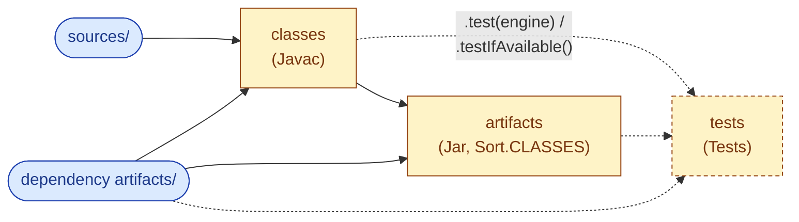
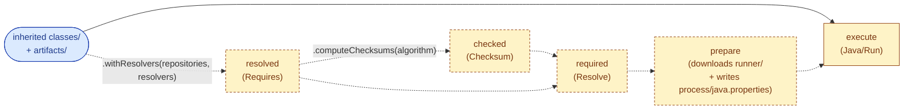
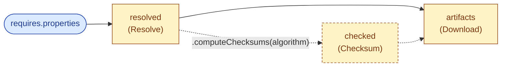
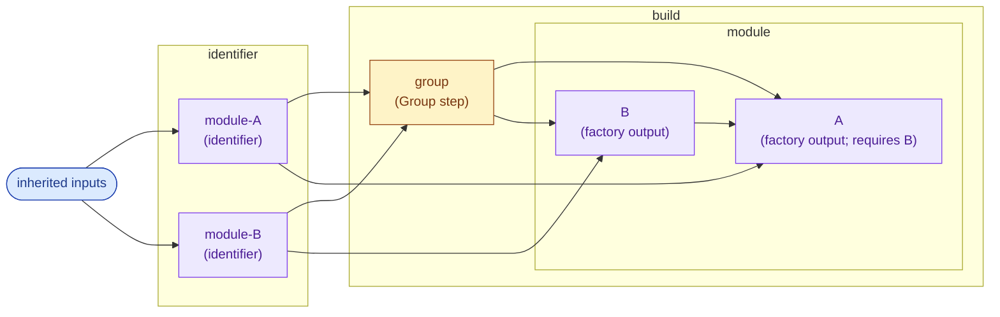
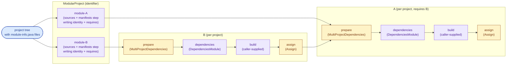

Jenesis
=======

Overview
--------

Jenesis is a proof-of-concept build tool for Java projects, written and configured in Java itself. A build is a
plain `.java` file that the user authors in their project's `build/` folder and launches with:

    java build/Main.java

The tool needs no installation, wrapper script, or precompiled binary; it relies on the JVM's ability to launch a
multi-file Java program directly from sources, and only on the Java standard library at runtime. The tool's own
sources are linked into the project alongside its `build/` script (or pulled in via Git submodules), so a build is
fully reproducible from a clone of the repository plus a JDK.

A build is described as a graph of *steps* and *modules*. Steps are individual units of work (compile, jar, resolve
dependencies, run tests, …) whose outputs are folders on disk; modules are reusable sub-graphs that wire several
steps together. The graph is executed in parallel, and every step's output folder is hashed: re-running the build
re-executes only the steps whose inputs have changed, so incremental builds fall out by construction.

Dependency declarations live outside the build script, in plain Java `.properties` files. Resolved dependency lists,
together with their checksums, are themselves expressible as properties and can be checked into source control.
This makes resolution deterministic and turns the dependency descriptor into a supply-chain artifact: a build won't
silently pick up a new transitive version, and a downloaded jar that doesn't match its checksum is rejected. There
is no hard dependency on Maven concepts. Maven is supported via `MavenRepository`/`MavenPomResolver`, but other
repositories and resolvers can be plugged in.

For IDE support, a `pom.xml` is kept alongside so the project opens, builds and debugs in any Maven-aware IDE.

Architecture
------------

The lowest primitive is a `BuildStep`, a single unit of work that reads from a set of input folders and writes
into a fresh output folder. It is a functional interface:

```java
CompletionStage<BuildStepResult> apply(Executor executor,
                                       BuildStepContext context,
                                       SequencedMap<String, BuildStepArgument> arguments);
```

Each invocation is handed a `BuildStepContext` and a map of predecessor outputs. The context holds three folder
slots:

- `next`: the folder this invocation writes into. It is created fresh for every run; the step never modifies any
  other folder.
- `previous`: the same step's output folder from the prior run, or `null` on a first run. A step can read it to
  decide what to copy or hard-link instead of regenerating, but it must not write into it.
- `supplement`: scratch space tied to the step's lifetime, available for intermediate files the step doesn't want
  to publish in `next`.

The `arguments` map carries one `BuildStepArgument` per registered predecessor. Each argument exposes the folder to
read from (`argument.folder()`) and a per-file checksum status (`ADDED`, `ALTERED`, `REMOVED`, `RETAINED`) computed
against the previous run. The default `shouldRun(...)` re-runs the step when any input has changed; a step can
override it to express finer-grained dependencies (e.g. `Bind` only re-runs when files matching its bound paths
changed, `Relocate` only when files under its declared prefixes changed).

Steps are organised into a graph by `BuildExecutor`:

- `addSource(name, path)` registers an external folder as an input.
- `addStep(name, BuildStep, predecessors…)` adds a step whose `arguments` will be populated from the named
  predecessors. Predecessors are addressed by their registered names; cross-module references use the `../` prefix
  (`BuildExecutorModule.PREVIOUS`) to climb out of the current sub-graph.
- `execute(selectors…)` runs the graph on a virtual-thread executor, scheduling each node as soon as its
  predecessors have completed. With no selectors, the full graph runs. Otherwise each selector is a slash-delimited
  path of identities (`module/step`) that restricts execution to the named steps and their preliminaries; `:`
  matches any one path segment and `::` matches any depth (zero or more). Wildcards are lenient — branches without
  a match are silently skipped — while a literal path that doesn't resolve throws.

  Once a step is matched, its **transitive preliminary closure** runs unconditionally (no further selector filtering)
  so its inputs are real folders, not lenient-skipped placeholders. Modules along the path are different from steps
  here: a module's `accept(...)` always runs (modules aren't cached), and `accept` is allowed to read its predecessor
  folders to wire its sub-graph dynamically. So whenever a module is reached by any selector — including via lenient
  `::` propagation — its step preliminaries are pinned and run normally (cache-checked but not lenient-skipped),
  guaranteeing those folders exist when `accept` reads them. Sibling modules whose subtree contains no match still
  have their `accept` invoked and their declared step preliminaries run; the engine can't determine "no match here"
  without descending, since module substructure is registered by `accept` itself. In practice this is a hash check
  per preliminary on a warm cache. If you know the path you want, prefer literal selectors (`module/step`) over
  `::/leaf` to avoid that residual work on unrelated subtrees.

A `BuildExecutorModule` is a sub-graph factory, also a functional interface, with
`accept(BuildExecutor, inherited)` populating a nested `BuildExecutor` with its own steps and (transitively) its
own sub-modules. The `inherited` map exposes the predecessor folders the parent passed in, addressed under their
`../`-prefixed identifiers. Modules can rename their published outputs by overriding `resolve(...)`. Composing
steps into modules turns commonly-recurring patterns (compile + jar + test, resolve + checksum + download, scan a
multi-project tree, …) into reusable units that take only their inputs as configuration.

Unlike steps, modules are not cached: `accept(...)` runs on every build to (re-)register its sub-graph, and only
the registered steps are then content-hashed and considered for skipping. Logic that lives inside the module body
itself — file scans, classpath assembly, conditional step wiring — therefore executes unconditionally on every
run; wrap it in a step if you need it skipped on unchanged inputs.

Three properties of the model give incremental builds and reproducibility for free:

- **Each step's output folder is immutable once produced.** A step only ever writes into its own `next`; downstream
  steps see predecessor outputs as read-only inputs. There is no shared mutable state, so a step's result is a pure
  function of its inputs.
- **Inputs and outputs are content-hashed.** Every output folder is checksummed when the step finishes; on the next
  run, those checksums become the predecessors' input checksums. If they all match and `shouldRun(...)` returns
  `false`, the step's previous output is reused unchanged. Anywhere along the chain that the hashes diverge (a
  source edit, an upstream re-run, a different dependency), the affected step (and only the affected step) is
  re-executed into a fresh `next` folder, which transparently replaces its predecessor.
- **Each step's configuration is content-hashed too.** `BuildStep extends Serializable`, and a
  `BuildStepHashFunction` digests the step's serialized form alongside the output checksums (in
  `<step>/checksum/step`). When a step is reconstructed with different field values — a different `Jar.Sort`,
  a different `Resolver`, a different placement function — its hash changes and the step re-runs even if its
  inputs are unchanged. Configuration that should *not* count as part of the build's identity (a `Repository` that
  by contract returns the same artifact for the same coordinate, a JDK service factory, a `MavenPomEmitter`) is
  marked `transient` so it never reaches the digest. Lambdas held by step fields use intersection bounds
  (`<T extends Function<…> & Serializable>`) at the constructor so the compiler generates them serializable;
  steps that hold non-serializable state simply fall back to a stable empty hash and don't false-invalidate.

The executor places a `.jenesis.build` marker at the build root so source scanners (`MavenProject`,
`ModularProject`) can skip nested builds, stores all per-step state under `target/`, and uses `cache/` by
convention for cross-build caches such as downloaded module URIs.

Conventional folders and files
------------------------------

Every step writes its output into `context.next()`. The conventions below define the names a step uses for the
artifacts it produces and the names downstream steps look for. The canonical names are constants on `BuildStep`;
others are declared next to the step that emits them.

| Path                       | Constant                         | Purpose                                                                                         |
| -------------------------- | -------------------------------- | ----------------------------------------------------------------------------------------------- |
| `sources/`                 | `BuildStep.SOURCES`              | A directory tree of `.java` source files (mirroring their package structure) consumed by compilation and documentation tooling, and packaged as-is into source jars.                                                                                  |
| `resources/`               | `BuildStep.RESOURCES`            | A directory tree of non-source files (configuration, message bundles, static assets) that should appear on the classpath alongside compiled classes and be embedded into produced jars.                                                              |
| `classes/`                 | `BuildStep.CLASSES`              | A directory tree of compiled `.class` files in their package layout, plus any non-source companion files copied verbatim from `sources/`. Forms a class- or module-path entry for downstream compilation, packaging and execution.                  |
| `artifacts/`               | `BuildStep.ARTIFACTS`            | A flat directory of jar files, either freshly produced as a packaging output or downloaded from an external repository. Each file forms a class- or module-path entry for downstream compilation and execution.                                     |
| `javadoc/`                 | `Javadoc.JAVADOC`                | A generated Javadoc tree (HTML, CSS and supporting resources), ready to be archived into a documentation jar or served as static content.                                                                                                            |
| `groups/`                  | `Group.GROUPS`                   | One `<encoded-group-name>.properties` file per identified group, listing the other groups whose coordinates the group transitively depends on so cross-project wiring can be derived purely from on-disk state.                                      |
| `pom/`                     | `MavenProject.POM`               | A mirror of the directory layout of a Maven multi-module project, with each `pom.xml` hard-linked from its original location to give downstream tooling a stable, sandboxed snapshot of the project's POM tree.                                      |
| `maven/`                   | `MavenProject.MAVEN`             | One properties file per discovered Maven module (`module-<encoded-path>.properties` for the main artifact, `test-module-<encoded-path>.properties` for the test artifact), holding the parsed coordinate, source/resource directories, packaging and dependency list extracted from a single `pom.xml`. |
| `identity.properties`      | `BuildStep.IDENTITY`             | `<prefix>/<coordinate>` keys (e.g. `maven/groupId/artifactId/[type/[classifier/]]version` or `module/<jpms-name>`) mapped to either an empty value (artifact not yet built; identifies the project's own coordinate) or the absolute filesystem path of an already-built jar.                          |
| `requires.properties`      | `BuildStep.REQUIRES`             | Same `<prefix>/<coordinate>` keys as `identity.properties`, mapped to either an empty value (still to be resolved or hashed) or an `<algorithm>/<hex>` content checksum that downstream consumers verify against the downloaded artifact.                                                             |
| `uris.properties`          | `DownloadModuleUris.URIS`        | `<prefix>/<jpms-module-name>` keys mapped to an absolute jar URL; populated from line-based `<module>=<url>` registries (default: sormuras/modules) and used during dependency resolution to translate a JPMS module name into a download URL.                                                        |
| `process/<command>.properties` | `ProcessBuildStep.PROCESS` (folder)  | Command-line fragments contributed to a downstream `ProcessBuildStep` whose tool name matches `<command>` (`java`, `javac`, `jar`, `javadoc`). Keys are flags (e.g. `--add-modules`); values are flag values, with literal `\n` inside a value emitting the same flag once per piece. Each input folder's file is processed independently and its entries are appended to the command line in folder order, so the same key in two folders becomes two flag instances. Values that name filesystem paths are written relative to the file's containing folder (paths are not resolved until the consumer step needs them), which keeps the on-disk content position-independent so build outputs can be relocated or shared between caches without rewriting.                                                                                          |
| `pom.xml`                  | `Pom.POM`                        | A generated Maven Project Object Model, ready to be packaged alongside a built jar so the artifact can be published to and consumed from any Maven-aware repository.                                                                                  |
| `target/`                  | (passed to `BuildExecutor.of`)   | The root folder under which every step's per-run output and the executor's incremental bookkeeping (output checksums and predecessor checksum snapshots used to decide whether a step needs to re-run) live. Safe to delete to force a clean build.   |
| `cache/`                   | by convention                    | A folder used for caches that outlive a single build, such as previously fetched JPMS module URI registries; cached entries are content-addressable and refreshed on demand by whatever produced them.                                                |
| `.jenesis.build`           | `BuildExecutor.BUILD_MARKER`     | An empty marker file placed at the root of an active build directory. Project-tree walkers honour it as a stop signal so nested builds aren't re-discovered as part of the parent build's project graph.                                              |

Build steps
-----------

The steps listed here are pre-implemented for convenience; the build tool itself does not depend on any of them, and a build is free to ignore them and supply its own `BuildStep` implementations.

| Step                       | What it does                                                                                                                                                                                   | Inputs (per predecessor folder)                                                                                                       | Outputs (under `context.next()`)                                                |
| -------------------------- |------------------------------------------------------------------------------------------------------------------------------------------------------------------------------------------------| ------------------------------------------------------------------------------------------------------------------------------------- | ------------------------------------------------------------------------------- |
| `Bind`                     | Hard-links files from each predecessor into a target layout under `context.next()`, driven by a `Map<Path, Path>` that mirrors specific subtrees under canonical names (used by the static factories `asSources()`, `asResources()`, `asIdentity(...)`, `asRequires(...)`). | a source folder, a named properties file, or any other predecessor subtree named in the map                                          | `sources/`, `resources/`, `identity.properties`, `requires.properties`, or any layout produced by the configured map |
| `Relocate`                 | Walks every file under each predecessor and asks a `Function<Path, Optional<Path>>` where (if anywhere) to hard-link it under `context.next()`; can be restricted to a `Set<Path>` of subtree prefixes for path-aware `shouldRun`. | every file in the predecessors (or only those under the configured prefixes)                                                          | whatever the placement function returns                                          |
| `Javac`                    | Compiles each predecessor's `sources/` with the `javac` tool, using their `classes/` and `artifacts/` as class- or module-path entries; writes the resulting `.class` files to `classes/`.    | `sources/`, `classes/`, `artifacts/`                                                                                                  | `classes/`                                                                       |
| `Jar`                      | Packages the folders selected by the configured `Jar.Sort` into a single jar under `artifacts/`.                                                                                               | per `Jar.Sort`: `CLASSES` reads `classes/` + `resources/`; `SOURCES` reads `sources/` + `resources/`; `JAVADOC` reads `javadoc/`         | `artifacts/classes.jar`, `artifacts/sources.jar`, or `artifacts/javadoc.jar` (depending on `Jar.Sort`) |
| `Javadoc`                  | Invokes the `javadoc` tool over each predecessor's `sources/` and writes the generated documentation tree to `javadoc/`.                                                                       | `sources/`                                                                                                                            | `javadoc/`                                                                       |
| `Java`                     | Runs `java` with each predecessor's `classes/`, `resources/` and the jars in `artifacts/` assembled into a class- and module-path; the entry point and command line are supplied by subclasses or `Java.of(...)`. | `classes/`, `resources/`, `artifacts/`                                                                                                | runs `java`; no canonical output                                                 |
| `Tests`                    | A `BuildExecutorModule` (described under *Build executor modules*) that scans each predecessor's `classes/` for test-named classes, runs them through a configured `TestEngine` via an internal `Java` subclass, and optionally fetches the runner on the side when `.withResolvers(...)` is set.   | `classes/`, `artifacts/`                                                                                                              | sub-steps: `resolved`, `checked` (optional), `required`, `prepare`, `execute`    |
| `Resolve`                  | Reads `requires.properties`, asks each prefixed group's `Resolver` for the transitive closure, and writes the resolved coordinates to a fresh `requires.properties`.                          | `requires.properties`                                                                                                                 | `requires.properties` (transitively resolved, per-prefix `Resolver`)             |
| `Checksum`                 | Reads `requires.properties`, fetches each unresolved coordinate from its `Repository`, and writes a new `requires.properties` where each empty value is replaced by `algorithm/<hex>`.        | `requires.properties`                                                                                                                 | `requires.properties` (with computed checksums)                                  |
| `Download`                 | Reads `requires.properties` and downloads each coordinate's artifact into `artifacts/`, validating against the recorded checksum where present and reusing a previous run's file when valid.  | `requires.properties`                                                                                                                 | `artifacts/<prefix>-<coordinate>.jar`, plus an empty `requires.properties`       |
| `Translate`                | Rewrites the keys of `requires.properties` through user-supplied per-prefix translator functions (e.g. JPMS module name → Maven coordinate).                                                  | `requires.properties`                                                                                                                 | `requires.properties` (keys remapped per-prefix)                                 |
| `Group`                    | Reads each predecessor's `identity.properties` and `requires.properties`; for each identified group, writes a `groups/<name>.properties` listing the other groups whose coordinates it depends on. | `identity.properties`, `requires.properties`                                                                                          | `groups/<encoded-name>.properties`                                               |
| `Assign`                   | Fills the empty values of `identity.properties` with paths to the jars in the predecessors' `artifacts/`, finalising the coordinate → file mapping.                                           | `identity.properties`, `artifacts/`                                                                                                   | `identity.properties` (empty values filled with artifact paths)                  |
| `DownloadModuleUris`       | Fetches the configured remote URL lists (default: the sormuras/modules registry) and concatenates them into a single `uris.properties`.                                                        | none (fetches the configured URLs)                                                                                                    | `uris.properties`                                                                |
| `MultiProjectDependencies` | Merges per-project `requires.properties` (and looks up sibling-project paths in their `identity.properties`) into one unified `requires.properties`, computing local-artifact checksums for any coordinates already built. | per-predecessor `identity.properties` or `requires.properties`, partitioned by predicate                                              | unified `requires.properties`, with checksums for resolved local artifacts       |
| `Pom`                      | Emits a Maven `pom.xml`, taking the project's own coordinate from the empty entry in `identity.properties` and its dependencies from `requires.properties` entries that share the same prefix. | `identity.properties` (self coordinate = empty value), `requires.properties`                                                          | `pom.xml`                                                                       |
| `Export`                   | Copies (and overwrites) files from each predecessor into an external target path through a `Function<Path, Optional<Path>>` placement, always re-runs (`shouldRun = true`); after copying it invokes an optional `Consumer<Path>` finalizer against the target. `MavenRepositoryLayout.toLocalRepository()` / `toRepository(Path)` ship a Maven-layout placement that writes `<groupId-as-path>/<artifactId>/<version>/<artifactId>-<version>.{jar,pom}` plus a finalizer that mirrors `mvn install` (writes `maven-metadata-local.xml` per artifact, `_remote.repositories` markers per version dir, and per-version snapshot metadata for `-SNAPSHOT` versions). | every file in the predecessors (only `classes.jar` / `pom.xml` for the Maven layout)                                                  | files copied under the configured target path; nothing is written under `context.next()` |

`ProcessBuildStep` and `Java` are abstract bases (used by `Javac`, `Jar`, `Javadoc`, and the inner `execute`
step of `Tests`); `Java.of(...)` gives an ad-hoc command runner. `DependencyTransformingBuildStep` is the shared base for `Resolve`, `Checksum`,
`Download`, and `Translate`; they all parse `requires.properties` into `(prefix, coordinate)` groups, transform
them, and write `requires.properties` back.

Before launching its tool, every `ProcessBuildStep` walks each input folder for `process/<command>.properties`
(where `<command>` is the tool name supplied to the constructor — `java`, `javac`, `jar`, `javadoc`), loads each
folder's file into its own map keyed by argument, and passes the per-folder maps to `process(...)`. Whatever the
subclass leaves behind in those maps is then materialised as command-line tokens prepended to the command line
the subclass produced, in folder order: each entry becomes a `--key value` pair, and `\n` inside a value emits
the same flag once per piece (so a predecessor can write `--add-modules=foo\nbar` to repeat a flag, and the same
key contributed by two predecessors yields two flag instances).

Path-shaped values are stored as paths relative to the file's containing folder and never resolved by
`ProcessBuildStep` itself — keeping the on-disk content position-independent in the same way `requires.properties`
does for coordinates. Resolution is the consumer's job. `Java` does this in its own per-folder iteration: in
addition to scanning each predecessor's `classes/`/`resources/`/`artifacts/`, it pulls `--module-path` and
`--class-path` entries out of that folder's properties map, splits each value on `\n`, resolves each piece against
the same `argument.folder()`, and folds the result into the path lists it ultimately joins with the platform
path-separator into a single `--module-path` / `-classpath` argument. Removing the keys from the per-folder map as
it consumes them keeps `ProcessBuildStep` from also materialising them as repeated flag instances the JVM would
treat as last-wins overrides.

`Export` is the one step that intentionally breaks two of the conventions that every other step holds to. Its
job is to publish a build's outputs outside the `target/` tree (e.g. into the user's local Maven repository, a
shared distribution folder, or a release staging directory), so it cannot honour the "immutable, content-hashed
output folder" invariant that drives incremental builds:

- **Writes outside `context.next()`.** The destination is supplied as a `Path` to the constructor and lives
  wherever the user wants it — `~/.m2/repository`, a network share, an existing distribution layout. Files are
  copied (not hard-linked, since the target may be on a different filesystem) and `REPLACE_EXISTING` always
  overwrites whatever is at the destination. `context.next()` itself is left empty.
- **Always re-runs.** `shouldRun(...)` returns `true`, so even if all inputs are unchanged the export is performed
  again. The reason is that the destination is outside the executor's control — anything could have edited or
  removed those files between builds — so the only safe assumption is that the export needs redoing every time.
  The step's serialized form is still hashed (config-aware cache invalidation still applies), but `consistent`
  results just shorten the diff status the placement function sees, not whether it runs.

The placement is the same `Function<Path, Optional<Path>>` shape `Relocate` uses: each visited file is mapped to
an `Optional<Path>` relative to the configured target, or skipped. `MavenRepositoryLayout.toLocalRepository()` and
`MavenRepositoryLayout.toRepository(Path)` ship a placement that consumes the canonical per-module output produced
by `Relocate(ModularProject.artifactsByModule())` (i.e. each sub-module folder contains both `classes.jar` and
`pom.xml`): for every visited file it reads the sibling `pom.xml`, parses `groupId`/`artifactId`/`version` out of
it, and routes the file to the standard Maven layout —

| File          | Maven destination                                       |
| ------------- | ------------------------------------------------------- |
| `classes.jar` | `<groupId-as-path>/<artifactId>/<version>/<artifactId>-<version>.jar` |
| `pom.xml`     | `<groupId-as-path>/<artifactId>/<version>/<artifactId>-<version>.pom` |

Files without a sibling `pom.xml` are skipped, so the same step can be pointed at a tree that mixes
multi-module output and arbitrary other content without false hits. After copying, the bundled finalizer
walks the target and writes the `mvn install`-equivalent metadata: a `maven-metadata-local.xml` per artifact
(`<release>` set to the highest non-SNAPSHOT version by Maven semantics, `<versions>` sorted ascending,
`<lastUpdated>` timestamp), an `_remote.repositories` marker per version directory, and a `modelVersion="1.1.0"`
`maven-metadata-local.xml` inside each `-SNAPSHOT` version directory listing per-extension/classifier
`<snapshotVersions>`. Unhandled today: checksum sidecars (`.sha1`/`.md5`), GPG signatures, classifier'd
artifacts (sources, javadoc, tests jars), and `<parent>` version inheritance — the `Pom` step always emits
an explicit `<version>`, so the last is fine in practice for artifacts produced by this build.

Build executor modules
----------------------

The modules listed here are pre-implemented for convenience; the build tool itself does not depend on any of them, and a build is free to ignore them and supply its own `BuildExecutorModule` implementations.

In every diagram below, blue rounded nodes are inputs (folders or files), yellow rectangles are steps, and
purple rectangles are nested sub-modules. Optional steps are connected with dashed edges; the edge label names
the method that enables them.

### `JavaModule`

Used for compiling and packaging a single Java module from its sources and its resolved dependencies. Calling
`.test(engine)` or `.testIfAvailable()` adds an extra `tests` sub-module that runs the compiled tests; the
`(repositories, resolvers)` overloads forward into `Tests.withResolvers(...)` so the test runner can be fetched
on the side instead of being a compile-time `requires` of the test module (see *`Tests`* below).



### `Tests`

A `BuildExecutorModule` that runs a configured `TestEngine` (e.g. JUnit 5) against the compiled tests of its
predecessors. The simple form adds only an `execute` step (`Java`) and expects the runner module to already be on
the inherited class- or module-path. Calling `withResolvers(repositories, resolvers)` instead fetches the runner
on the side, so the user never has to declare it as a compile-time `requires` of their test module:

- `resolved` (`Tests.Requires`) writes the runner's coordinate to `requires.properties`, picking the first entry in
  `TestEngine.coordinates()` whose `<prefix>` is served by one of the configured resolvers — `TestDefaultEngine.JUNIT5`
  ships both `module/org.junit.platform.console` and `maven/org.junit.platform/junit-platform-console/<version>`,
  so the same engine works across `Modular`, `ModularByMaven`, and `Manual`-style builds. If the runner is already
  visible on an input folder (`TestEngine.hasRunner(...)`), nothing is written.
- `checked` (`Checksum`, optional, only when `.computeChecksums(algorithm)` is set) fetches each unresolved
  coordinate from its `Repository` and rewrites `requires.properties` with `algorithm/<hex>` checksums.
- `required` (`Resolve`) expands that single coordinate into its transitive closure via the matching
  `Resolver`.
- `prepare` (`Tests.Prepare`) fetches each resolved coordinate via its `Repository` into a `runner/` subfolder of
  its output — deliberately not `artifacts/`, so the runner's jars stay invisible to a downstream `Assign` step
  that scans for module artifacts — and writes `process/java.properties` with `--module-path=<paths>` (paths
  separated by `\n`, recorded relative to the step's own output folder so they survive the temp-to-persistent move).
- `execute` (`Tests.Run` extends `Java`) honours the `-Djenesis.test=<patterns>` system property: a
  comma-separated list of Java regex entries, each `<classRegex>` or `<classRegex>#<methodName>`. Class entries are
  emitted via the engine's `prefix()` (e.g. JUnit 5's `-select-class=`); method entries via `methodPrefix()` (e.g.
  `-select-method=`). The property's value is part of the step's serialized state (so changing it invalidates
  the cache); when set, the step is also forced to re-run regardless of cache consistency. The step picks the
  properties file up via the standard `ProcessBuildStep`
  mechanism. `Java` consumes `--module-path` and `--class-path` entries in its own per-folder iteration,
  resolving each relative value against the same `argument.folder()` it scans for `classes/`/`artifacts/` and
  folding them into the same path lists, so they end up in a single combined `--module-path` / `-classpath`
  argument instead of repeated flag instances the JVM would treat as last-wins overrides.



### `DependenciesModule`

Used for resolving and downloading external dependencies declared in `requires.properties`. The pipeline runs
`Resolve` (transitive closure) → `Checksum` (content hashes; only when `.computeChecksums(algorithm)` is set)
→ `Download` (jars). Without checksums the `checked` step is skipped and `Download` reads directly from
`resolved`.



### `MultiProjectModule`

Used as the generic shape behind multi-project layouts. An *identifier* sub-module discovers the projects in a
source tree and writes their coordinates and dependencies; a `Group` step partitions the cross-project
dependency graph; a *factory* then assembles one sub-module per discovered project, wiring cross-project edges
between them. Each per-project closure receives a `ModuleDescriptor` exposing `name()` and `dependencies()`; the
concrete subtype (`ModularModuleDescriptor` or `MavenModuleDescriptor`) also exposes the standardised inherited
keys as helpers (`sources()`, `manifests()`, `artifacts()`, `checked()`), so a closure doesn't need to know how
the identifier laid out its outputs. The example below shows two projects `A` and `B` where `A` requires `B`,
so `B` is built first and its output flows into `A`.



### `MavenProject`

Used to drive a build from a Maven project layout. As the identifier inside a `MultiProjectModule`, it mirrors
every `pom.xml` into `pom/`, parses each into a per-module `maven/<path>.properties`, and emits one
`module-X` sub-module per discovered POM containing source folders, optional resource folders, and a
`manifests` step that writes the project's own coordinate (`identity.properties`) and its declared Maven
dependencies (`requires.properties`). `MavenProject.make(...)` returns the full wrapped `MultiProjectModule`
whose factory runs `prepare` (`MultiProjectDependencies`), `dependencies` (`DependenciesModule.computeChecksums`),
`build` (caller-supplied, typically `JavaModule`), and `assign` (`Assign`) for each project.


### `ModularProject`

Used to drive a build from a JPMS-modular project layout. As the identifier inside a `MultiProjectModule`, it
walks the source tree for `module-info.java` files and emits one sub-module per descriptor, each containing a
`sources` source and a `manifests` step that parses the descriptor and writes `identity.properties` plus
`requires.properties` from the JPMS `requires` directives. `ModularProject.make(...)` returns the full wrapped
`MultiProjectModule` whose factory runs `prepare` (`MultiProjectDependencies`), `dependencies`
(`DependenciesModule.computeChecksums`), `build` (caller-supplied, typically `JavaModule`), and `assign`
(`Assign`) for each project.



Configuration
-------------

The following system properties and environment variables tune the build at launch time.

| Name                    | Kind                | Effect                                                                                                                                                                                                                                |
| ----------------------- | ------------------- | ------------------------------------------------------------------------------------------------------------------------------------------------------------------------------------------------------------------------------------- |
| `jenesis.rebuild`       | system property     | When `true`, the build script (e.g. `Modules.java`) deletes `target/` before constructing the `BuildExecutor`, forcing a full re-run of every step.                                                                                  |
| `jenesis.debug`         | system property     | When `true`, the default `BuildExecutorCallback` prints per-step debug output (input/output checksum diffs, decisions to skip or re-run) instead of just the high-level status lines.                                                |
| `jenesis.test`          | system property     | When set, `Tests.execute` only emits selectors for classes (and optionally methods) matching the comma-separated regex entries `<classRegex>[#<method>]`. The value is part of the step's serialized state, and the step is forced to re-run regardless of cache consistency. |
| `MAVEN_REPOSITORY_URI`  | environment variable| Overrides the default `MavenDefaultRepository` upstream URL (`https://repo1.maven.org/maven2/`). Useful for pointing at an internal mirror; a trailing slash is added automatically if missing.                                       |
| `JAVA_HOME`             | environment variable| Consulted by `ProcessBuildStep`/`ProcessHandler` to locate the `java`/`javac`/`javadoc` binaries when the `java.home` system property is not set (typical when launching from a non-JDK runtime).                                     |

Properties are passed on the JVM command line, e.g.

    java -Djenesis.rebuild=true build/Modules.java

### Selectors on the command line

The build script forwards its `String[] args` to `BuildExecutor.execute(...)` (e.g. `root.execute(args)` in
`build/Modular.java`), so any positional arguments after the build file are interpreted as selectors. With no
arguments, the full graph runs.

| Invocation                                | What runs                                                                                                                                                       |
| ----------------------------------------- | --------------------------------------------------------------------------------------------------------------------------------------------------------------- |
| `java build/Modular.java`                 | Whole graph. On a warm cache, every step is `[SKIPPED]`.                                                                                                        |
| `java build/Modular.java ::/test`         | Every `test` sub-module at any depth, plus its transitive preliminary closure. Modules along the path have their step preliminaries cache-checked; sibling sub-graphs that happen to be scheduled by `::` lenient-skip. |
| `java build/Modular.java build/::/test`   | Same, but anchored under the top-level `build` module. Top-level entries that aren't on the path to `build` (e.g. the `collect` step that depends on `build`) are not scheduled at all.                  |
| `java -Djenesis.test='.*FooTest' build/Modular.java ::/test` | Same selector, but `Tests.execute` re-runs unconditionally and only selects classes matching the regex; upstream `classes`/`artifacts` etc. stay cached. |

A literal selector that doesn't resolve throws (`Unknown selector: …`). Wildcards (`:` and `::`) are lenient — they
silently skip branches with no match — but as a result they over-schedule sibling subtrees: their modules' `accept`
runs and their declared step preliminaries are pinned for safety. Prefer literal paths when you know them.

Implementation details
----------------------

### `BuildExecutor`

`BuildExecutor` is the engine that owns one level of the graph. It does two things in sequence: collect
*registrations* into an ordered map, then *execute* that map under a set of selectors. The same class plays both
roles at every nesting depth — a module is implemented as a child `BuildExecutor` whose `target` directory is a
subfolder of its parent's and whose `location` prefix is "parent-path/", so log lines and error messages stay
addressable as slash-delimited paths.

**Registrations.** Every `addSource`/`addStep`/`addModule` call funnels into the private `add(...)` helper, which
stores a `Registration(Bound bound, Set<String> preliminaries, Map<String, String> dependencies)` keyed by the
caller-supplied identity. `dependencies` is the raw declaration (which may contain slashes for paths into
sub-modules); `preliminaries` is the derived set of *top-level* identifiers the registration depends on (the
substring before the first slash). Preliminaries drive scheduling order; dependencies drive how predecessor
summaries are filtered into a registration's input map. Sources reach the same code path: a source is a step that
publishes a fixed folder.

**`Bound`.** Each registration carries a `Bound`, a tiny internal interface with a single `apply(...)` method that
returns a `CompletionStage<Map<String, Map<String, StepSummary>>>` — the outer map's single key is the
registration's identity, the inner map is its published outputs (one entry per leaf for steps; potentially many,
keyed by sub-paths, for modules). `Bound` also carries a `module()` flag (default `false`, overridden to `true` by
`bindModule`). The flag is the only externally-visible distinction between steps and modules at execution time;
everything else falls out of `Bound.apply`'s behavior.

**`bindStep`.** Wraps a `BuildStep` in a `Bound` whose `apply` does the per-step caching. On entry it bails early
with an empty result if any forwarded selector reaches it (so lenient-skipping costs nothing). Otherwise it locates
the step's persistent folder under `target/<urlencoded-identity>/`, reads the previously written input checksums and
step-config hash, and computes `consistent` by comparing them against the current step-config hash and the current
output folder's contents. If `consistent && !shouldRun(arguments)`, the cached output is returned as-is. Otherwise
the step runs into a fresh temp directory; on success the temp directory atomically replaces the persistent folder
(or, if the step set `BuildStepResult.next() == false`, the temp is deleted and the previous run is reused).
Crashed runs always delete the temp.

**`bindModule`.** Wraps a `BuildExecutorModule` in a `Bound` whose `apply` is *not* short-circuited by selectors —
modules always run their `accept(buildExecutor, folders)` to register a sub-graph. The child `BuildExecutor` it
hands to `accept` shares the parent's hash functions and callback, but has its own `target` subfolder and its own
empty `registrations`. After `accept` returns, the child's `doExecute(...)` is invoked with the same selectors that
reached the parent module, so filtering descends with the user's selector intact. Each result published by the
child is run through the module's optional `resolver` to give the parent its public name.

**`doExecute`.** The selector resolver. It produces three sets: `scheduled` (registrations that will be dispatched
in this level), `pinned` (registrations whose preliminary chain must run unconditionally), and `direct`
(registrations that should not receive any forwarded selectors). It also produces a `forwarded` map of selectors
to pass into each registration:

- A literal first segment matching a registration name pins it. With no tail, it also goes into `direct`. With a
  tail, the tail is forwarded.
- `:` and `::` schedule every registration at this level. With no tail, all are pinned and direct. With a tail,
  the descend selector is forwarded to all and (for `::`) the tail is also re-queued so it can match at this depth.
- A literal first segment with no matching registration throws unless the selector is lenient.

After the queue drains, two passes pin preliminaries: every preliminary of any pinned registration is added to
`scheduled`, `direct`, and `pinned`, transitively. The second pass adds every *scheduled module* to `pinned` so
the same walk picks up the module's step preliminaries — this is what guarantees a module's `accept` finds its
predecessor folders even when the selector reached it only via lenient propagation. Finally, registrations in
`direct` have their forwarded selectors stripped, so they execute unconditionally instead of lenient-skipping.

Dispatch is then a topological loop: pick scheduled entries whose preliminaries have all been dispatched, build
their input map by translating each declared dependency into a `StepSummary` (cross-module dependencies via the
inherited map, intra-level dependencies by name, sub-path dependencies by exact path lookup into the predecessor's
published outputs), and call `bound.apply(...)` on the executor. Results are collected per-registration in
`dispatched`; the final result is the union of all top-level published summaries.

**Caching invariants.** Three things have to match for a step to be reused: the step's *configuration hash* (a
digest of `ObjectOutputStream.writeObject(step)`), the *predecessor input checksums* (compared against what was
recorded on the previous run), and the *current output folder* (re-hashed and compared against the previously
written `checksums` file). A divergence anywhere — a constructor field changed, a predecessor produced different
bytes, the output was tampered with — flips `consistent` to `false` and the step re-runs. Selectors are *not* part
of the hash; they only gate scheduling, so a step that runs under selectors produces the same cached output a full
build would have, and subsequent unselected runs hit the cache as expected.

### Java support

Generic infrastructure (`BuildExecutor`, `BuildStep`, `BuildExecutorModule`) doesn't know anything about Java. The
Java-specific classes are a thin layer of `BuildStep`/`BuildExecutorModule` implementations that plug into it.

- **`ProcessBuildStep`** is the abstract base for every step that shells out to an external command. Subclasses
  return their command-line via `process(...)`; the base class assembles the process, captures stdout/stderr,
  validates the exit code, and reports a `BuildStepResult`. It also defines the `process/<name>.properties`
  convention used by upstream steps to inject command-line arguments (see `Tests.Prepare`, which writes
  `process/java.properties` with `--module-path=…`).
- **`JdkProcessBuildStep`** extends `ProcessBuildStep` with a single twist: it serializes `Runtime.version()`
  into its config hash so a JDK upgrade invalidates every cached `javac`/`java`/`javadoc` output without any
  per-step opt-in.
- **`ProcessHandler`** wraps the actual invocation (forked `Process` or in-process `ToolProvider` call). The
  factory function passed to a step's constructor decides which: `Javac.tool()` runs `javac` in-process via
  `java.util.spi.ToolProvider`; `Javac.process()` forks. The same split exists for `Jar` and `Javadoc`.
- **`Javac`, `Jar`, `Javadoc`, `Java`** are the concrete tool drivers. They consume the conventional folders
  (`sources/`, `classes/`, `resources/`, `artifacts/`) and produce the conventional outputs documented in the
  *Conventional folders and files* section.
- **`Tests`** is a `BuildExecutorModule` that wires `Java` into a runner. `TestEngine` and `TestDefaultEngine`
  encode per-framework metadata (main class, command-line prefix for selecting classes/methods, marker class
  used to detect the framework on the classpath, optional Maven coordinates of the runner). New frameworks slot
  in by implementing `TestEngine`.
- **`JavaModule`** is the canonical `BuildExecutorModule` for "compile sources, package as a jar, optionally run
  tests". It delegates to `Javac`, `Jar`, and `Tests`. Build scripts that don't have multi-project structure
  (`Minimal.java`, `Manual.java`) wire it directly.
- **`ModuleInfoParser` / `ModuleInfo`** read JPMS `module-info.class` straight from bytecode (no class loading)
  and surface the module name and `requires` set — including `requires transitive`, `requires static`, and
  `requires static transitive`.
- **`ModularJarResolver`** is a `Resolver` (the generic resolution interface) backed by `ModuleInfoParser`. It
  walks each candidate jar's `module-info`, follows the `requires` edges into a transitive closure, and emits
  resolved coordinates. JPMS rules differ from Maven's (no version conflict resolution; transitivity is opt-in
  per `requires transitive`), so the resolver is small but distinct.
- **`DownloadModuleUris`** is a `BuildStep` that materializes a properties file mapping module name → URI.
  `Modular.java` and similar scripts feed it the `sormuras/modules` registry plus a project-local override.
- **`ModularProject`** is the equivalent of `MavenProject` but for module-based multi-project builds: it walks
  a directory tree, identifies modules from their `module-info.java`, and registers a `JavaModule` per module
  via `MultiProjectModule`.

The wiring pattern is uniform: anything Java-specific that runs as part of a step is a `BuildStep` (cached on
config hash + I/O); anything that wires sub-graphs is a `BuildExecutorModule`; anything that resolves
coordinates implements `Resolver`. The generic infrastructure treats all three as opaque.

### Maven support

Maven support is layered on top of the same generic interfaces, with one extra wrinkle: Maven repositories
serve POMs in addition to artifacts, so they get a refined `Repository` interface.

- **`MavenRepository`** extends the generic `Repository` with `fetchMetadata(groupId, artifactId, version)`
  returning an `InputStream` over the POM. Implementations: `MavenDefaultRepository` (HTTP, with on-disk cache
  in `cache/`) and any user-supplied subclass (e.g. an internal Nexus mirror). The `MAVEN_REPOSITORY_URI`
  environment variable overrides the default upstream URL.
- **`Pom`** is a `BuildStep` that emits or transforms `pom.xml` files in the build graph (used by
  `MavenProject`'s scan/prepare flow).
- **`MavenPomEmitter`** is a stateless serializer: takes a `Pom` model and writes a `pom.xml`. Used both for
  publishing and for materializing per-module POMs during multi-project builds.
- **`MavenPomResolver`** is the resolver. Implements `Resolver` and is the densest piece of code in the repo:
  parses POMs (with parent inheritance), applies dependency-management overrides, walks the transitive closure
  with Maven's nearest-wins version conflict resolution, honors `<exclusions>`, distinguishes `compile`/`runtime`
  /`provided`/`test` scopes (and prunes them per Maven's transitive-scope rules), and resolves BOM (`pom`-type)
  imports. The output is a flat list of resolved coordinates that downstream steps (`Checksum`, `Download`)
  consume.
- **`MavenDependencyKey` / `MavenDependencyName` / `MavenDependencyValue` / `MavenDependencyScope`** are the
  data records the resolver operates on. `Key` is the conflict-resolution identity (groupId+artifactId+type
  +classifier, version excluded so the resolver can pick one); `Name` is `groupId+artifactId` for BOM/parent
  lookups; `Value` carries everything else (version, scope, optional, exclusions).
- **`MavenLocalPom`** captures a parsed POM (coordinates, parent, dependencies, dependency-management,
  properties). The resolver expands these lazily.
- **`MavenVersionNegotiator` / `MavenDefaultVersionNegotiator`** handle Maven's version-range syntax
  (`[1.0,2.0)`, `LATEST`, `RELEASE`, etc.) — picking a concrete version from a candidate list per the rules
  described in the Maven version comparison spec.
- **`MavenRepositoryLayout`** is a `Function<Path, Optional<Path>>` that maps a coordinate-named file (e.g.
  `maven-org.junit.jupiter-junit-jupiter-5.10.0.jar`) into the Maven local-repo layout
  (`org/junit/jupiter/junit-jupiter/5.10.0/junit-jupiter-5.10.0.jar`). It plugs into `Relocate` to materialize
  a local Maven repository alongside the build's normal artifact folder.
- **`MavenUriParser`** maps coordinate strings to/from URI form, used by repository implementations.
- **`MavenModuleDescriptor`** is `MavenProject`'s implementation of `ModuleDescriptor` — the bridge between
  Maven's per-module data and `MultiProjectModule`'s generic factory contract.
- **`MavenProject`** is the `BuildExecutorModule` entry point: scans a directory tree of `pom.xml` files,
  produces one `MavenModuleDescriptor` per module, and feeds them into `MultiProjectModule` along with a
  `JavaModule` factory. The scan is itself a step (`Pom`) so it caches; the per-module wiring runs in
  `MultiProjectModule`'s body each build.

Same uniform pattern as Java support: `BuildStep` for cached units of work, `BuildExecutorModule` for sub-graph
wiring, `Resolver`/`Repository` for dependency lookup. A user wiring Maven into a build never touches the
resolver mechanics directly — they pass a `Map<String, Resolver>` keyed by prefix (`"maven"`, `"module"`) to
`JavaModule.testIfAvailable(...)` or `DependenciesModule`, and the generic infrastructure dispatches
coordinates to the right resolver by prefix.

Status
------

Jenesis is still a proof of concept. Pieces still on the to-do list:

- Evaluate module to publish to Maven Central. Full deployment might be out of scope for a build tool, from a conceptual point of view. Building and releasing are two different things.
- Extending all build step implementations to expose their full set of standard options. (Evaluate configuration through properties file by previous steps).
- High-level builder for Project with defaults as default entry point.
- Add support for external plugin steps via repository.
- Consider automatic wrapping of build in Docker.
- Fix different TODOs within the project.
