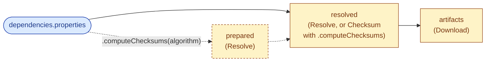
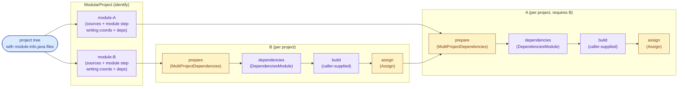

Jenesis
=======

Overview
--------

Jenesis is a proof-of-concept build tool for Java projects, written and configured in Java itself. A build is a
plain `.java` file that the user authors in their project's `build/` folder and launches with:

    java build/Main.java

The tool needs no installation, wrapper script, or precompiled binary; it relies on the JVM's ability to launch a
multi-file Java program directly from sources, and only on the Java standard library at runtime. The tool's own
sources are linked into the project alongside its `build/` script (or pulled in via Git submodules), so a build is
fully reproducible from a clone of the repository plus a JDK.

A build is described as a graph of *steps* and *modules*. Steps are individual units of work (compile, jar, resolve
dependencies, run tests, …) whose outputs are folders on disk; modules are reusable sub-graphs that wire several
steps together. The graph is executed in parallel, and every step's output folder is hashed: re-running the build
re-executes only the steps whose inputs have changed, so incremental builds fall out by construction.

Dependency declarations live outside the build script, in plain Java `.properties` files. Resolved dependency lists,
together with their checksums, are themselves expressible as properties and can be checked into source control.
This makes resolution deterministic and turns the dependency descriptor into a supply-chain artifact: a build won't
silently pick up a new transitive version, and a downloaded jar that doesn't match its checksum is rejected. There
is no hard dependency on Maven concepts. Maven is supported via `MavenRepository`/`MavenPomResolver`, but other
repositories and resolvers can be plugged in.

For IDE support, a `pom.xml` is kept alongside so the project opens, builds and debugs in any Maven-aware IDE.

Architecture
------------

The lowest primitive is a `BuildStep`, a single unit of work that reads from a set of input folders and writes
into a fresh output folder. It is a functional interface:

```java
CompletionStage<BuildStepResult> apply(Executor executor,
                                       BuildStepContext context,
                                       SequencedMap<String, BuildStepArgument> arguments);
```

Each invocation is handed a `BuildStepContext` and a map of predecessor outputs. The context holds three folder
slots:

- `next`: the folder this invocation writes into. It is created fresh for every run; the step never modifies any
  other folder.
- `previous`: the same step's output folder from the prior run, or `null` on a first run. A step can read it to
  decide what to copy or hard-link instead of regenerating, but it must not write into it.
- `supplement`: scratch space tied to the step's lifetime, available for intermediate files the step doesn't want
  to publish in `next`.

The `arguments` map carries one `BuildStepArgument` per registered predecessor. Each argument exposes the folder to
read from (`argument.folder()`) and a per-file checksum status (`ADDED`, `CHANGED`, `REMOVED`, `RETAINED`) computed
against the previous run. The default `shouldRun(...)` re-runs the step when any input has changed; a step can
override it to express finer-grained dependencies (e.g. `Bind` only re-runs when files matching its bound paths
changed).

Steps are organised into a graph by `BuildExecutor`:

- `addSource(name, path)` registers an external folder as an input.
- `addStep(name, BuildStep, predecessors…)` adds a step whose `arguments` will be populated from the named
  predecessors. Predecessors are addressed by their registered names; cross-module references use the `../` prefix
  (`BuildExecutorModule.PREVIOUS`) to climb out of the current sub-graph.
- `execute()` runs the graph on a virtual-thread executor, scheduling each node as soon as its predecessors have
  completed.

A `BuildExecutorModule` is a sub-graph factory, also a functional interface, with
`accept(BuildExecutor, inherited)` populating a nested `BuildExecutor` with its own steps and (transitively) its
own sub-modules. The `inherited` map exposes the predecessor folders the parent passed in, addressed under their
`../`-prefixed identifiers. Modules can rename their published outputs by overriding `resolve(...)`. Composing
steps into modules turns commonly-recurring patterns (compile + jar + test, resolve + checksum + download, scan a
multi-project tree, …) into reusable units that take only their inputs as configuration.

Two properties of the model give incremental builds and reproducibility for free:

- **Each step's output folder is immutable once produced.** A step only ever writes into its own `next`; downstream
  steps see predecessor outputs as read-only inputs. There is no shared mutable state, so a step's result is a pure
  function of its inputs.
- **Inputs and outputs are content-hashed.** Every output folder is checksummed when the step finishes; on the next
  run, those checksums become the predecessors' input checksums. If they all match and `shouldRun(...)` returns
  `false`, the step's previous output is reused unchanged. Anywhere along the chain that the hashes diverge (a
  source edit, an upstream re-run, a different dependency), the affected step (and only the affected step) is
  re-executed into a fresh `next` folder, which transparently replaces its predecessor.

The executor places a `.jenesis.build` marker at the build root so source scanners (`MavenProject`,
`ModularProject`) can skip nested builds, stores all per-step state under `target/`, and uses `cache/` by
convention for cross-build caches such as downloaded module URIs.

Conventional folders and files
------------------------------

Every step writes its output into `context.next()`. The conventions below define the names a step uses for the
artifacts it produces and the names downstream steps look for. The canonical names are constants on `BuildStep`;
others are declared next to the step that emits them.

| Path                       | Constant                         | Purpose                                                                                         |
| -------------------------- | -------------------------------- | ----------------------------------------------------------------------------------------------- |
| `sources/`                 | `BuildStep.SOURCES`              | A directory tree of `.java` source files (mirroring their package structure) consumed by compilation and documentation tooling, and packaged as-is into source jars.                                                                                  |
| `resources/`               | `BuildStep.RESOURCES`            | A directory tree of non-source files (configuration, message bundles, static assets) that should appear on the classpath alongside compiled classes and be embedded into produced jars.                                                              |
| `classes/`                 | `BuildStep.CLASSES`              | A directory tree of compiled `.class` files in their package layout, plus any non-source companion files copied verbatim from `sources/`. Forms a class- or module-path entry for downstream compilation, packaging and execution.                  |
| `artifacts/`               | `BuildStep.ARTIFACTS`            | A flat directory of jar files, either freshly produced as a packaging output or downloaded from an external repository. Each file forms a class- or module-path entry for downstream compilation and execution.                                     |
| `javadoc/`                 | `Javadoc.JAVADOC`                | A generated Javadoc tree (HTML, CSS and supporting resources), ready to be archived into a documentation jar or served as static content.                                                                                                            |
| `groups/`                  | `Group.GROUPS`                   | One `<encoded-group-name>.properties` file per identified group, listing the other groups whose coordinates the group transitively depends on so cross-project wiring can be derived purely from on-disk state.                                      |
| `pom/`                     | `MavenProject.POM`               | A mirror of the directory layout of a Maven multi-module project, with each `pom.xml` hard-linked from its original location to give downstream tooling a stable, sandboxed snapshot of the project's POM tree.                                      |
| `maven/`                   | `MavenProject.MAVEN`             | One properties file per discovered Maven module (`module-<encoded-path>.properties` for the main artifact, `test-module-<encoded-path>.properties` for the test artifact), holding the parsed coordinate, source/resource directories, packaging and dependency list extracted from a single `pom.xml`. |
| `coordinates.properties`   | `BuildStep.COORDINATES`          | `<prefix>/<coordinate>` keys (e.g. `maven/groupId/artifactId/[type/[classifier/]]version` or `module/<jpms-name>`) mapped to either an empty value (artifact not yet built; identifies the project's own coordinate) or the absolute filesystem path of an already-built jar.                          |
| `dependencies.properties`  | `BuildStep.DEPENDENCIES`         | Same `<prefix>/<coordinate>` keys as `coordinates.properties`, mapped to either an empty value (still to be resolved or hashed) or an `<algorithm>/<hex>` content checksum that downstream consumers verify against the downloaded artifact.                                                          |
| `uris.properties`          | `DownloadModuleUris.URIS`        | `<prefix>/<jpms-module-name>` keys mapped to an absolute jar URL; populated from line-based `<module>=<url>` registries (default: sormuras/modules) and used during dependency resolution to translate a JPMS module name into a download URL.                                                        |
| `pom.xml`                  | `Pom.POM`                        | A generated Maven Project Object Model, ready to be packaged alongside a built jar so the artifact can be published to and consumed from any Maven-aware repository.                                                                                  |
| `target/`                  | (passed to `BuildExecutor.of`)   | The root folder under which every step's per-run output and the executor's incremental bookkeeping (output checksums and predecessor checksum snapshots used to decide whether a step needs to re-run) live. Safe to delete to force a clean build.   |
| `cache/`                   | by convention                    | A folder used for caches that outlive a single build, such as previously fetched JPMS module URI registries; cached entries are content-addressable and refreshed on demand by whatever produced them.                                                |
| `.jenesis.build`           | `BuildExecutor.BUILD_MARKER`     | An empty marker file placed at the root of an active build directory. Project-tree walkers honour it as a stop signal so nested builds aren't re-discovered as part of the parent build's project graph.                                              |

Build steps
-----------

The steps listed here are pre-implemented for convenience; the build tool itself does not depend on any of them, and a build is free to ignore them and supply its own `BuildStep` implementations.

| Step                       | What it does                                                                                                                                                                                   | Inputs (per predecessor folder)                                                                                                       | Outputs (under `context.next()`)                                                |
| -------------------------- |------------------------------------------------------------------------------------------------------------------------------------------------------------------------------------------------| ------------------------------------------------------------------------------------------------------------------------------------- | ------------------------------------------------------------------------------- |
| `Bind`                     | Hard-links files from each predecessor into a target layout under `context.next()`, driven by a `Map<Path, Path>` that mirrors specific subtrees under canonical names (used by the static factories `asSources()`, `asResources()`, `asCoordinates(...)`, `asDependencies(...)`). | a source folder, a named properties file, or any other predecessor subtree named in the map                                          | `sources/`, `resources/`, `coordinates.properties`, `dependencies.properties`, or any layout produced by the configured map |
| `Relocate`                 | Walks every file under each predecessor and asks a `Function<Path, Optional<Path>>` where (if anywhere) to hard-link it under `context.next()`; can be restricted to a `Set<Path>` of subtree prefixes for path-aware `shouldRun`. | every file in the predecessors (or only those under the configured prefixes)                                                          | whatever the placement function returns                                          |
| `Javac`                    | Compiles each predecessor's `sources/` with the `javac` tool, using their `classes/` and `artifacts/` as class- or module-path entries; writes the resulting `.class` files to `classes/`.    | `sources/`, `classes/`, `artifacts/`                                                                                                  | `classes/`                                                                       |
| `Jar`                      | Packages the folders selected by the configured `Jar.Sort` into a single jar under `artifacts/`.                                                                                               | per `Jar.Sort`: `CLASSES` reads `classes/` + `resources/`; `SOURCES` reads `sources/` + `resources/`; `JAVADOC` reads `javadoc/`         | `artifacts/classes.jar`, `artifacts/sources.jar`, or `artifacts/javadoc.jar` (depending on `Jar.Sort`) |
| `Javadoc`                  | Invokes the `javadoc` tool over each predecessor's `sources/` and writes the generated documentation tree to `javadoc/`.                                                                       | `sources/`                                                                                                                            | `javadoc/`                                                                       |
| `Java`                     | Runs `java` with each predecessor's `classes/`, `resources/` and the jars in `artifacts/` assembled into a class- and module-path; the entry point and command line are supplied by subclasses or `Java.of(...)`. | `classes/`, `resources/`, `artifacts/`                                                                                                | runs `java`; no canonical output                                                 |
| `Tests`                    | Specialisation of `Java` that scans each predecessor's `classes/` for test-named classes and hands them to a configured `TestEngine` (e.g. JUnit 5), with `artifacts/` on the runtime path.    | inherits `Java`; selects test classes from `classes/`                                                                                 | runs the configured `TestEngine`                                                 |
| `Resolve`                  | Reads `dependencies.properties`, asks each prefixed group's `Resolver` for the transitive closure, and writes the resolved coordinates to a fresh `dependencies.properties`.                   | `dependencies.properties`                                                                                                             | `dependencies.properties` (transitively resolved, per-prefix `Resolver`)         |
| `Checksum`                 | Reads `dependencies.properties`, fetches each unresolved coordinate from its `Repository`, and writes a new `dependencies.properties` where each empty value is replaced by `algorithm/<hex>`.  | `dependencies.properties`                                                                                                             | `dependencies.properties` (with computed checksums)                              |
| `Download`                 | Reads `dependencies.properties` and downloads each coordinate's artifact into `artifacts/`, validating against the recorded checksum where present and reusing a previous run's file when valid. | `dependencies.properties`                                                                                                             | `artifacts/<prefix>-<coordinate>.jar`, plus an empty `dependencies.properties`   |
| `Translate`                | Rewrites the keys of `dependencies.properties` through user-supplied per-prefix translator functions (e.g. JPMS module name → Maven coordinate).                                               | `dependencies.properties`                                                                                                             | `dependencies.properties` (keys remapped per-prefix)                             |
| `Group`                    | Reads each predecessor's `coordinates.properties` and `dependencies.properties`; for each identified group, writes a `groups/<name>.properties` listing the other groups whose coordinates it depends on. | `coordinates.properties`, `dependencies.properties`                                                                                   | `groups/<encoded-name>.properties`                                               |
| `Assign`                   | Fills the empty values of `coordinates.properties` with paths to the jars in the predecessors' `artifacts/`, finalising the coordinate → file mapping.                                         | `coordinates.properties`, `artifacts/`                                                                                                | `coordinates.properties` (empty values filled with artifact paths)               |
| `DownloadModuleUris`       | Fetches the configured remote URL lists (default: the sormuras/modules registry) and concatenates them into a single `uris.properties`.                                                        | none (fetches the configured URLs)                                                                                                    | `uris.properties`                                                                |
| `MultiProjectDependencies` | Merges per-project `dependencies.properties` (and looks up sibling-project paths in their `coordinates.properties`) into one unified `dependencies.properties`, computing local-artifact checksums for any coordinates already built. | per-predecessor `coordinates.properties` or `dependencies.properties`, partitioned by predicate                                        | unified `dependencies.properties`, with checksums for resolved local artifacts   |
| `Pom`                      | Emits a Maven `pom.xml`, taking the project's own coordinate from the empty entry in `coordinates.properties` and its dependencies from `dependencies.properties` entries that share the same prefix. | `coordinates.properties` (self coordinate = empty value), `dependencies.properties`                                                   | `pom.xml`                                                                       |

`ProcessBuildStep` and `Java` are abstract bases (used by `Javac`, `Jar`, `Javadoc`, and `Tests`); `Java.of(...)`
gives an ad-hoc command runner. `DependencyTransformingBuildStep` is the shared base for `Resolve`, `Checksum`,
`Download`, and `Translate`; they all parse `dependencies.properties` into `(prefix, coordinate)` groups, transform
them, and write `dependencies.properties` back.

Build executor modules
----------------------

The modules listed here are pre-implemented for convenience; the build tool itself does not depend on any of them, and a build is free to ignore them and supply its own `BuildExecutorModule` implementations.

In every diagram below, blue rounded nodes are inputs (folders or files), yellow rectangles are steps, and
purple rectangles are nested sub-modules. Optional steps are connected with dashed edges; the edge label names
the method that enables them.

### `JavaModule`

Used for compiling and packaging a single Java module from its sources and its resolved dependencies. Calling
`.test(engine)` or `.testIfAvailable()` adds an extra step that runs the compiled tests.


### `DependenciesModule`

Used for resolving and downloading external dependencies declared in `dependencies.properties`. Calling
`.computeChecksums(algorithm)` inserts an extra `prepared` step so that resolution and content-hashing are
recorded before the artifacts are fetched, making the dependency set verifiable on subsequent builds.



### `MultiProjectModule`

Used as the generic shape behind multi-project layouts. An *identifier* sub-module discovers the projects in a
source tree and writes their coordinates and dependencies; a `Group` step partitions the cross-project
dependency graph; a *factory* then assembles one sub-module per discovered project, wiring cross-project edges
between them. The example below shows two projects `A` and `B` where `A` requires `B`, so `B` is built first
and its output flows into `A`.


### `MavenProject`

Used to drive a build from a Maven project layout. As the identifier inside a `MultiProjectModule`, it mirrors
every `pom.xml` into `pom/`, parses each into a per-module `maven/<path>.properties`, and emits one
`module-X` sub-module per discovered POM containing source folders, optional resource folders, and a `declare`
step that writes the project's own coordinate and its resolved Maven dependencies. `MavenProject.make(...)`
returns the full wrapped `MultiProjectModule` whose factory runs `prepare` (`MultiProjectDependencies`),
`dependencies` (`DependenciesModule.computeChecksums`), `build` (caller-supplied, typically `JavaModule`), and
`assign` (`Assign`) for each project.

```mermaid
flowchart LR
  classDef input fill:#dbeafe,stroke:#1e40af,color:#1e3a8a;
  classDef step fill:#fef3c7,stroke:#92400e,color:#78350f;
  classDef module fill:#ede9fe,stroke:#7c3aed,color:#4c1d95;
  tree(["project tree<br/>with pom.xml files"]):::input
  subgraph "MavenProject (identify)"
    direction LR
    scan["scan<br/>(mirrors pom.xml<br/>into pom/)"]:::step
    prepare["prepare<br/>(writes maven/*.properties)"]:::step
    subgraph "module"
      direction LR
      idA["module-A<br/>(sources, resources-N,<br/>declare step)"]:::module
      idB["module-B<br/>(sources, resources-N,<br/>declare step)"]:::module
    end
    scan --> prepare --> idA
    prepare --> idB
  end
  subgraph "B (per project)"
    direction LR
    pBprep["prepare<br/>(MultiProjectDependencies)"]:::step
    pBdeps["dependencies<br/>(DependenciesModule)"]:::module
    pBbuild["build<br/>(caller-supplied)"]:::module
    pBassn["assign<br/>(Assign)"]:::step
    pBprep --> pBdeps --> pBbuild --> pBassn
  end
  subgraph "A (per project, requires B)"
    direction LR
    pAprep["prepare<br/>(MultiProjectDependencies)"]:::step
    pAdeps["dependencies<br/>(DependenciesModule)"]:::module
    pAbuild["build<br/>(caller-supplied)"]:::module
    pAassn["assign<br/>(Assign)"]:::step
    pAprep --> pAdeps --> pAbuild --> pAassn
  end
  tree --> scan
  idA --> pAprep
  idB --> pBprep
  pBassn --> pAprep
```



### `ModularProject`

Used to drive a build from a JPMS-modular project layout. As the identifier inside a `MultiProjectModule`, it
walks the source tree for `module-info.java` files and emits one sub-module per descriptor, each containing a
`sources` source and a `module` step that parses the descriptor and writes `coordinates.properties` plus
`dependencies.properties` from the JPMS `requires` directives. `ModularProject.make(...)` returns the full
wrapped `MultiProjectModule` whose factory runs `prepare` (`MultiProjectDependencies`), `dependencies`
(`DependenciesModule.computeChecksums`), `build` (caller-supplied, typically `JavaModule`), and `assign`
(`Assign`) for each project.



Status
------

Jenesis is still a proof of concept. Pieces still on the to-do list:

- Module for test discovery that pulls in the matching runner dependency automatically.
- Evaluate module to publish to Maven Central and local Maven repository. Full deployment might be out of scope for a build tool, from a conceptual point of view. Building and releasing are two different things.
- Extending all build step implementations to expose their full set of standard options.
