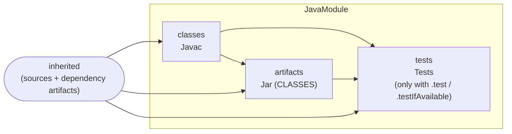
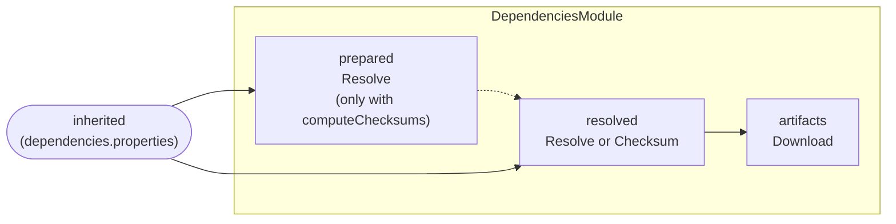
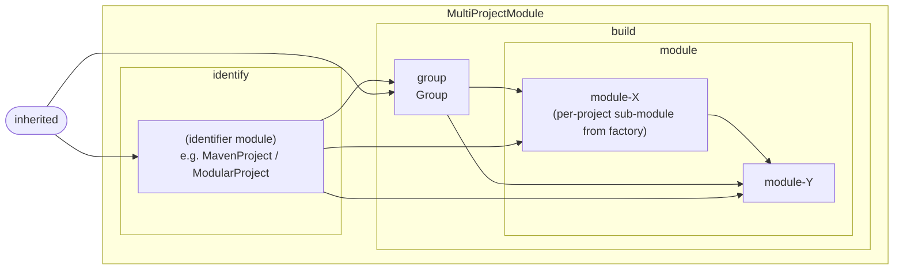
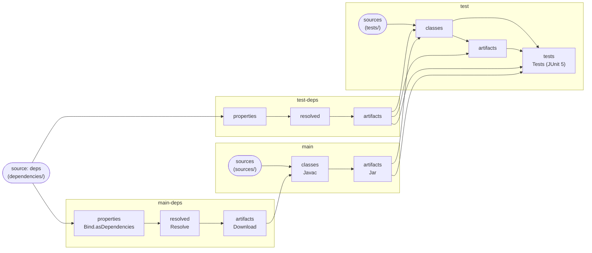
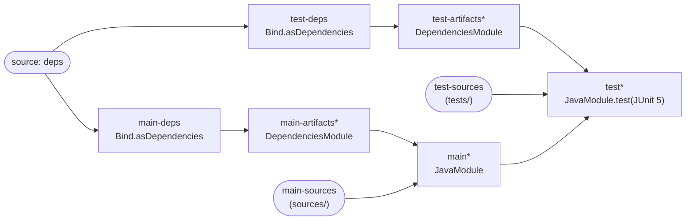
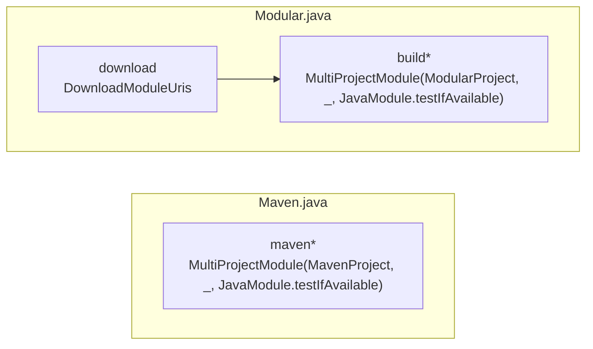

Jenesis
=======

POC for a simple-enough, yet powerful enough build tool that targets Java, and is written and configured in Java, and
that has inherent support for (a) parallel incremental builds, and therewith build reproducibility and (b) supply-chain
security when it comes to downloading external resources.

As a side goal, the build tool should be storable as source code alongside another project, without a need of explicit
installation. At the same time, it should be possible to compile the build to avoid repeated compilation. Doing so, a
build should be executable by using the JVM only once a copy of a project's source is obtained, by embracing the JVM's
ability to run programs from source files. This avoids storing precompiled binaries in repositories, and allows for the
execution of builds in environments that only have the JVM installed without the deployment of build tool wrappers that
often entail a (cachable) download of the tool. It should be possible to manage updates of these sources easily, and to
add extensions (plugins) to the base implementation alongside.

The build tool should only rely on the Java standard library and should be launchable using a command such as:

    java build/Main.java

where `Main` is a user defined class located in the project's build folder, which assembles the build using the
classes of this build tool. This is also demonstrated within this project, where the build tool is the source but
also linked into the build folder as it would be suggested to users of this tool. This would also be possible by
using for example Git Submodules. For IDE-support, a POM is stored alongside, and it should always be possible to
build this project using Maven to debug errors in the project source which is used for building itself.

By automatically caching results of single build steps, expensive but commonly stable tasks should be cached implicitly.
This avoids the need of, for example, repeated resolution of dependency trees. As the result of such resolution can
be stored in a textual format, dependency resolution could also be checked into a source repository. This allows both
to store checksums of previously resolved files for validation, and stabilizes resolution process which can otherwise
render builds non-deterministic, for example when version ranges are declared in (transitive) dependencies.

To allow for an effective implementation of such caching, dependency descriptors should not be defined as a part of the
build description, but separately. In the simplest format, it should always be possible to express information in the
Java properties format. Based on this, it is trivial to translate common descriptions into this format. As a
demonstration of this concept, Java module info classes should be offered as a canonical way of defining (build) module
names and dependencies.

Specific implementations of dependency resolution or repositories should not be hard-coded into the build tool.
There should, for example, not be any hard dependency on Maven concepts, to allow for their substitution.

Getting started
---------------

Jenesis requires a JDK 25 or later, since it relies on the JVM's ability to launch a multi-file program directly from
sources. Once the project sources (including the linked-in `build/jenesis` folder) are available, a build is run with:

    java build/Main.java

`build/Main.java` is the project-owned entry point. In this repository it dispatches to `Maven.java` when a `pom.xml`
is present, and falls back to `Modular.java` otherwise — so the same command works whether you check out a fresh clone
or a derivative project that opts out of Maven metadata. The intermediate target directory and the dependency cache
are placed under `target/` and `cache/` respectively, both of which are git-ignored.

The `build/` folder of this repository doubles as a gallery of equivalent build descriptions, each illustrating a
different layer of the API:

| Entry point         | What it shows |
| ------------------- | ------------- |
| `Minimal.java`      | The lowest-level API: declaring sources, javac and jar steps, plus a JUnit 5 test step, by hand. |
| `Manual.java`       | A two-module layout (main + test) with explicit dependency resolution and download steps. |
| `Modules.java`      | The same shape as `Manual.java`, but using the `JavaModule` and `DependenciesModule` conventions. |
| `Maven.java`        | A `pom.xml`-driven build that derives modules and dependencies from Maven metadata. |
| `Modular.java`      | A `module-info.java`-driven build that derives modules from JPMS descriptors and a `modules.properties` URI map. |
| `ModularByMaven.java` | The modular layout above, but with module URIs translated through Maven coordinates. |

Dependencies for each layout live in `dependencies/` as plain `.properties` files (`main.properties`, `test.properties`,
`modules.properties`). They are intentionally textual so that resolved coordinates and their checksums can be checked
into source control to stabilise builds and underpin supply-chain validation.

Build graph and module composition
----------------------------------

Every build is a directed graph. A `BuildExecutor` exposes three primitives:

- `addSource(name, ...)` introduces an external folder as an input.
- `addStep(name, BuildStep, predecessors)` adds a unit of work whose output lands under `target/.../<name>` and which
  can read each predecessor's folder as `argument.folder()`.
- `addModule(name, BuildExecutorModule, predecessors)` nests another graph under `name`, with predecessors visible to
  the module's children through the `inherited` map (referenced from inside as `../predecessor`).

A `BuildExecutorModule` is therefore just a sub-graph factory. The classes in `build.jenesis.project` and
`build.jenesis.maven`/`build.jenesis.module` are pre-fabricated sub-graphs for common patterns. The diagrams below
show their internal shape and how the entry points in `build/` chain them together. In the diagrams, rounded nodes are
external sources, rectangles are steps, and labelled boxes are modules; arrows point from a predecessor to its
consumer.

### `JavaModule`

Compiles, jars and (optionally) tests a single Java module from its inherited sources and dependencies.

### `DependenciesModule`

Turns a `dependencies.properties` declaration into a folder of resolved jars. With `computeChecksums(...)` an extra
`Checksum` step pins the resolution before download.

### `MultiProjectModule`

The generic shape behind `MavenProject` and `ModularProject`. An *identifier* sub-module discovers projects and writes
their `coordinates.properties` / `dependencies.properties`; `Group` partitions those into per-project property files;
the *factory* then assembles one sub-module per discovered project, with cross-project dependencies wired in.

`MavenProject.make(...)` and `ModularProject.make(...)` are convenience constructors that return exactly such a
`MultiProjectModule`. Their identifier sub-module differs in how it discovers projects:

- `MavenProject` — `scan` step (mirrors every `pom.xml` into `pom/`), then `prepare` (writes per-module
  `module-*.properties` into `maven/`), then a nested `module` group with one sub-module per discovered POM.
- `ModularProject` — walks the project tree for `module-info.java` files and emits one sub-module per descriptor,
  whose `module` step writes `coordinates.properties` and `dependencies.properties` from the parsed module info.

The factory side is shared: each per-project sub-module gets a `prepare` step (`MultiProjectDependencies`), a
`dependencies` `DependenciesModule` (with checksums), a `build` module supplied by the caller (typically a
`JavaModule`) and an `assign` step that pins the produced artifact back to its coordinate.

### Example assemblies

`Manual.java` writes the graph out by hand using only the low-level steps:

`Modules.java` builds the same graph, but composed from convention modules (each box marked `*` expands to one of the
diagrams above):

`Maven.java` and `Modular.java` shrink further: the entire multi-project shape is hidden inside a single module, with
`JavaModule` supplied as the factory for each discovered project.

`ModularByMaven.java` is the modular layout above with a `MavenUriParser` translating module URIs through Maven
coordinates before the `ModularProject` identifier runs.

Project layout
--------------

- `sources/` — the build tool itself, exposed as the `build.jenesis` Java module.
- `build/` — the project's own build descriptions, with `build/jenesis` symlinked to `sources/build/jenesis` so that
  `java build/Main.java` finds the tool without a separate compilation step.
- `dependencies/` — properties files describing external dependencies for the various entry points.
- `tests/` — unit tests for the build tool (run via `mvn test` or via any of the build entry points above).
- `pom.xml` — kept alongside so the project can be opened, built and debugged in any IDE that understands Maven.

Folder and file conventions
---------------------------

Every build step writes its output into the directory exposed by `context.next()` and reads its inputs from
`argument.folder()` for each predecessor. The names a step uses for the artifacts it produces — and the names
downstream steps look for — follow the conventions below. The canonical names live as constants on `BuildStep`;
step-specific ones are declared next to the code that emits them.

### Folders inside `context.next()`

Folder names are written with their trailing slash to match the constants and to read as directory names.

| Folder        | Constant                | Producers                                                                  | Consumers                                                                                          |
| ------------- | ----------------------- | -------------------------------------------------------------------------- | -------------------------------------------------------------------------------------------------- |
| `sources/`    | `BuildStep.SOURCES`     | `Bind.asSources()`                                                         | `Javac`, `Javadoc`                                                                                  |
| `resources/`  | `BuildStep.RESOURCES`   | `Bind.asResources()`                                                       | `Jar` (`CLASSES`/`SOURCES` sort), `Java`/`Tests` (when not `jarsOnly`)                              |
| `classes/`    | `BuildStep.CLASSES`     | `Javac`                                                                    | `Jar` (`CLASSES` sort), `Java`/`Tests`, downstream `Javac` (added to `--class-path`/`--module-path`) |
| `artifacts/`  | `BuildStep.ARTIFACTS`   | `Jar`, `Download`                                                          | `Javac` (path entries), `Java`/`Tests`, `Assign`                                                    |
| `javadoc/`    | `Javadoc.JAVADOC`       | `Javadoc`                                                                  | `Jar` (`JAVADOC` sort)                                                                              |
| `groups/`     | `Group.GROUPS`          | `Group` (one `<name>.properties` per identified group)                     | `MultiProjectModule` (reads `groups/<id>.properties`)                                               |
| `pom/`        | `MavenProject.POM`      | `MavenProject` `scan` step (mirrors `pom.xml` files from the project tree) | `MavenProject` `prepare` step                                                                       |
| `maven/`      | `MavenProject.MAVEN`    | `MavenProject` `prepare` step (per-module `module-*.properties` and `test-module-*.properties`) | `MavenProject` module factory                                                                       |

### Files inside `context.next()`

| File                       | Constant                  | Producers                                                                                                                                                | Consumers                                              |
| -------------------------- | ------------------------- | -------------------------------------------------------------------------------------------------------------------------------------------------------- | ------------------------------------------------------ |
| `coordinates.properties`   | `BuildStep.COORDINATES`   | `Bind.asCoordinates(name)`, `Assign`, `MavenProject` `declare`                                                                                           | `Assign`, `Group`                                      |
| `dependencies.properties`  | `BuildStep.DEPENDENCIES`  | `Bind.asDependencies(name)`, every `DependencyTransformingBuildStep` (`Resolve`, `Checksum`, `Download`, `Translate`), `MavenProject` `declare`           | every `DependencyTransformingBuildStep`, `Group`       |
| `uris.properties`          | `DownloadModuleUris.URIS` | `DownloadModuleUris`                                                                                                                                     | `ModularProject` (module URI lookup)                   |

`coordinates.properties` maps a coordinate (`group/path`) either to an empty value (the coordinate is yet to be
resolved) or to a path/checksum string. `dependencies.properties` uses the same key shape to describe required
coordinates and their expected checksum (or empty for "use whatever resolves").

### Outside step folders

These live at well-known locations relative to the project root or the build root, not inside a step's output
directory.

| Path             | Constant                          | Purpose                                                                                                                                          |
| ---------------- | --------------------------------- | ------------------------------------------------------------------------------------------------------------------------------------------------ |
| `target/`        | passed to `BuildExecutor.of(...)` | Build root: each step gets a sub-folder underneath, with `previous`/`next` slots for incremental runs.                                           |
| `cache/`         | by convention (e.g. `cache/modules`) | Cross-build caches such as downloaded module URIs.                                                                                            |
| `.jenesis.build` | `BuildExecutor.BUILD_MARKER`      | Marker file placed at the root of an active build directory; `MavenProject`/`ModularProject` skip subtrees that contain it so nested builds aren't traversed. |
| `../` prefix     | `BuildExecutorModule.PREVIOUS`    | Used in `addStep`/`addModule` keys to refer up one level (e.g. `../deps`, `../../../identify/...`).                                              |

### Conventional step and module identifiers

These are not file paths but the string names that the higher-level convention modules use when they wire up steps.
They appear as keys in `inherited` maps and in cross-module references.

- `JavaModule` — `classes`, `artifacts`, `tests` (`JavaModule.CLASSES`/`ARTIFACTS`/`TESTS`).
- `DependenciesModule` — `prepared`, `resolved`, `artifacts` (`DependenciesModule.PREPARED`/`RESOLVED`/`ARTIFACTS`).
- `MultiProjectModule` — `identify`, `group`, `build`, `module` (`MultiProjectModule.IDENTIFY`/`GROUP`/`BUILD`/`MODULE`).
- `MavenProject` — `scan`, `prepare`, `assign`, plus a nested `MultiProjectModule.MODULE` group.

Status
------

Jenesis is still a proof of concept. Pieces still on the to-do list:

- Module for test discovery that pulls in the matching runner dependency automatically.
- Task to add GPG signatures of artifacts.
- Task to publish to Maven Central and local Maven repository.
- Extending all build step implementations to expose their full set of standard options.
